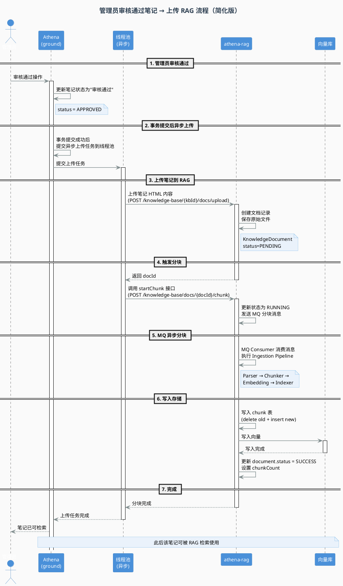

# Athena 笔记审核通过后上传到 RAG 的完整链路

## 1. 背景与结论

Athena 笔记上传到 RAG 不是在用户发布笔记时立即触发，而是在后台审核通过（approve）后由 `athena-ground` 自动触发。整体链路如下：

```text
后台审核通过
  -> athena-ground: AdminNoteReviewController /approve
  -> NoteReviewServiceImpl.approve 更新笔记审核状态
  -> 根据 note type 判断是否需要上传到 RAG
  -> AthenaNoteRagAsyncUploadServiceImpl 注册事务 afterCommit 回调
  -> 审核事务提交成功后提交到 athenaNoteRagUploadExecutor 线程池
  -> 线程池异步执行 AthenaNoteDocumentUploadServiceImpl.upload
  -> AthenaNoteDocumentUploadServiceImpl 将笔记正文包装成 HTML 文件
  -> HTTP 调用 athena-rag 文档上传接口
  -> athena-rag: KnowledgeDocumentController.upload 创建 KnowledgeDocument 记录并存储文件
  -> athena-ground 再调用 athena-rag startChunk 接口
  -> athena-rag 发送文档分块 MQ 事务消息
  -> KnowledgeDocumentChunkConsumer 异步消费
  -> KnowledgeDocumentServiceImpl.executeChunk 执行 Pipeline 解析、清洗、分块、Embedding
  -> 持久化 chunk 到业务表并写入向量库
```

## 2. 涉及服务与模块

| 服务/模块 | 主要职责 |
| --- | --- |
| `athena-ground` | 笔记审核、笔记内容读取、事务提交后异步提交上传任务、RAG 上传请求构造、知识库路由 |
| `athena-rag` | 文档入库、文件存储、分块任务调度、Pipeline 处理、Embedding、向量库写入 |
| RocketMQ | RAG 文档分块任务异步化 |
| 向量库（PgVector 等） | 存储文档 chunk embedding，供 RAG 检索使用 |

## 3. 审核通过触发点

### 3.1 后台审核接口

入口控制器位于：

- `athena/Back_End/athena-ground/athena-ground-biz/src/main/java/athena/ground/biz/controller/AdminNoteReviewController.java`

关键接口：

```java
@PostMapping("/approve")
public Result approve(@RequestBody NoteApproveDTO request) {
    return noteReviewService.approve(request);
}
```

该接口的完整路径是：

```text
POST /athena/admin/blog/review/approve
```

### 3.2 approve 中更新审核状态并触发上传

核心实现位于：

- `athena/Back_End/athena-ground/athena-ground-biz/src/main/java/athena/ground/biz/service/impl/NoteReviewServiceImpl.java`

关键逻辑：

```java
@Override
@Transactional(rollbackFor = Exception.class)
public Result approve(NoteApproveDTO request) {
    if (request == null || request.getNoteId() == null) {
        return Result.fail("noteId不能为空");
    }

    ReviewUploadPayload payload;
    try {
        payload = buildApprovePayloadAndUpdateStatus(request.getNoteId(), UserIdHolder.getUserId());
    } catch (Exception e) {
        log.error("审核通过失败, noteId={}", request.getNoteId(), e);
        return Result.fail(e.getMessage());
    }

    if (shouldUploadAsRagentDocument(payload.type())) {
        athenaNoteRagAsyncUploadService.submitAfterCommit(
                payload.noteId(),
                payload.title(),
                payload.content(),
                payload.type(),
                payload.authorId()
        );
    }
    insightFeginApi.refreshNoteFeature(payload.noteId());
    Result<Void> result = Result.ok();
    result.setMessage("审核通过");
    return result;
}
```

这段代码做了三件事：

1. 调用 `buildApprovePayloadAndUpdateStatus` 校验笔记状态并更新为已通过。
2. 如果笔记类型满足 RAG 上传条件，则调用 `athenaNoteRagAsyncUploadService.submitAfterCommit(...)` 注册事务提交后的异步上传任务。
3. `approve` 请求线程不再同步等待 RAG 上传完成，会继续刷新 insight 特征并返回“审核通过”。

### 3.3 审核状态更新与上传 payload 构建

同一个类中的 `buildApprovePayloadAndUpdateStatus` 负责：

- 查询 `note_basic`。
- 校验当前状态必须是待审核。
- 更新审核状态为通过。
- 查询 `note_content` 获取正文。
- 组装 `ReviewUploadPayload`。

关键代码：

```java
private ReviewUploadPayload buildApprovePayloadAndUpdateStatus(Long noteId, Long reviewerId) {
    NoteBasicDO noteBasicDO = noteBasicMapper.selectByNoteId(noteId);
    if (noteBasicDO == null) {
        throw new IllegalStateException("文章不存在");
    }
    if (noteBasicDO.getStatus() == null || noteBasicDO.getStatus() != STATUS_PENDING) {
        throw new IllegalStateException("当前文章不处于待审核状态");
    }

    NoteBasicDO update = new NoteBasicDO();
    update.setNoteId(noteId);
    update.setStatus(STATUS_APPROVED);
    update.setReviewerId(reviewerId);
    update.setReviewTime(LocalDateTime.now());
    noteBasicMapper.updateByPrimaryKeySelective(update);

    NoteContentDO noteContentDO = noteContentDOMapper.selectByNoteId(noteId);
    return new ReviewUploadPayload(
            noteId,
            noteBasicDO.getTitle(),
            noteContentDO == null ? null : noteContentDO.getContent(),
            noteBasicDO.getType(),
            noteBasicDO.getUserId()
    );
}
```

## 4. 哪些笔记会上传到 RAG

`NoteReviewServiceImpl.shouldUploadAsRagentDocument` 控制是否上传：

```java
private boolean shouldUploadAsRagentDocument(Byte type) {
    return type != null && type != 0 && type != 1 && type != 2;
}
```

也就是说：

- `type == null`：不上传。
- `type == 0 / 1 / 2`：不上传。
- 其他类型：审核通过后上传到 RAG。

从业务含义上看，我们当前实现将部分普通类型排除，把其他更偏知识类/专业类的笔记同步为 RAG document。

## 5. Athena Ground 到 RAG 的异步上传调度

当前 `athena-ground` 不再在审核请求线程里同步调用 RAG。审核通过后，`NoteReviewServiceImpl` 只负责把上传任务提交给 `AthenaNoteRagAsyncUploadService`，由它在事务提交后放入线程池执行。

### 5.1 线程池配置

线程池配置位于：

- `athena/Back_End/athena-ground/athena-ground-biz/src/main/java/athena/ground/biz/config/AthenaNoteRagUploadExecutorConfig.java`

关键配置：

```java
@Bean("athenaNoteRagUploadExecutor")
public Executor athenaNoteRagUploadExecutor() {
    ThreadPoolTaskExecutor executor = new ThreadPoolTaskExecutor();
    executor.setCorePoolSize(8);
    executor.setMaxPoolSize(8);
    executor.setQueueCapacity(1000);
    executor.setThreadNamePrefix("athena-note-rag-upload-");
    executor.setWaitForTasksToCompleteOnShutdown(true);
    executor.setAwaitTerminationSeconds(30);
    executor.setRejectedExecutionHandler(new ThreadPoolExecutor.AbortPolicy());
    executor.initialize();
    return executor;
}
```

说明：

- 固定 8 个上传线程，适合 RAG document 上传这类偏 HTTP I/O 的任务。
- 有界队列 1000，避免无界堆积导致内存风险。
- 使用 `AbortPolicy`，当 8 个线程都忙且队列满时拒绝任务，不把上传逻辑回退到审核请求线程执行。
- `AthenaNoteRagAsyncUploadServiceImpl` 会捕获 `RejectedExecutionException` 并记录包含 `noteId/authorId/type` 的日志。

### 5.2 afterCommit 异步提交

异步服务位于：

- `athena/Back_End/athena-ground/athena-ground-biz/src/main/java/athena/ground/biz/service/impl/AthenaNoteRagAsyncUploadServiceImpl.java`

关键代码：

```java
@Override
public void submitAfterCommit(Long noteId, String title, String contentHtml, Byte type, Long authorId) {
    Runnable submitTask = () -> submitUploadTask(noteId, title, contentHtml, type, authorId);
    if (TransactionSynchronizationManager.isSynchronizationActive()) {
        TransactionSynchronizationManager.registerSynchronization(new TransactionSynchronization() {
            @Override
            public void afterCommit() {
                submitTask.run();
            }
        });
        return;
    }
    submitTask.run();
}
```

这里的关键点是：只有审核事务提交成功后才会真正提交上传任务，避免出现“审核事务回滚，但 RAG 已经上传文档”的脏同步问题。

线程池提交和异常处理：

```java
private void submitUploadTask(Long noteId, String title, String contentHtml, Byte type, Long authorId) {
    try {
        athenaNoteRagUploadExecutor.execute(() -> uploadQuietly(noteId, title, contentHtml, type, authorId));
        log.info("[AthenaNoteUpload] 已提交异步上传 RAG 任务, noteId={}, authorId={}, type={}", noteId, authorId, type);
    } catch (RejectedExecutionException e) {
        log.error("[AthenaNoteUpload] 异步上传 RAG 线程池已满，任务被拒绝, noteId={}, authorId={}, type={}", noteId, authorId, type, e);
    }
}

private void uploadQuietly(Long noteId, String title, String contentHtml, Byte type, Long authorId) {
    try {
        log.info("[AthenaNoteUpload] 开始异步上传 RAG, noteId={}, authorId={}, type={}", noteId, authorId, type);
        athenaNoteDocumentUploadService.upload(noteId, title, contentHtml, type, authorId);
        log.info("[AthenaNoteUpload] 异步上传 RAG 成功, noteId={}, authorId={}, type={}", noteId, authorId, type);
    } catch (Exception e) {
        log.error("[AthenaNoteUpload] 异步上传 RAG 失败, noteId={}, authorId={}, type={}", noteId, authorId, type, e);
    }
}
```

因此，`athena-ground` 到 `athena-rag` 的 document 上传现在是线程池异步执行，而不是审核接口同步执行。

## 6. Athena Ground 到 RAG 的 document 上传请求

真正的上传实现仍位于：

- `athena/Back_End/athena-ground/athena-ground-biz/src/main/java/athena/ground/biz/service/impl/AthenaNoteDocumentUploadServiceImpl.java`

### 6.1 参数校验

入口方法：

```java
@Override
public void upload(Long noteId, String title, String contentHtml, Byte type, Long authorId) {
    validateRequest(noteId, title, contentHtml, type, authorId);

    AthenaKnowledgeRouteService.KnowledgeTarget target = knowledgeRouteService.resolveTarget(Integer.valueOf(type));
    String fileName = buildFileName(noteId, title);
    String uploadUrl = routingProperties.getBaseUrl() + "/api/ragent/knowledge-base/" + target.kbId() + "/docs/upload";
    ...
}
```

`validateRequest` 会要求：

- `noteId` 非空。
- `type` 非空。
- `authorId` 非空。
- `title` 非空。
- `contentHtml` 非空。

如果任何必填字段缺失，会抛出 `IllegalArgumentException`，最终在异步任务 `uploadQuietly` 中被捕获并记录“异步上传 RAG 失败”。

### 6.2 知识库与 Pipeline 路由

`AthenaNoteDocumentUploadServiceImpl` 不直接写死 `kbId` 和 `pipelineId`，而是通过 `AthenaKnowledgeRouteService.resolveTarget(type)` 获取。

实现位于：

- `athena/Back_End/athena-ground/athena-ground-biz/src/main/java/athena/ground/biz/service/impl/AthenaKnowledgeRouteServiceImpl.java`

关键代码：

```java
@Override
public KnowledgeTarget resolveTarget(Integer type) {
    Assert.notNull(type, "笔记类型不能为空");

    if (routingProperties.getCommonTypes().contains(type)) {
        AthenaNoteDocumentRoutingProperties.KnowledgeTarget target = routingProperties.getCommonTarget();
        return new KnowledgeTarget(target.getKbCode(), target.getKbId(), target.getPipelineId());
    }

    return routingProperties.getMappings().stream()
            .filter(mapping -> type >= mapping.getTypeRangeStart() && type <= mapping.getTypeRangeEnd())
            .map(AthenaNoteDocumentRoutingProperties.TypeRangeMapping::getTarget)
            .findFirst()
            .map(target -> new KnowledgeTarget(target.getKbCode(), target.getKbId(), target.getPipelineId()))
            .orElseThrow(() -> new IllegalArgumentException("未找到匹配的知识库路由，type=" + type));
}
```

配置类位于：

- `athena/Back_End/athena-ground/athena-ground-biz/src/main/java/athena/ground/biz/config/AthenaNoteDocumentRoutingProperties.java`

配置前缀：

```text
athena.rag.note-document
```

配置项包括：

- `mappings`：笔记类型区间到知识库目标的映射。
- `commonTypes`：通用知识类型列表。
- `commonTarget`：通用知识库目标。
- `KnowledgeTarget.kbCode`：业务知识库编码。
- `KnowledgeTarget.kbId`：RAG 知识库主键 ID。
- `KnowledgeTarget.pipelineId`：复用的 Athena note pipelineId。

### 6.3 Multipart 上传内容

`AthenaNoteDocumentUploadServiceImpl.upload` 会将笔记正文作为 HTML 文件上传：

```java
HttpHeaders headers = new HttpHeaders();
headers.setContentType(MediaType.MULTIPART_FORM_DATA);
headers.set(GlobalConstants.USER_ID, String.valueOf(authorId));

// 为文件设置 Content-Type
HttpHeaders fileHeaders = new HttpHeaders();
fileHeaders.setContentType(MediaType.TEXT_HTML);
Resource fileResource = new NamedByteArrayResource(contentHtml.getBytes(StandardCharsets.UTF_8), fileName);
HttpEntity<Resource> fileEntity = new HttpEntity<>(fileResource, fileHeaders);

// 构建 metadata JSON
String metadataJson = buildMetadataJson(noteId, title, type, authorId);

MultiValueMap<String, Object> body = new LinkedMultiValueMap<>();
body.add("file", fileEntity);
body.add("sourceType", "file");
body.add("processMode", "pipeline");
body.add("pipelineId", target.pipelineId());
body.add("metadata", metadataJson);

HttpEntity<MultiValueMap<String, Object>> requestEntity = new HttpEntity<>(body, headers);
```

请求字段含义：

| 字段 | 值 | 说明 |
| --- | --- | --- |
| `file` | HTML 文件 | 文件名形如 `athena-note-{noteId}-{title}.html` |
| `sourceType` | `file` | 告诉 RAG 这是直接上传文件，不是 URL 拉取 |
| `processMode` | `pipeline` | 使用 RAG 的 ingestion pipeline 处理 |
| `pipelineId` | 路由目标中的 pipelineId | 决定解析、清洗、分块、索引等节点配置 |
| `metadata` | JSON 字符串 | 携带 noteId/title/type/authorId/source |
| Header `USER_ID` | authorId | 用作者身份调用 RAG 接口 |

metadata 构造如下：

```java
private String buildMetadataJson(Long noteId, String title, Byte type, Long authorId) {
    Map<String, Object> metadata = new java.util.HashMap<>();
    metadata.put("noteId", noteId);
    metadata.put("title", title);
    metadata.put("type", type);
    metadata.put("authorId", authorId);
    metadata.put("source", "athena-note");
    try {
        return JsonUtils.toJsonString(metadata);
    } catch (Exception e) {
        log.error("构建 metadata JSON 失败", e);
        return "{}";
    }
}
```

### 6.4 上传成功后立即触发分块

上传接口返回成功后，`AthenaNoteDocumentUploadServiceImpl` 会解析 `data.id` 作为 `docId`，然后调用 RAG 的分块接口：

```java
ResponseEntity<String> response = restTemplate.exchange(uploadUrl, HttpMethod.POST, requestEntity, String.class);
Map<String, Object> payload = JsonUtils.parseObject(response.getBody(), new TypeReference<Map<String, Object>>() {
});
...
@SuppressWarnings("unchecked")
Map<String, Object> data = (Map<String, Object>) payload.get("data");
String docId = data == null || data.get("id") == null ? null : String.valueOf(data.get("id"));
if (!StringUtils.hasText(docId)) {
    throw new RuntimeException("调用 ragent 文档上传接口失败：未返回 docId");
}

startChunk(docId, authorId);
```

`startChunk` 调用：

```java
private void startChunk(String docId, Long authorId) {
    String chunkUrl = routingProperties.getBaseUrl() + "/api/ragent/knowledge-base/docs/" + docId + "/chunk";
    HttpHeaders headers = new HttpHeaders();
    headers.set(GlobalConstants.USER_ID, String.valueOf(authorId));
    HttpEntity<Void> requestEntity = new HttpEntity<>(headers);
    ResponseEntity<String> response = restTemplate.exchange(chunkUrl, HttpMethod.POST, requestEntity, String.class);
    ...
}
```

因此 Athena Ground 对 RAG 的调用实际分两步：

1. `POST /api/ragent/knowledge-base/{kbId}/docs/upload`
2. `POST /api/ragent/knowledge-base/docs/{docId}/chunk`

## 7. RAG 文档上传入口

RAG 侧控制器位于：

- `athena/Back_End/athena-rag/bootstrap/src/main/java/com/nageoffer/ai/ragent/knowledge/controller/KnowledgeDocumentController.java`

### 7.1 上传接口

```java
@PostMapping(value = "/knowledge-base/{kb-id}/docs/upload", consumes = MediaType.MULTIPART_FORM_DATA_VALUE)
public Result<KnowledgeDocumentVO> upload(@PathVariable("kb-id") String kbId,
                                          @RequestPart(value = "file", required = false) MultipartFile file,
                                          @ModelAttribute KnowledgeDocumentUploadRequest requestParam) {
    return Results.success(documentService.upload(kbId, requestParam, file));
}
```

Athena Ground 调用的路径带有 `/api/ragent` 前缀，RAG controller 内部路径是 `/knowledge-base/{kb-id}/docs/upload`。

### 7.2 上传请求对象

请求对象位于：

- `athena/Back_End/athena-rag/bootstrap/src/main/java/com/nageoffer/ai/ragent/knowledge/controller/request/KnowledgeDocumentUploadRequest.java`

关键字段：

```java
private String sourceType;
private String sourceLocation;
private Boolean scheduleEnabled;
private String scheduleCron;
private String processMode;
private String chunkStrategy;
private String chunkConfig;
private String pipelineId;
private String metadata;
```

Athena 笔记上传场景只用到：

- `sourceType=file`
- `processMode=pipeline`
- `pipelineId=...`
- `metadata=...`
- `file=...`

## 8. RAG 上传落库与文件存储流程

RAG 上传实现位于：

- `athena/Back_End/athena-rag/bootstrap/src/main/java/com/nageoffer/ai/ragent/knowledge/service/impl/KnowledgeDocumentServiceImpl.java`

### 8.1 upload 创建 document 记录

核心代码：

```java
@Override
public KnowledgeDocumentVO upload(String kbId, KnowledgeDocumentUploadRequest requestParam, MultipartFile file) {
    KnowledgeBaseDO kbDO = knowledgeBaseMapper.selectById(kbId);
    Assert.notNull(kbDO, () -> new ClientException("知识库不存在"));

    SourceType sourceType = SourceType.normalize(requestParam.getSourceType());
    validateSourceAndSchedule(sourceType, requestParam);
    StoredFileDTO stored = resolveStoredFile(kbDO.getCollectionName(), sourceType, requestParam.getSourceLocation(), file);
    ProcessModeConfig modeConfig = resolveProcessModeConfig(requestParam);

    KnowledgeDocumentDO documentDO = KnowledgeDocumentDO.builder()
            .kbId(kbId)
            .docName(stored.getOriginalFilename())
            .enabled(1)
            .chunkCount(0)
            .fileUrl(stored.getUrl())
            .fileType(stored.getDetectedType())
            .fileSize(stored.getSize())
            .status(DocumentStatus.PENDING.getCode())
            .sourceType(sourceType.getValue())
            .sourceLocation(SourceType.URL == sourceType ? StrUtil.trimToNull(requestParam.getSourceLocation()) : null)
            .scheduleEnabled(isScheduleEnabled(sourceType, requestParam) ? 1 : 0)
            .scheduleCron(isScheduleEnabled(sourceType, requestParam) ? StrUtil.trimToNull(requestParam.getScheduleCron()) : null)
            .processMode(modeConfig.processMode().getValue())
            .chunkStrategy(modeConfig.chunkingMode() != null ? modeConfig.chunkingMode().getValue() : null)
            .chunkConfig(modeConfig.chunkConfig())
            .pipelineId(modeConfig.pipelineId())
            .metadata(StrUtil.trimToNull(requestParam.getMetadata()))
            .createdBy(UserContext.getUsername())
            .updatedBy(UserContext.getUsername())
            .build();
    documentMapper.insert(documentDO);

    return BeanUtil.toBean(documentDO, KnowledgeDocumentVO.class);
}
```

该方法完成：

1. 校验知识库存在。
2. 规范化 `sourceType`。
3. 存储上传文件，得到 `StoredFileDTO`。
4. 校验处理模式：Athena 场景为 `pipeline`，必须提供存在的 `pipelineId`。
5. 插入 `KnowledgeDocumentDO`，状态为 `PENDING`。
6. 返回文档对象，其中 `id` 会被 Athena Ground 作为后续分块的 `docId`。

### 8.2 文件存储

文件存储通过：

```java
private StoredFileDTO resolveStoredFile(String bucketName, SourceType sourceType, String sourceLocation, MultipartFile file) {
    if (SourceType.FILE == sourceType) {
        Assert.notNull(file, () -> new ClientException("上传文件不能为空"));
        return fileStorageService.upload(bucketName, file);
    }
    return remoteFileFetcher.fetchAndStore(bucketName, sourceLocation);
}
```

Athena 笔记场景 `sourceType=file`，因此走 `fileStorageService.upload(bucketName, file)`。

这里的 `bucketName` 使用知识库的 `collectionName`，也就是知识库对应的向量集合名/存储空间名。

### 8.3 Pipeline 模式校验

```java
private ProcessModeConfig resolveProcessModeConfig(KnowledgeDocumentUploadRequest request) {
    ProcessMode processMode = ProcessMode.normalize(request.getProcessMode());
    if (ProcessMode.CHUNK == processMode) {
        ...
    } else {
        if (!StringUtils.hasText(request.getPipelineId())) {
            throw new ClientException("使用Pipeline模式时，必须指定Pipeline ID");
        }
        try {
            ingestionPipelineService.get(request.getPipelineId());
        } catch (Exception e) {
            throw new ClientException("指定的Pipeline不存在: " + request.getPipelineId());
        }
        return new ProcessModeConfig(processMode, null, null, request.getPipelineId());
    }
}
```

这意味着 Athena 笔记上传依赖路由配置中的 `pipelineId` 必须在 RAG 的 ingestion pipeline 表中存在。我们已经用nacos来动态配置了，可以保证pipeline是在的，而且是独特给athena笔记同步用的

## 9. RAG 分块任务触发与异步消费

### 9.1 分块接口

控制器接口：

```java
@PostMapping("/knowledge-base/docs/{doc-id}/chunk")
public Result<Void> startChunk(@PathVariable(value = "doc-id") String docId) {
    documentService.startChunk(docId);
    return Results.success();
}
```

### 9.2 startChunk 发送事务消息

`KnowledgeDocumentServiceImpl.startChunk`：

```java
@Override
public void startChunk(String docId) {
    KnowledgeDocumentChunkEvent event = KnowledgeDocumentChunkEvent.builder()
            .docId(docId)
            .operator(UserContext.getUsername())
            .build();

    messageQueueProducer.sendInTransaction(
            chunkTopic,
            docId,
            "文档分块",
            event,
            arg -> {
                int updated = documentMapper.update(
                        new LambdaUpdateWrapper<KnowledgeDocumentDO>()
                                .set(KnowledgeDocumentDO::getStatus, DocumentStatus.RUNNING.getCode())
                                .set(KnowledgeDocumentDO::getUpdatedBy, event.getOperator())
                                .eq(KnowledgeDocumentDO::getId, docId)
                                .ne(KnowledgeDocumentDO::getStatus, DocumentStatus.RUNNING.getCode())
                );
                if (updated == 0) {
                    KnowledgeDocumentDO documentDO = documentMapper.selectById(docId);
                    Assert.notNull(documentDO, () -> new ClientException("文档不存在"));
                    throw new ClientException("文档分块操作正在进行中，请稍后再试");
                }
                KnowledgeDocumentDO documentDO = documentMapper.selectById(docId);
                event.setKbId(documentDO.getKbId());
                scheduleService.upsertSchedule(documentDO);
            }
    );
}
```

该方法的关键设计：

- 先把 document 状态从非 `RUNNING` 更新为 `RUNNING`。
- 如果已经是 `RUNNING`，拒绝重复触发。
- 通过事务消息发送 MQ，确保状态更新和消息发送保持一致。
- topic 来自：

```java
@Value("knowledge-document-chunk_topic")
private String chunkTopic;
```

### 9.3 MQ 消费者执行分块

消费者位于：

- `athena/Back_End/athena-rag/bootstrap/src/main/java/com/nageoffer/ai/ragent/knowledge/mq/KnowledgeDocumentChunkConsumer.java`

关键代码：

```java
@RocketMQMessageListener(
        topic = "knowledge-document-chunk_topic",
        consumerGroup = "knowledge-document-chunk_cg"
)
public class KnowledgeDocumentChunkConsumer implements RocketMQListener<MessageWrapper<KnowledgeDocumentChunkEvent>> {

    private final KnowledgeDocumentService documentService;

    @Override
    public void onMessage(MessageWrapper<KnowledgeDocumentChunkEvent> message) {
        KnowledgeDocumentChunkEvent event = message.getBody();

        log.info("[消费者] 开始消费文档分块任务，docId={}, keys={}", event.getDocId(), message.getKeys());

        UserContext.set(LoginUser.builder().username(event.getOperator()).build());
        try {
            documentService.executeChunk(event.getDocId());
        } finally {
            UserContext.clear();
        }
    }
}
```

消费者会恢复 operator 到 `UserContext`，再调用 `executeChunk(docId)`。

## 10. RAG 分块、Embedding 与向量写入

### 10.1 executeChunk 与 runChunkTask

```java
@Override
public void executeChunk(String docId) {
    KnowledgeDocumentDO documentDO = documentMapper.selectById(docId);
    if (documentDO == null) {
        log.warn("文档不存在，跳过分块任务, docId={}", docId);
        return;
    }

    runChunkTask(documentDO);
}
```

`runChunkTask` 会创建分块日志，并根据 `processMode` 选择处理方式：

```java
private void runChunkTask(KnowledgeDocumentDO documentDO) {
    String docId = documentDO.getId();
    ProcessMode processMode = ProcessMode.normalize(documentDO.getProcessMode());

    KnowledgeDocumentChunkLogDO chunkLog = KnowledgeDocumentChunkLogDO.builder()
            .docId(docId)
            .status(DocumentStatus.RUNNING.getCode())
            .processMode(processMode.getValue())
            .chunkStrategy(documentDO.getChunkStrategy())
            .pipelineId(documentDO.getPipelineId())
            .startTime(new Date())
            .build();
    chunkLogMapper.insert(chunkLog);

    try {
        List<VectorChunk> chunkResults;
        if (ProcessMode.PIPELINE == processMode) {
            long start = System.currentTimeMillis();
            chunkResults = runPipelineProcess(documentDO);
            chunkDuration = System.currentTimeMillis() - start;
        } else {
            ChunkProcessResult result = runChunkProcess(documentDO);
            ...
            chunkResults = result.chunks();
        }

        long persistStart = System.currentTimeMillis();
        String collectionName = resolveCollectionName(documentDO.getKbId());
        int savedCount = persistChunksAndVectorsAtomically(collectionName, docId, chunkResults);
        persistDuration = System.currentTimeMillis() - persistStart;

        updateChunkLog(chunkLog.getId(), DocumentStatus.SUCCESS.getCode(), savedCount,
                extractDuration, chunkDuration, embedDuration, persistDuration, totalDuration, null);
    } catch (Exception e) {
        log.error("文档分块任务执行失败：docId={}", docId, e);
        markChunkFailed(documentDO.getId());
        updateChunkLog(chunkLog.getId(), DocumentStatus.FAILED.getCode(), 0,
                extractDuration, chunkDuration, embedDuration, persistDuration, totalDuration, e.getMessage());
    }
}
```

Athena 笔记上传固定传 `processMode=pipeline`，因此进入 `runPipelineProcess`。

### 10.2 Pipeline 执行

```java
private List<VectorChunk> runPipelineProcess(KnowledgeDocumentDO documentDO) {
    String docId = String.valueOf(documentDO.getId());
    String pipelineId = documentDO.getPipelineId();

    if (pipelineId == null) {
        throw new IllegalStateException("Pipeline模式下Pipeline ID为空：docId=" + docId);
    }

    KnowledgeBaseDO kbDO = knowledgeBaseMapper.selectById(documentDO.getKbId());

    PipelineDefinition pipelineDef = ingestionPipelineService.getDefinition(pipelineId);

    byte[] fileBytes;
    try (InputStream is = fileStorageService.openStream(documentDO.getFileUrl())) {
        fileBytes = is.readAllBytes();
    } catch (Exception e) {
        throw new RuntimeException("读取文件内容失败：docId=" + docId, e);
    }

    // 解析 metadata（如果存在）
    Map<String, Object> metadata = parseMetadata(documentDO.getMetadata());

    IngestionContext context = IngestionContext.builder()
            .taskId(docId)
            .pipelineId(pipelineId)
            .rawBytes(fileBytes)
            .mimeType(documentDO.getFileType())
            .metadata(metadata)
            .vectorSpaceId(VectorSpaceId.builder()
                    .logicalName(kbDO.getCollectionName())
                    .build())
            .skipIndexerWrite(true)
            .build();

    IngestionContext result = ingestionEngine.execute(pipelineDef, context);

    if (result.getError() != null) {
        throw new RuntimeException("Pipeline执行失败：" + result.getError().getMessage(), result.getError());
    }

    List<VectorChunk> chunks = result.getChunks();
    if (chunks == null || chunks.isEmpty()) {
        log.warn("Pipeline执行完成但未产生分块：docId={}", docId);
        return List.of();
    }

    return chunks;
}
```

注意这里设置了：

```java
.skipIndexerWrite(true)
```

含义是：Pipeline 中的 Indexer 节点只做校验、补齐 chunkId/embedding/metadata，不直接写向量库。最终统一由 `persistChunksAndVectorsAtomically` 写入，保证业务 chunk 表和向量库的一致性。

### 10.3 Parser 节点解析 HTML

Athena 上传的文件是 `.html` 且 Content-Type 是 `text/html`。Pipeline 中 Parser 节点负责把原始字节解析成文本。

Parser 节点位于：

- `athena/Back_End/athena-rag/bootstrap/src/main/java/com/nageoffer/ai/ragent/ingestion/node/ParserNode.java`

关键逻辑：

```java
DocumentParser parser = parserSelector.select(parserType);
if (parser == null) {
    return NodeResult.fail(new ClientException("未找到解析器: " + parserType));
}
ParseResult result = parser.parse(context.getRawBytes(), mimeType, options);
context.setRawText(result.text());

StructuredDocument document = StructuredDocument.builder()
        .text(result.text())
        .metadata(result.metadata())
        .build();
context.setDocument(document);
```

Parser 会根据 pipeline 配置选择 parser，默认是 TIKA；同时 `resolveType` 支持通过 MIME 或文件名识别 HTML。

### 10.4 Chunker 节点分块并生成 embedding

Chunker 节点位于：

- `athena/Back_End/athena-rag/bootstrap/src/main/java/com/nageoffer/ai/ragent/ingestion/node/ChunkerNode.java`

关键代码：

```java
String text = StringUtils.hasText(context.getEnhancedText()) ? context.getEnhancedText() : context.getRawText();
if (!StringUtils.hasText(text)) {
    return NodeResult.fail(new ClientException("可分块文本为空"));
}
ChunkerSettings settings = parseSettings(config.getSettings());
ChunkingStrategy chunker = chunkingStrategyFactory.requireStrategy(settings.getStrategy());
...
List<VectorChunk> results = chunker.chunk(text, chunkConfig);
List<VectorChunk> chunks = convertToVectorChunks(results);

// 嵌入：为切分后的文本块生成向量
chunkEmbeddingService.embed(chunks, null);

context.setChunks(chunks);
return NodeResult.ok("已分块 " + chunks.size() + " 段");
```

它会优先使用 `enhancedText`，否则使用 Parser 输出的 `rawText`，再按 pipeline 配置的分块策略切分并生成 embedding。

### 10.5 Indexer 节点补齐 metadata，但不直接写库

Indexer 节点位于：

- `athena/Back_End/athena-rag/bootstrap/src/main/java/com/nageoffer/ai/ragent/ingestion/node/IndexerNode.java`

关键代码：

```java
if (context.isSkipIndexerWrite()) {
    // 调用方会在事务中统一写向量，此处只做校验和 chunkId/embedding 的填充（buildRows 已完成）
    return NodeResult.ok("已准备 " + rows.size() + " 个分块（向量写入由调用方统一完成）");
}

insertRows(collectionName, context.getTaskId(), rows);
return NodeResult.ok("已写入 " + rows.size() + " 个分块到集合 " + collectionName);
```

由于 `runPipelineProcess` 设置了 `skipIndexerWrite=true`，所以 Athena 笔记场景不会在 Indexer 节点里直接写向量库。

Indexer 仍会根据 pipeline 的 `metadataFields` 把 `noteId/title/type/authorId/source` 等 metadata 写入 chunk metadata：

```java
if (metadataFields != null && !metadataFields.isEmpty()) {
    Map<String, Object> combined = new HashMap<>(mergedMetadata);
    if (chunk.getMetadata() != null) {
        combined.putAll(chunk.getMetadata());
    }

    for (String field : metadataFields) {
        Object value = combined.get(field);
        if (value != null) {
            addMetadataValue(metadata, field, value);
            chunkMetadataMap.put(field, value);
        }
    }
}

chunk.setMetadata(chunkMetadataMap);
```

这也是 Athena 笔记 metadata 能跟随 chunk 进入向量库的重要环节。

### 10.6 原子化持久化 chunk 与向量

最终统一写入发生在：

```java
private int persistChunksAndVectorsAtomically(String collectionName, String docId, List<VectorChunk> chunkResults) {
    List<KnowledgeChunkCreateRequest> chunks = chunkResults.stream()
            .map(vc -> {
                KnowledgeChunkCreateRequest req = new KnowledgeChunkCreateRequest();
                req.setChunkId(vc.getChunkId());
                req.setIndex(vc.getIndex());
                req.setContent(vc.getContent());
                return req;
            })
            .toList();
    transactionOperations.executeWithoutResult(status -> {
        knowledgeChunkService.deleteByDocId(docId);
        knowledgeChunkService.batchCreate(docId, chunks);
        vectorStoreService.deleteDocumentVectors(collectionName, docId);
        vectorStoreService.indexDocumentChunks(collectionName, docId, chunkResults);
        KnowledgeDocumentDO updateDocumentDO = KnowledgeDocumentDO.builder()
                .id(docId)
                .chunkCount(chunks.size())
                .status(DocumentStatus.SUCCESS.getCode())
                .updatedBy(UserContext.getUsername())
                .build();
        documentMapper.updateById(updateDocumentDO);
    });
    return chunks.size();
}
```

该方法确保每次重建文档索引时：

1. 删除旧业务 chunk。
2. 批量创建新业务 chunk。
3. 删除旧向量。
4. 写入新向量。
5. 更新 document 状态为 `SUCCESS`，并记录 chunk 数量。

如果过程中出错，`runChunkTask` 会：

- 记录错误日志。
- 调用 `markChunkFailed` 将 document 状态置为 `FAILED`。
- 更新 chunk log 为 `FAILED` 并写入错误信息。

## 11. 数据状态流转

### 11.1 Athena Ground 笔记审核状态

`NoteReviewServiceImpl` 中定义：

```java
private static final byte STATUS_PENDING = 0;
private static final byte STATUS_APPROVED = 1;
private static final byte STATUS_REJECTED = 2;
```

审核通过时：

```text
note_basic.status: PENDING(0) -> APPROVED(1)
```

### 11.2 RAG Document 状态

RAG document 的典型状态流转：

```text
PENDING -> RUNNING -> SUCCESS
                 \-> FAILED
```

具体发生点：

| 状态 | 发生位置 | 说明 |
| --- | --- | --- |
| `PENDING` | `KnowledgeDocumentServiceImpl.upload` | 文档记录刚创建，尚未分块 |
| `RUNNING` | `KnowledgeDocumentServiceImpl.startChunk` | 分块任务被触发，事务消息准备发送 |
| `SUCCESS` | `persistChunksAndVectorsAtomically` | chunk 和向量写入完成 |
| `FAILED` | `markChunkFailed` | 分块、Pipeline 或持久化失败 |

## 12. 异常处理与一致性分析

### 12.1 审核与 RAG 上传不是强一致

`NoteReviewServiceImpl.approve` 上有事务注解，但它现在只负责在事务提交后提交异步上传任务：

```java
if (shouldUploadAsRagentDocument(payload.type())) {
    athenaNoteRagAsyncUploadService.submitAfterCommit(...);
}
```

真正调用 RAG 的逻辑在 `AthenaNoteRagAsyncUploadServiceImpl.uploadQuietly` 中执行，并捕获异常：

```java
try {
    athenaNoteDocumentUploadService.upload(noteId, title, contentHtml, type, authorId);
} catch (Exception e) {
    log.error("[AthenaNoteUpload] 异步上传 RAG 失败, noteId={}, authorId={}, type={}", noteId, authorId, type, e);
}
```

因此：

- 审核状态更新失败：接口返回失败，事务回滚，不会提交 RAG 上传任务。
- 审核事务提交成功：`afterCommit` 才会向线程池提交 RAG 上传任务。
- 线程池满导致任务被拒绝：审核不会回滚，会记录“异步上传 RAG 线程池已满，任务被拒绝”日志；RAG 知识库可能缺失该笔记。
- 异步上传执行失败：审核不会回滚，会记录“异步上传 RAG 失败”日志；RAG 知识库可能缺失该笔记。
- RAG 上传成功但分块失败：RAG document 存在，但状态会进入 `FAILED`，不会可用或检索效果不完整。

### 12.2 线程池异步化的取舍

当前方案不是 MQ/outbox 级别的可靠投递，而是轻量异步化：

- 优点：审核接口不再同步等待 RAG 上传，能够降低审核链路耗时；固定 8 并发 + 有界队列可以限制对 RAG 的瞬时冲击。
- 风险：任务提交后如果应用进程退出、线程池队列满、异步任务失败，目前主要依赖日志排查，没有持久化补偿表。
- 适用阶段：适合当前先降低审核主链路风险；如果后续要求“审核通过后必须进入 RAG”，建议再引入 MQ/outbox 或定时补偿。

### 12.3 RAG 文档分块使用异步事务消息

RAG 的 `startChunk` 用事务消息先设置状态再发送 MQ，避免重复分块和消息/状态不一致。

### 12.4 chunk 与向量写入尽量保持一致

`persistChunksAndVectorsAtomically` 将业务 chunk 删除/创建、向量删除/写入、document 状态更新放在同一个事务回调中执行。需要注意：如果向量库不是关系库事务资源，严格意义上无法和 DB 完成分布式事务，但代码通过先删后写和失败标记来尽量保持可恢复。

## 13. 一次完整调用时序

```text
1. 管理员调用 POST /athena/admin/blog/review/approve
2. AdminNoteReviewController.approve -> NoteReviewServiceImpl.approve
3. 查询 note_basic，校验 status=PENDING
4. 更新 note_basic.status=APPROVED、reviewerId、reviewTime
5. 查询 note_content 获取 HTML 正文
6. 判断 type 是否需要上传：type != null && type not in [0,1,2]
7. 调用 AthenaNoteRagAsyncUploadService.submitAfterCommit 注册 afterCommit 回调
8. approve 请求继续刷新 insight feature 并返回“审核通过”
9. 审核事务提交成功后，afterCommit 回调向 athenaNoteRagUploadExecutor 提交任务
10. 线程池 worker 异步执行 AthenaNoteDocumentUploadServiceImpl.upload
11. AthenaKnowledgeRouteService.resolveTarget(type) 解析 kbId/pipelineId
12. 构造 multipart/form-data：
    - file: athena-note-{noteId}-{title}.html
    - sourceType=file
    - processMode=pipeline
    - pipelineId=...
    - metadata={noteId,title,type,authorId,source}
13. athena-ground 异步线程调用 RAG：POST /api/ragent/knowledge-base/{kbId}/docs/upload
14. RAG 校验知识库存在，存储文件，插入 KnowledgeDocument(status=PENDING)
15. RAG 返回 docId
16. athena-ground 异步线程调用 RAG：POST /api/ragent/knowledge-base/docs/{docId}/chunk
17. RAG 将 KnowledgeDocument.status 更新为 RUNNING，并发送 MQ 事务消息
18. KnowledgeDocumentChunkConsumer 消费消息
19. executeChunk -> runPipelineProcess
20. Pipeline 读取文件 bytes，解析 metadata，执行 Parser/Enhancer/Chunker/Indexer 等节点
21. Chunker 生成 chunks 和 embedding
22. Indexer 在 skipIndexerWrite=true 下只准备 chunk/metadata，不直接写向量库
23. persistChunksAndVectorsAtomically 写业务 chunk 和向量库
24. 更新 KnowledgeDocument.status=SUCCESS、chunkCount=n
25. 更新 chunk log 为 SUCCESS
```

## 14. 关键代码索引

| 环节 | 文件 | 关键方法 |
| --- | --- | --- |
| 审核入口 | `athena-ground/.../AdminNoteReviewController.java` | `approve` |
| 审核状态更新与提交异步上传 | `athena-ground/.../NoteReviewServiceImpl.java` | `approve`, `buildApprovePayloadAndUpdateStatus`, `shouldUploadAsRagentDocument` |
| RAG 上传线程池配置 | `athena-ground/.../AthenaNoteRagUploadExecutorConfig.java` | `athenaNoteRagUploadExecutor` |
| afterCommit 异步调度 | `athena-ground/.../AthenaNoteRagAsyncUploadServiceImpl.java` | `submitAfterCommit`, `submitUploadTask`, `uploadQuietly` |
| Ground 侧实际上传 RAG | `athena-ground/.../AthenaNoteDocumentUploadServiceImpl.java` | `upload`, `startChunk`, `buildMetadataJson` |
| 知识库路由 | `athena-ground/.../AthenaKnowledgeRouteServiceImpl.java` | `resolveTarget` |
| 路由配置 | `athena-ground/.../AthenaNoteDocumentRoutingProperties.java` | `baseUrl`, `mappings`, `commonTarget` |
| RAG 上传入口 | `athena-rag/.../KnowledgeDocumentController.java` | `upload`, `startChunk` |
| RAG 上传落库 | `athena-rag/.../KnowledgeDocumentServiceImpl.java` | `upload`, `resolveStoredFile`, `resolveProcessModeConfig` |
| RAG 分块触发 | `athena-rag/.../KnowledgeDocumentServiceImpl.java` | `startChunk` |
| MQ 消费 | `athena-rag/.../KnowledgeDocumentChunkConsumer.java` | `onMessage` |
| Pipeline 执行 | `athena-rag/.../KnowledgeDocumentServiceImpl.java` | `executeChunk`, `runChunkTask`, `runPipelineProcess` |
| Parser 节点 | `athena-rag/.../ParserNode.java` | `execute` |
| Chunker 节点 | `athena-rag/.../ChunkerNode.java` | `execute` |
| Indexer 节点 | `athena-rag/.../IndexerNode.java` | `execute`, `buildRows` |
| chunk/向量持久化 | `athena-rag/.../KnowledgeDocumentServiceImpl.java` | `persistChunksAndVectorsAtomically` |

## 15. 排查建议

如果审核通过后 RAG 中查不到笔记，建议按以下顺序排查：

1. 查看 `NoteReviewServiceImpl.approve` 是否确实进入 `shouldUploadAsRagentDocument` 分支，确认笔记 `type` 不能是 `null/0/1/2`。
2. 查看 `AthenaNoteRagAsyncUploadServiceImpl` 日志：
   - `已提交异步上传 RAG 任务`：说明 afterCommit 后已进入线程池队列。
   - `异步上传 RAG 线程池已满，任务被拒绝`：说明 8 个线程都忙且队列 1000 已满，本次上传任务未执行。
   - `开始异步上传 RAG`：说明线程池 worker 已开始执行。
   - `异步上传 RAG 成功`：说明 Ground 侧上传和触发分块接口都调用成功。
   - `异步上传 RAG 失败`：说明 Ground 调用 RAG 上传或触发分块失败。
3. 确认 `athena.rag.note-document` 配置是否能根据 type 路由到正确的 `kbId` 和 `pipelineId`。
4. 确认 `baseUrl + /api/ragent` 是否能访问 RAG 服务。
5. 在 RAG 文档表中按文件名前缀 `athena-note-{noteId}` 查询是否创建了 document。
6. 查看 document 状态：
   - `PENDING`：上传成功但没有成功触发分块，或分块触发后状态未更新。
   - `RUNNING`：分块任务正在运行或卡住。
   - `FAILED`：Pipeline/Embedding/向量写入失败，查看 chunk log 错误。
   - `SUCCESS`：入库成功，应继续检查检索侧 collection、metadata 和召回条件。
7. 查看 RocketMQ topic `knowledge-document-chunk_topic${unique-name:}` 是否有消费异常。
8. 查看 RAG `KnowledgeDocumentChunkConsumer` 和 `KnowledgeDocumentServiceImpl.runChunkTask` 日志。
9. 如果 metadata 未进入向量库，检查 Pipeline 的 Indexer 节点 `metadataFields` 是否包含 `noteId/title/type/authorId/source`。

## 16. 简化版流程图

> 用一句话描述每个步骤的版本，适合快速理解整体走向。



## 17. 小结

Athena 笔记进入 RAG 的链路本质上是"审核完成后的线程池异步 document 上传 + RAG 内部异步分块索引"。`athena-ground` 负责判断哪些笔记需要同步、在审核事务提交后提交异步任务、选择目标知识库和 pipeline、把笔记正文封装成 HTML 文档并调用 RAG；`athena-rag` 负责将文档记录落库、存储文件、通过 MQ 异步执行 Pipeline，最终生成 chunk embedding 并写入向量库。


