# Athena 系统使用手册

本文档说明 Athena 项目各子系统的日常使用方式，包含三个独立模块：

## 快速导航

- **[第一部分：网站端与 App 端](#第一部分网站端与-app-端)** — `admin_web_front` 与 `athena_app_front`
  - 内容审核、发布、管理后台
  - 女性健康知识浏览、社区互动、健康记录
  
- **[第二部分：RAG 智能检索对话系统](#第二部分rag-智能检索对话系统)** — `athena_rag_front`
  - 知识库管理、智能对话、链路追踪、系统配置

---

# 第一部分：网站端与 App 端

## 1. 系统组成

- 网站前端 `admin_web_front`
- Android App `athena_app_front`

两端共同服务于内容生产、内容分发和女性健康场景使用。

## 2. 网站前端使用说明

### 2.1 登录

1. 打开管理后台登录页。
2. 输入账号信息完成登录。
3. 系统会根据角色进入不同首页。

### 2.2 角色说明

- `admin`：管理员，主要负责审核与内容管理。
- `kol`：发布者，主要负责内容发布。

### 2.3 审核功能

管理员登录后可进入审核页面，对待审内容进行查看、审核和状态处理。

常见操作包括：

- 查看内容列表
- 查看内容详情
- 根据规则筛选内容
- 删除不合规内容

审核详情页面展示待审核内容的完整信息。

驳回操作页面用于填写处理意见。

### 2.4 内容管理

管理员可在内容管理页面查看已发布内容，支持：

- 按模块筛选
- 按内容类型筛选
- 查看内容详情

### 2.5 内容删除

内容删除属于高风险操作，删除前应确认内容 ID、标题、作者。

### 2.6 发布文章

发布文章页面面向内容发布者使用。

### 2.7 发布视频

发布视频页面用于提交视频类内容。

## 3. App 端使用说明

### 3.1 推荐页

### 3.2 知识与科普模块

### 3.3 广场模块

### 3.4 发布页指引

### 3.5 图文详情

### 3.6 视频详情

### 3.7 AI 模块

### 3.8 记录经期

### 3.9 记录身体状况

### 3.10 分析报告

### 3.11 我的界面

### 3.12 个人信息管理

---

# 第二部分：RAG 智能检索对话系统

## 1. 系统简介

RAG 前端 (`athena_rag_front/rag-frontend`) 是 Athena 的智能问答知识库管理系统，提供用户对话界面和管理后台功能。

- **用户端**：智能对话、会话管理
- **管理端**：知识库管理、数据摄取、链路追踪、系统设置

## 2. 登录与认证

### 2.1 登录入口

访问 `/login` 页面

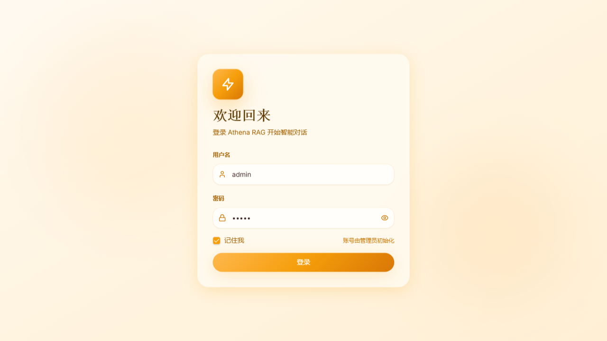

1. 输入用户名和密码
2. 系统验证身份并返回 Token
3. 根据角色跳转：
   - `user` 角色 → 聊天页面 (`/chat`)
   - `admin` 角色 → 管理后台 (`/admin/dashboard`)

## 3. 用户端功能

### 3.1 智能对话

**入口**：`/chat` 或 `/chat/:sessionId`

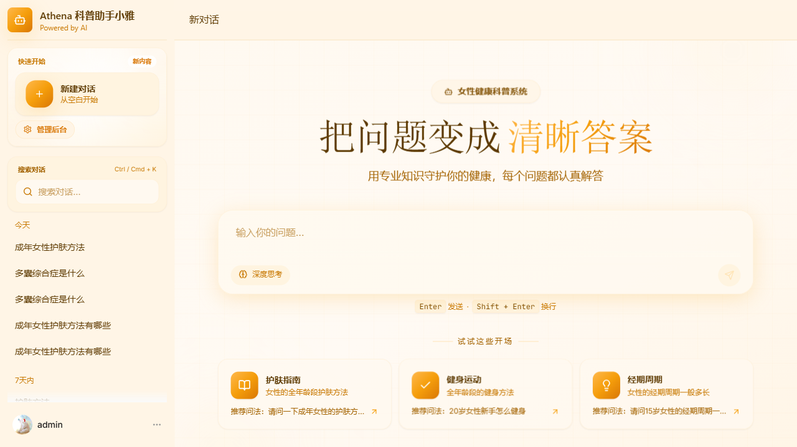

**基础对话**：
1. 在输入框输入问题（1-2000 字符）
2. 点击发送或按 Enter 键
3. 系统实时流式返回 AI 回答
4. 支持 Markdown 渲染和代码高亮

**深度思考模式**：
1. 点击输入框右侧的"深度思考"开关
2. AI 会先展示思考过程，再给出回答
3. 适用于复杂问题分析

**消息操作**：
- 复制消息内容
- 点赞/点踩反馈
- 停止生成（点击"停止"按钮）
- 查看引用来源（点击消息底部的引用链接）

### 3.2 会话管理

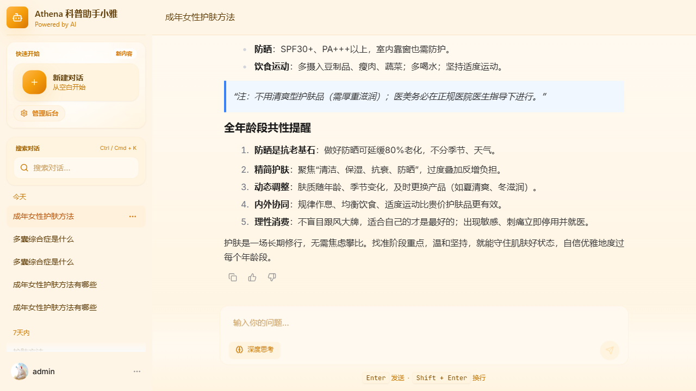

**新建会话**：点击侧边栏顶部"新建对话"按钮

**切换会话**：点击侧边栏中的会话卡片

**重命名会话**：
1. 鼠标悬停在会话卡片上
2. 点击"编辑"图标
3. 输入新名称（1-50 字符）
4. 保存

**删除会话**：
1. 鼠标悬停在会话卡片上
2. 点击"删除"图标
3. 确认删除操作

**注意事项**：
- 会话列表按时间倒序排列
- 删除会话会同时删除所有消息记录
- 会话标题可自动根据首条消息生成

## 4. 管理端功能

### 4.1 仪表板

**入口**：`/admin/dashboard`

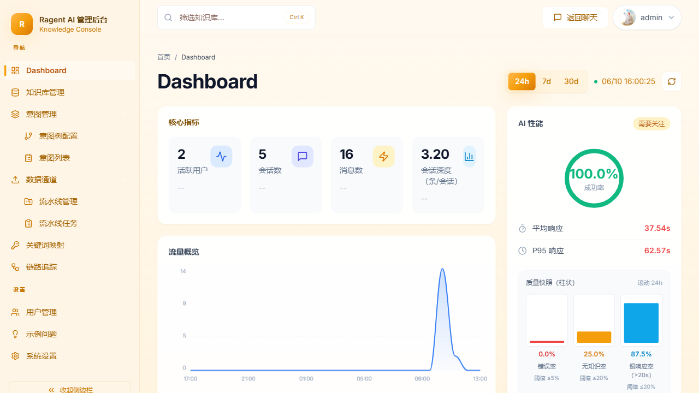

展示系统概览数据：
- 知识库数量
- 文档总数
- 会话总数
- 查询量趋势图（近 7 天）

### 4.2 知识库管理

**入口**：`/admin/knowledge`

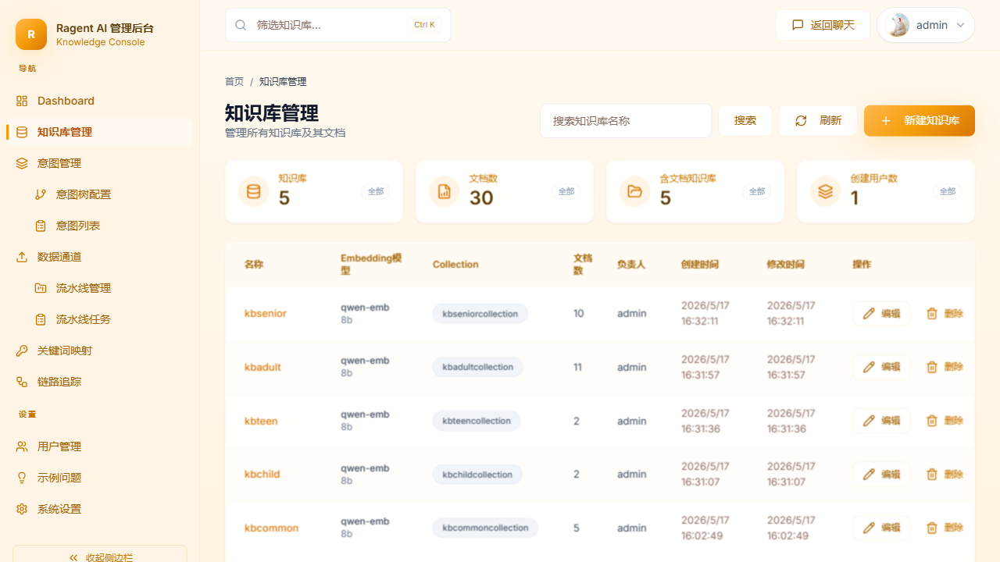

**创建知识库**：
1. 点击"创建知识库"按钮
2. 填写名称、描述
3. 选择嵌入模型（如 `text-embedding-3-small`）
4. 提交创建

**查看知识库列表**：
- 显示所有知识库
- 每个卡片显示：名称、描述、文档数、创建时间

**删除知识库**：
1. 点击知识库卡片右上角"删除"按钮
2. 确认删除操作
3. 注意：删除知识库会同时删除所有关联文档

**文档管理**：
1. 点击知识库卡片进入详情
2. 查看文档列表（文件名、大小、上传时间）
3. 上传新文档（支持 PDF/DOCX/TXT/MD/HTML，< 50MB）
4. 删除文档（点击文档行的删除按钮）
5. 查看文档分块（点击"查看分块"）

### 4.3 数据摄取

**入口**：`/admin/ingestion`

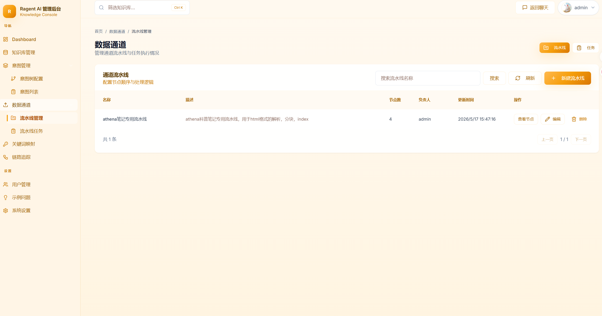

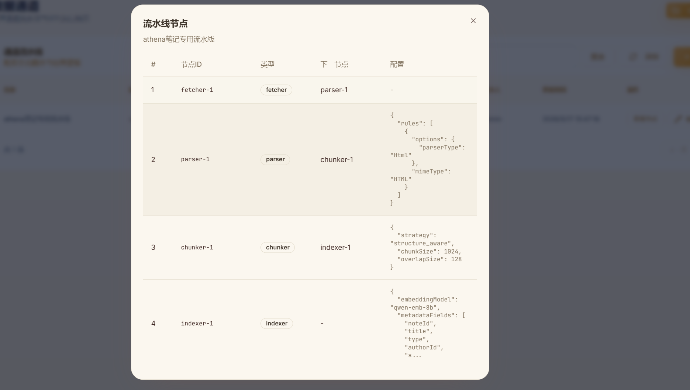

**批量上传文档**：
1. 选择目标知识库
2. 拖拽或点击上传多个文件
3. 配置切分参数：
   - `chunk_size`：256-2048（默认 512）
   - `overlap`：0-200（默认 50）
4. 点击"开始处理"
5. 查看实时处理进度

**查看任务列表**：
- 显示所有上传任务
- 每条记录包含：文件名、状态、进度、时间

### 4.4 意图管理

**树形视图入口**：`/admin/intent-tree`

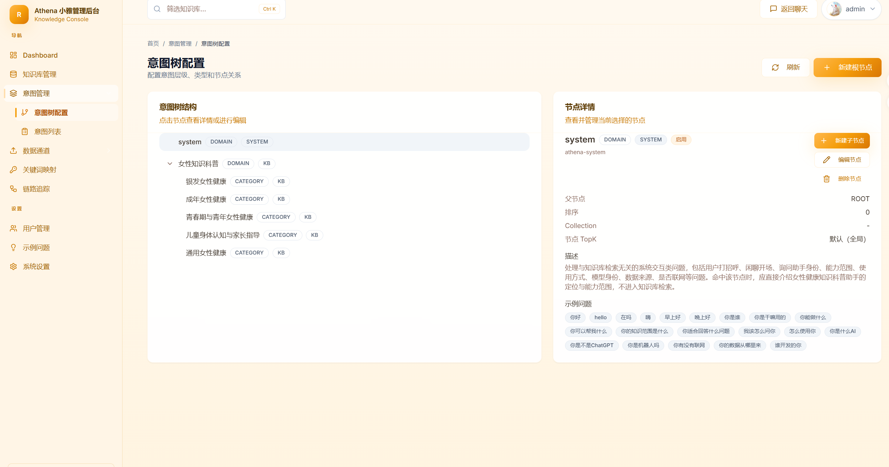

**列表视图入口**：`/admin/intent-list`

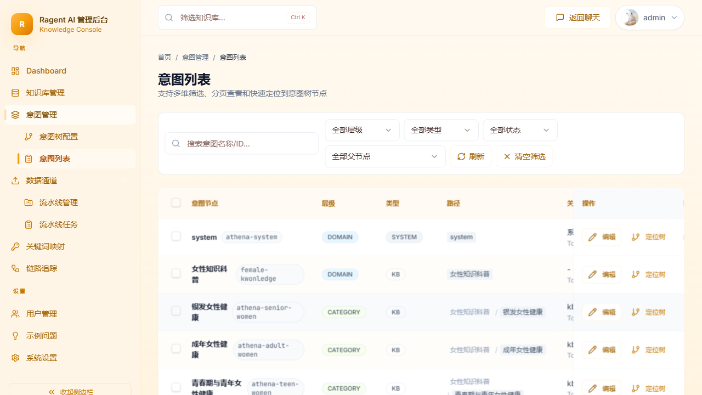

**意图树视图**：
- 以树形结构展示意图层级
- 支持展开/折叠节点
- 直观查看父子关系

**意图列表管理**：
1. 查看所有意图
2. 新建意图：填写名称、父意图、触发关键词、响应策略
3. 编辑意图：修改配置信息
4. 删除意图：移除不需要的意图

### 4.5 链路追踪

**入口**：`/admin/traces`

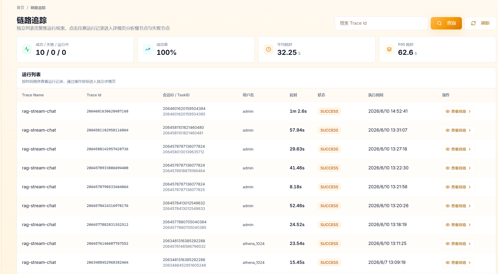

**追踪列表**：
- 查看所有 RAG 调用记录
- 筛选条件：时间范围、状态、关键词
- 显示：查询时间、查询文本、耗时、状态

**追踪详情**：
1. 点击记录行进入详情页
2. 查看完整链路信息：
   - **查询信息**：原始问题、查询时间
   - **检索结果**：匹配文档、相似度分数
   - **生成信息**：使用的模型、Prompt、生成的回答
   - **性能统计**：各阶段耗时、总耗时

### 4.6 示例问题管理

**入口**：`/admin/sample-questions`

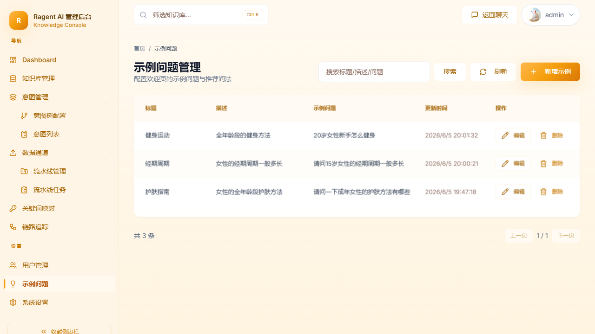

管理聊天页面的示例问题：
1. 查看现有示例问题列表
2. 新建示例问题
3. 编辑问题文本
4. 启用/禁用问题
5. 删除示例问题

### 4.7 查询映射管理

**入口**：`/admin/mappings`

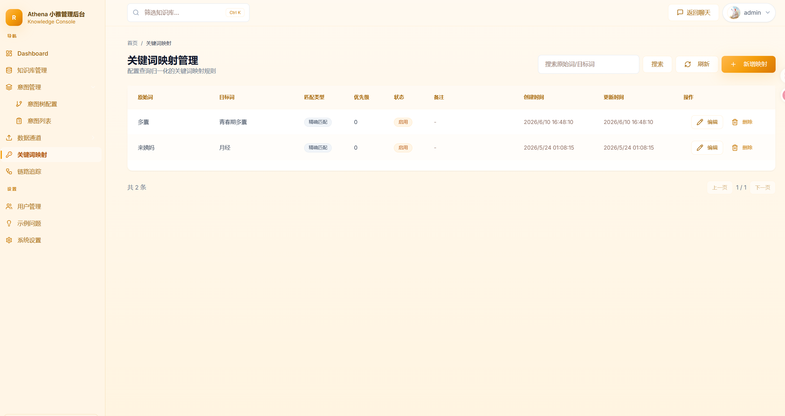

配置查询词映射和同义词转换：
1. 添加映射规则
2. 配置源关键词和目标关键词
3. 测试映射效果
4. 删除过期映射

### 4.8 系统设置

**入口**：`/admin/settings`

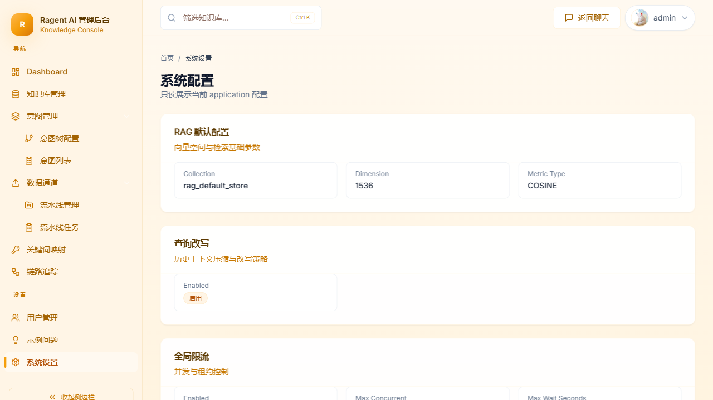

系统设置页面集中管理 RAG 引擎的核心配置参数。

**LLM 配置**：
- 选择大语言模型（如 GPT-4、Claude 等）
- 设置温度参数（0.0 - 1.0，越低越确定）
- 设置最大 Token 数

**向量模型配置**：
- 选择嵌入模型（如 `text-embedding-3-small`）
- 配置向量维度

**检索参数**：
- **Top K** — 每次查询返回的相关文档数量（1-20）
- **相似度阈值** — 文档相关度最低分数（0.0-1.0）

**提示词模板**：
- 编辑系统 Prompt
- 配置回答格式要求

### 4.9 用户管理

**入口**：`/admin/users`

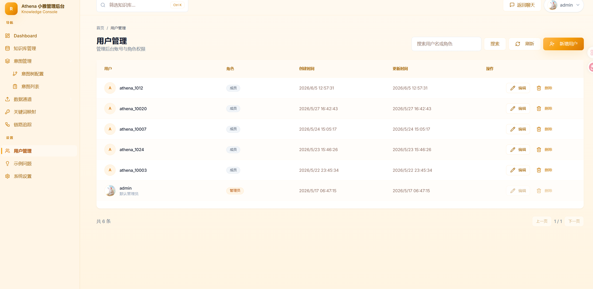

**用户列表**：
- 显示所有用户
- 字段：用户名、角色、创建时间、状态

**新建用户**：
1. 点击"新建用户"
2. 填写用户名（3-20 字符）
3. 设置密码（6-128 字符）
4. 选择角色（user/admin）
5. 提交创建

**修改用户角色**：
1. 点击用户行的"编辑"按钮
2. 修改角色
3. 保存更改

**删除用户**：
1. 点击用户行的"删除"按钮
2. 确认删除操作

## 5. 常见问题

### 5.1 无法连接后端

**现象**：页面提示"网络错误"或"No static resource"

**解决方法**：
1. 确认后端服务运行在 9090 端口
2. 检查 Vite 代理配置是否正确
3. 重启前端开发服务器：`npm run dev`

### 5.2 SSE 连接中断

**现象**：消息流式输出突然停止

**解决方法**：
1. 检查网络连接是否稳定
2. 确认 Nginx 配置了足够的超时时间
3. 点击"停止"按钮后重新发送

### 5.3 文档上传失败

**现象**：文件上传后提示失败

**解决方法**：
1. 检查文件大小是否超过 50MB
2. 确认文件格式是否支持
3. 检查后端存储服务是否正常
4. 查看浏览器控制台错误信息

### 5.4 Token 过期

**现象**：操作时提示"未授权"

**解决方法**：
1. 退出登录
2. 重新登录获取新 Token
3. 如果频繁过期，联系管理员检查 Token 有效期配置

## 6. 使用建议

1. **定期备份数据**：重要知识库应定期导出备份
2. **监控链路追踪**：通过追踪页面监控系统性能和质量
3. **优化检索参数**：根据实际效果调整 Top K 和相似度阈值
4. **维护意图树**：及时更新意图配置以提升问答准确度
5. **清理无效会话**：定期删除测试会话节省存储空间

---

**维护者**: Athena Team  
**最后更新**: 2026-06-10
