# Athena 双端系统使用手册

## 1. 文档说明

本文档用于指导 Athena 系统的日常使用，覆盖管理员网站端 `admin_web_front` 与用户 App 端 `athena_app_front` 的主要功能、页面入口、操作流程和注意事项。

Athena 系统面向女性健康知识传播、社区互动、健康记录和智能辅助咨询等场景。系统由后台内容管理能力与移动端用户服务能力共同组成：管理员与内容发布者在网站端完成内容发布、内容审核、内容维护等工作，普通用户在 App 端完成内容浏览、互动发布、健康记录、AI 咨询和个人资料管理。

## 2. 系统组成与角色

### 2.1 系统组成

- 管理员网站端：`admin_web_front`，主要用于内容审核、内容管理、文章发布、视频发布和平台运营维护。
- 用户 App 端：`athena_app_front`，主要用于健康知识浏览、广场互动、AI 咨询、经期与身体状况记录、分析报告查看和个人中心管理。

### 2.2 用户角色

- 管理员：负责平台内容审核、违规内容处理、已发布内容管理、内容详情查看和运营秩序维护。
- 内容发布者：负责在后台发布图文文章或视频内容，并根据审核结果进行调整。
- App 普通用户：负责在移动端浏览内容、参与互动、记录健康数据、查看分析结果和维护个人资料。

## 3. 管理员网站端使用说明

### 3.1 登录与工作入口

管理员或内容发布者打开网站端后，使用分配的账号登录系统。登录成功后，系统会根据账号角色展示对应功能入口。管理员通常进入内容审核、内容管理等运营页面；内容发布者通常进入发布文章、发布视频等内容生产页面。

使用建议：

1. 首次登录后确认当前账号角色是否正确。
2. 执行审核、删除等敏感操作前，先核对内容标题、作者、类型和发布时间。
3. 若页面数据加载异常，优先检查网络连接、后端服务状态和登录状态是否过期。

### 3.2 内容审核

内容审核页面用于集中处理待审核内容。管理员可在列表中查看内容标题、类型、作者、提交时间和当前状态，并根据平台规范进入详情页进行审核处理。

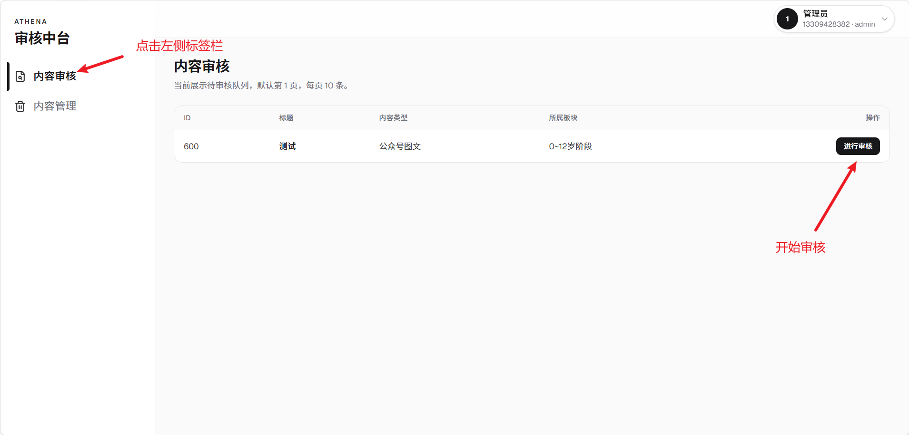

操作流程：

1. 进入后台的内容审核页面。
2. 在审核列表中定位待处理内容，可结合内容类型、提交时间、作者信息进行判断。
3. 点击目标内容的查看或审核入口，进入审核详情页面。
4. 根据内容是否符合平台规范，选择通过、驳回或进一步处理。

审核时应重点关注：

- 内容是否涉及不当医疗承诺、虚假宣传或误导性健康建议。
- 图片、视频、标题和正文是否存在违规表达。
- 内容分类是否准确，是否适合展示给对应用户群体。
- 作者提交的信息是否完整，是否需要退回修改。

### 3.3 审核详情与驳回处理

审核详情页面展示待审核内容的完整信息，管理员应在该页面完成最终判断。对于不符合平台规范的内容，应选择驳回并填写清晰、可执行的驳回原因，便于发布者修改后重新提交。

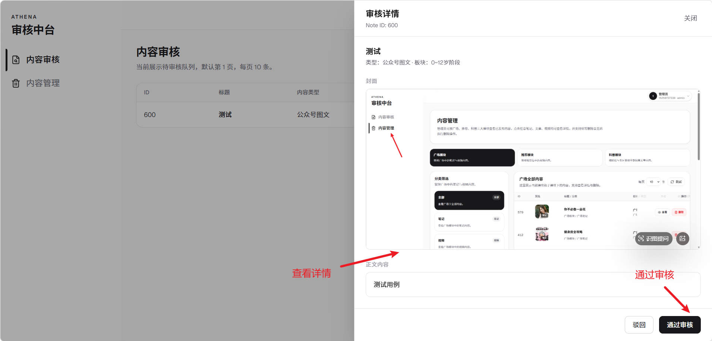

驳回操作页面用于填写处理意见。驳回原因应避免笼统描述，建议明确指出问题位置、违规原因和修改方向。

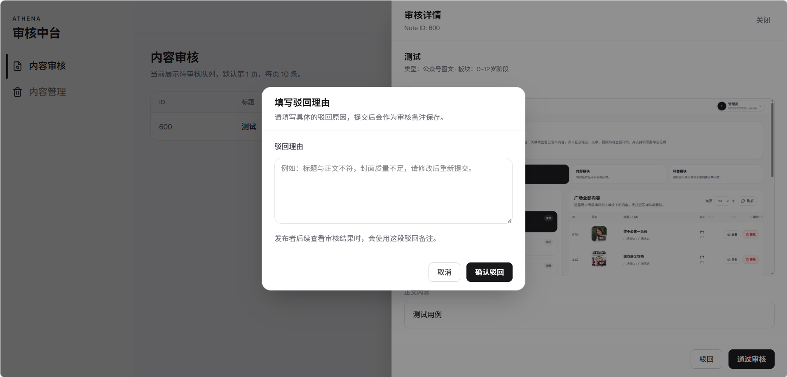

推荐驳回说明写法：

- 标题存在夸大表述，请调整为客观描述。
- 正文涉及诊断或治疗建议，请改为科普性说明，并提醒用户必要时咨询专业医生。
- 图片内容不符合平台展示规范，请替换后重新提交。
- 内容分类与正文主题不一致，请重新选择合适分类。

### 3.4 内容管理

内容管理页面用于查看、检索和维护平台已发布或已入库的内容。管理员可根据内容状态、内容类型、所属模块、作者等条件进行筛选，以便快速定位目标内容。

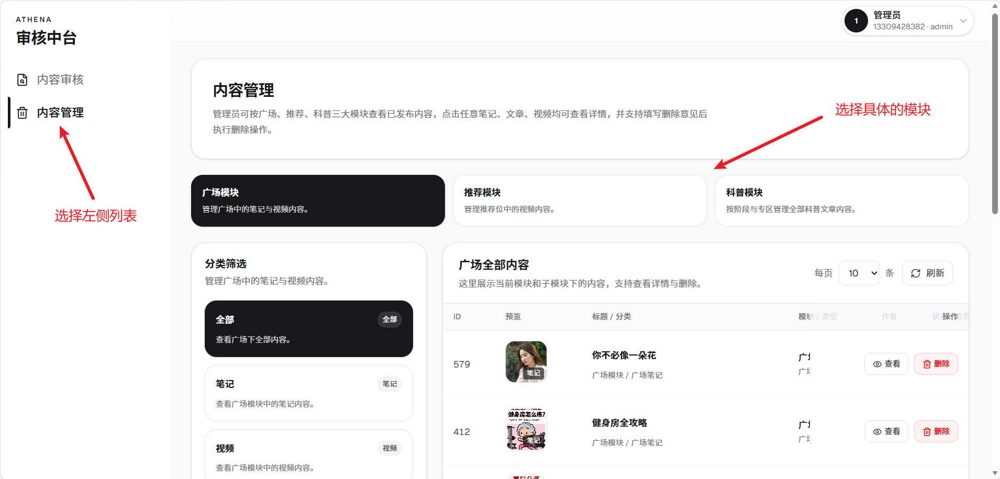

当内容数量较多时，可结合列表字段和筛选条件进行精确定位。管理人员应优先通过标题、发布时间、内容类型和发布状态确认目标内容，避免误操作。

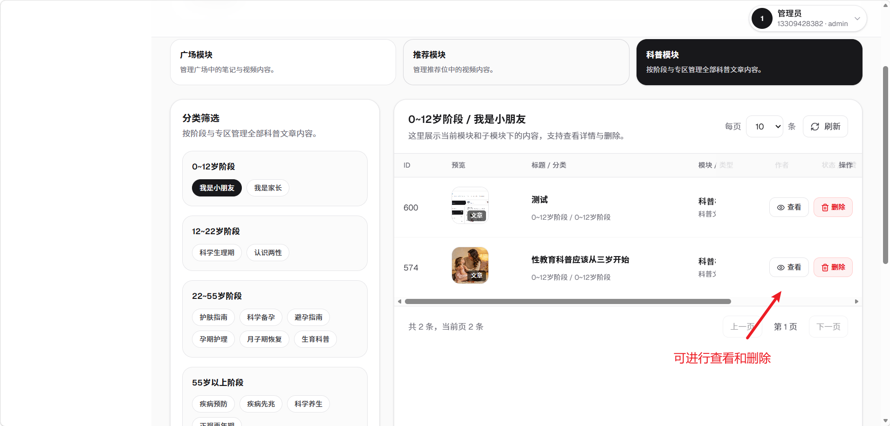

常见操作包括：

1. 查看内容列表，确认内容当前状态。
2. 使用筛选条件缩小查询范围。
3. 进入内容详情页核对完整内容。
4. 对不适合继续展示的内容执行删除或下架处理。

### 3.5 内容详情查看

内容详情页面用于查看某一条内容的完整信息，包括标题、正文、图片或视频信息、作者信息、发布时间和内容状态等。管理员在删除、驳回或其他处理前，应先进入详情页确认内容完整上下文。

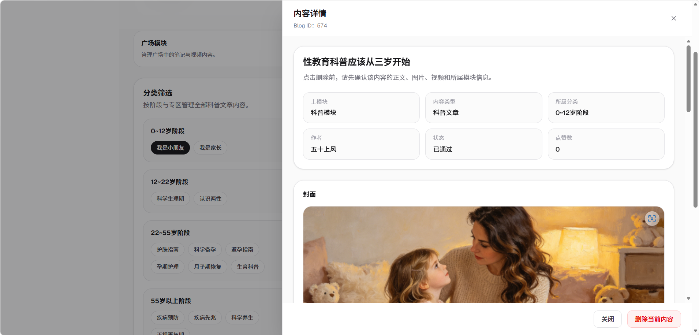

操作要点：

- 核对内容主体是否与列表中选择的记录一致。
- 检查正文、封面、附件和视频是否正常展示。
- 如需处理违规内容，应先记录违规点，再执行删除或驳回。
- 对用户投诉或运营巡检发现的问题内容，应在详情页完成二次确认。

### 3.6 内容删除

内容删除属于高风险操作，通常用于处理违规、重复、错误发布或不再适合展示的内容。删除前应确认内容 ID、标题、作者和处理原因，避免误删正常内容。

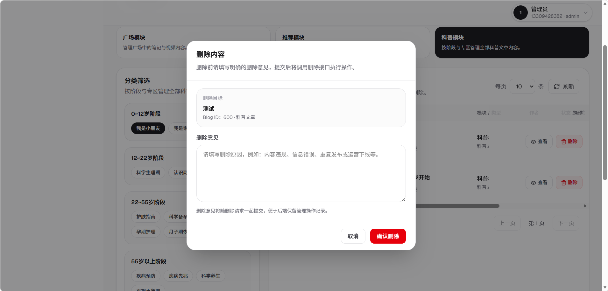

建议流程：

1. 在内容管理列表中定位目标内容。
2. 进入内容详情页进行二次核对。
3. 点击删除按钮后，阅读确认提示。
4. 确认无误后执行删除。
5. 删除后返回列表，检查该内容是否已不再展示或状态已更新。

### 3.7 发布文章

发布文章页面面向内容发布者使用，用于创建健康科普、运营活动、平台公告等图文内容。发布者应按页面要求填写标题、正文、分类、封面等信息，并在提交前检查内容完整性。

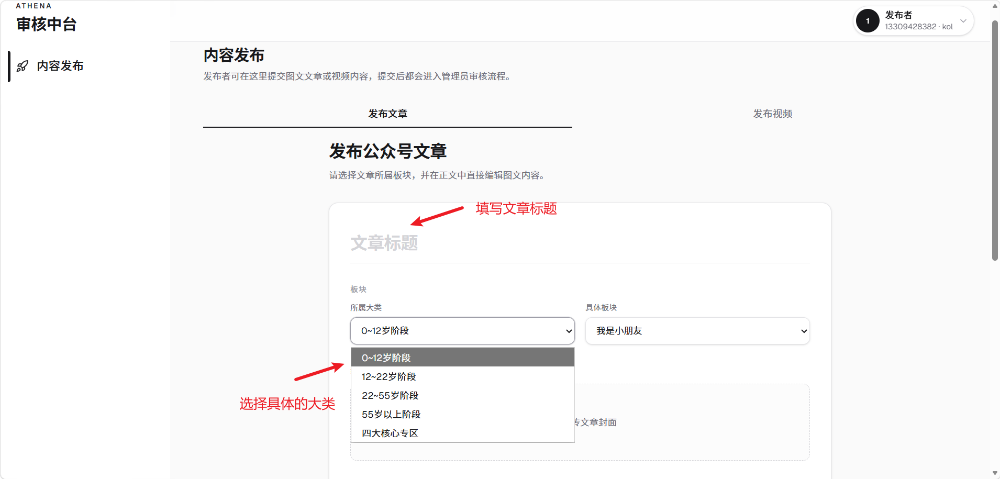

当文章内容较长或包含多项素材时，应分段组织正文，保证标题、正文、图片和分类之间逻辑一致。

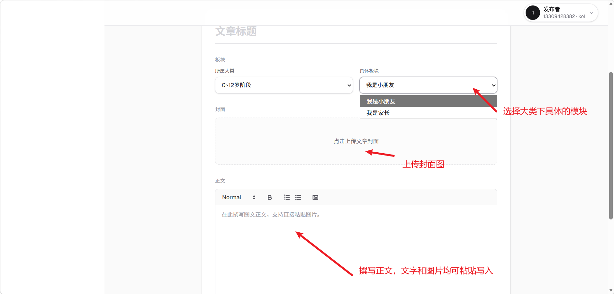

文章发布流程：

1. 进入发布文章页面。
2. 填写文章标题，标题应简洁、准确，避免夸张或误导性表达。
3. 选择文章分类或所属模块。
4. 编辑正文内容，必要时插入图片或补充说明。
5. 上传封面或配图，并检查图片清晰度。
6. 点击提交，等待后台审核。

### 3.8 发布视频

发布视频页面用于提交视频类内容。视频内容通常包括封面、标题、简介、视频文件或视频地址等信息。提交前应确认视频可播放、封面清晰、标题与视频主题一致。

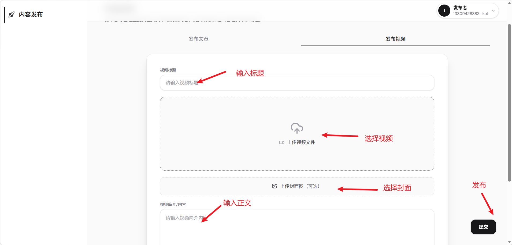

视频发布注意事项：

- 视频内容应与女性健康、科普知识、社区活动或平台主题相关。
- 视频标题应准确概括核心内容。
- 封面图应清晰，不得使用误导性、低俗或违规图片。
- 上传后应确认视频文件加载成功，再提交审核。

## 4. 用户 App 端使用说明

### 4.1 App 首页与推荐内容

用户进入 App 后，可在推荐页浏览系统推送的健康科普、社区内容和运营推荐信息。推荐页通常承担内容发现入口作用，用户可通过卡片、标签或列表进入详情页。

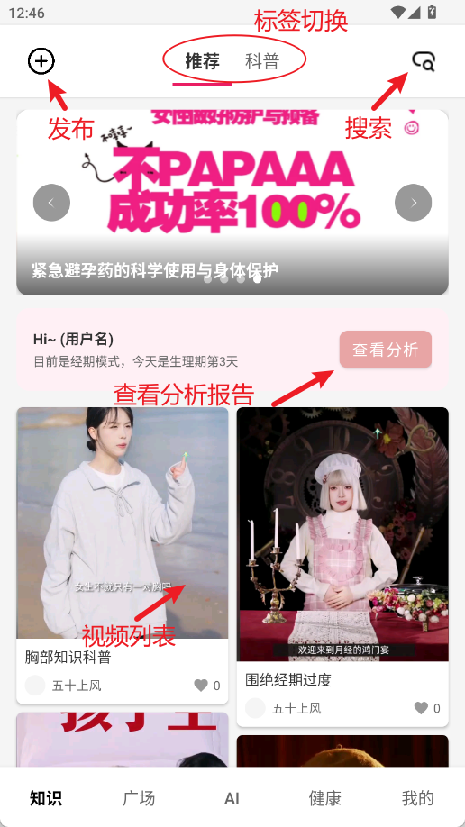

使用方式：

1. 打开 App 后进入推荐或首页内容流。
2. 上下滑动浏览推荐内容。
3. 点击感兴趣的内容卡片进入详情。
4. 根据页面入口切换到知识、广场、AI、记录或我的模块。

### 4.2 知识与科普模块

科普模块用于浏览女性健康相关知识内容。用户可按照主题分类查看文章、视频或 AI 辅助科普内容，适用于经期、备孕、避孕、青春期、成熟期、亲子家庭、皮肤护理等场景的信息获取。

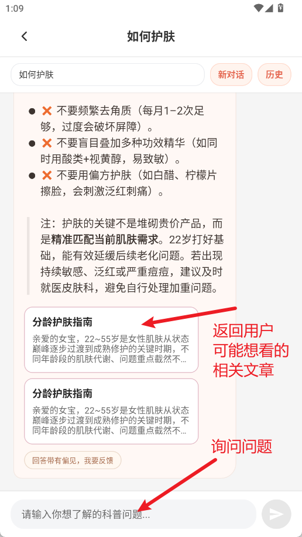

操作说明：

1. 进入知识或科普模块。
2. 根据主题分类选择感兴趣的内容。
3. 点击内容卡片查看详情。
4. 对不理解的问题，可结合 AI 模块继续提问。

使用建议：

- 科普内容用于健康知识参考，不能替代医生诊断。
- 涉及持续疼痛、异常出血、严重不适等情况，应及时寻求专业医疗帮助。
- 阅读内容时注意发布时间、适用人群和内容来源。

### 4.3 广场模块

广场模块用于浏览社区动态、图文内容和视频内容。用户可在此查看他人发布的经验分享、健康记录、话题讨论，也可通过发布入口创建自己的内容。

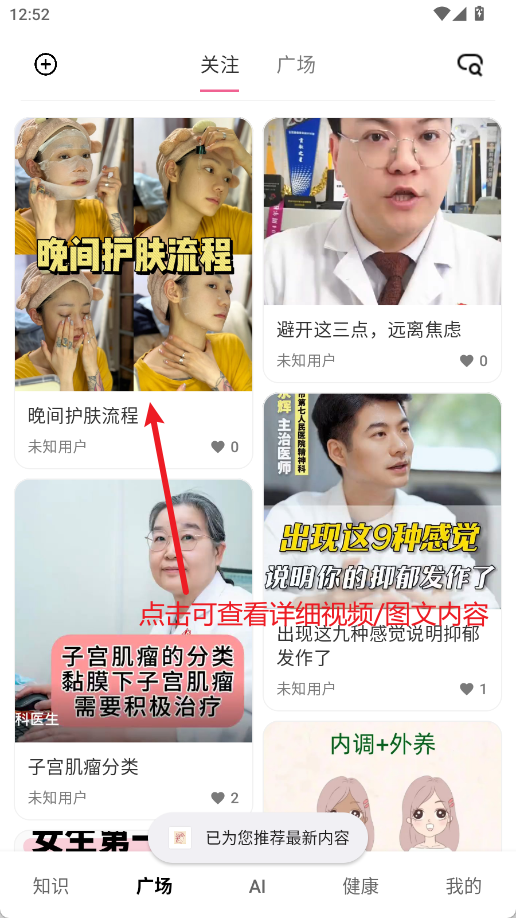

常见操作：

1. 进入广场模块。
2. 浏览图文、视频或话题内容。
3. 点击内容卡片进入详情页。
4. 根据页面功能进行点赞、评论、收藏或分享。
5. 需要发布内容时，点击发布入口进入发布页。

社区互动应遵守平台规范，不发布侵犯隐私、误导医疗、攻击他人或不适合公开展示的内容。

### 4.4 发布页指引

App 端发布页用于引导用户选择发布内容类型。用户可根据实际内容选择图文、视频或其他可用发布形式。

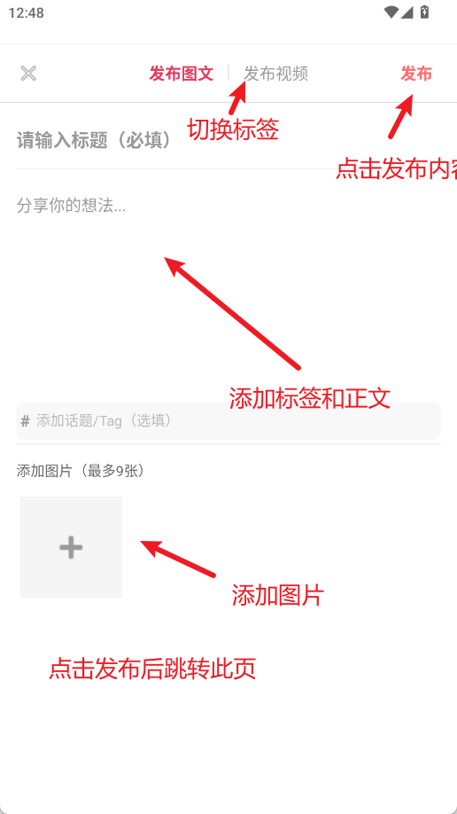

发布建议：

- 发布前确认内容是否适合公开展示。
- 涉及个人健康经历时，避免暴露真实姓名、联系方式、住址、身份证件、病历编号等敏感信息。
- 图片或视频中如包含他人，应确认已获得授权。
- 内容提交后可能进入审核流程，审核通过后才会公开展示。

### 4.5 图文详情

图文详情页展示单条图文内容的完整信息，包括正文、图片、作者、互动区域等。用户可在详情页阅读完整内容，并进行评论、点赞、收藏等互动。

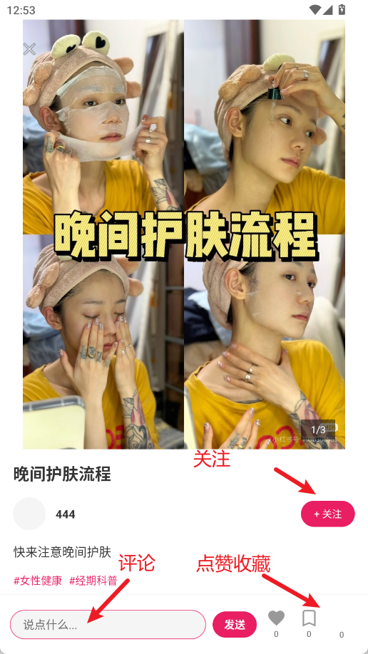

操作说明：

1. 在推荐页或广场页点击图文内容。
2. 阅读正文和图片说明。
3. 如需互动，可使用页面底部或内容区域的评论、点赞、收藏等按钮。
4. 如发现违规内容，可根据页面入口进行反馈或举报。

### 4.6 视频详情

视频详情页用于播放视频内容并展示标题、简介、作者和互动信息。用户应在网络良好的环境下观看视频，避免因网络波动造成加载失败或播放卡顿。

操作说明：

1. 点击视频卡片进入详情页。
2. 等待视频加载后点击播放。
3. 可根据页面提供的控件暂停、继续播放或查看互动信息。
4. 视频内容如涉及健康建议，应结合自身情况理性参考。

### 4.7 AI 模块

AI 模块提供智能问答、健康科普辅助、问题检索和隐私守护等能力。用户可输入健康相关问题，系统会根据问题内容返回参考性回答。

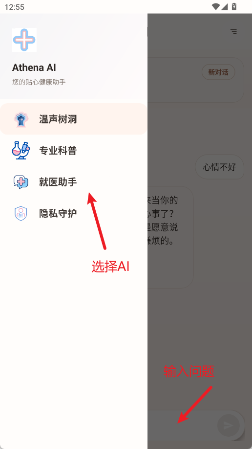

使用流程：

1. 进入 AI 模块。
2. 在输入框中描述问题，建议尽量提供清晰背景，例如年龄阶段、症状持续时间、已采取措施等。
3. 查看 AI 返回的回答，并结合推荐内容继续阅读。
4. 如问题涉及急性疼痛、严重不适、异常出血或用药安全，应及时咨询专业医生。

注意事项：

- AI 回答仅作信息参考，不构成诊断结论。
- 不建议输入身份证号、手机号、住址、完整病历等高敏感信息。
- 对重要健康决策，应以专业医疗机构意见为准。

### 4.8 隐私守护 AI

隐私守护 AI 用于提醒用户识别敏感信息、保护个人隐私，并辅助判断内容是否适合公开发布。该功能尤其适用于社区发布、个人资料展示和健康内容咨询场景。

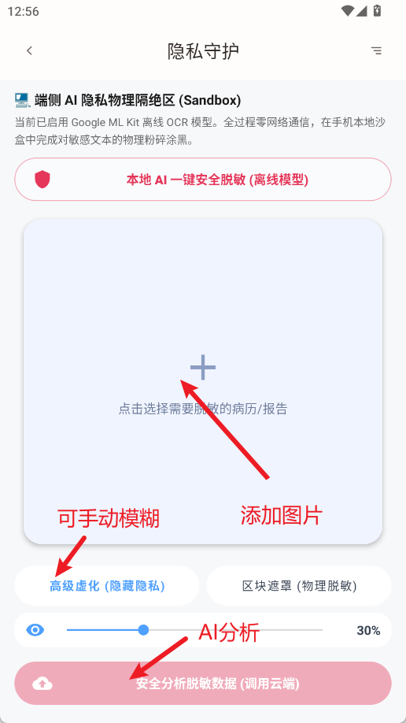

建议使用场景：

- 发布社区内容前，检查是否包含过度暴露的个人信息。
- 咨询健康问题前，删除身份证号、手机号、住址等敏感字段。
- 对图片、文字中可能出现的隐私风险进行二次确认。

### 4.9 记录经期

记录经期功能用于记录月经开始日期、结束日期、周期变化和相关状态。系统可根据历史记录辅助用户了解周期规律，并为后续分析报告提供数据基础。

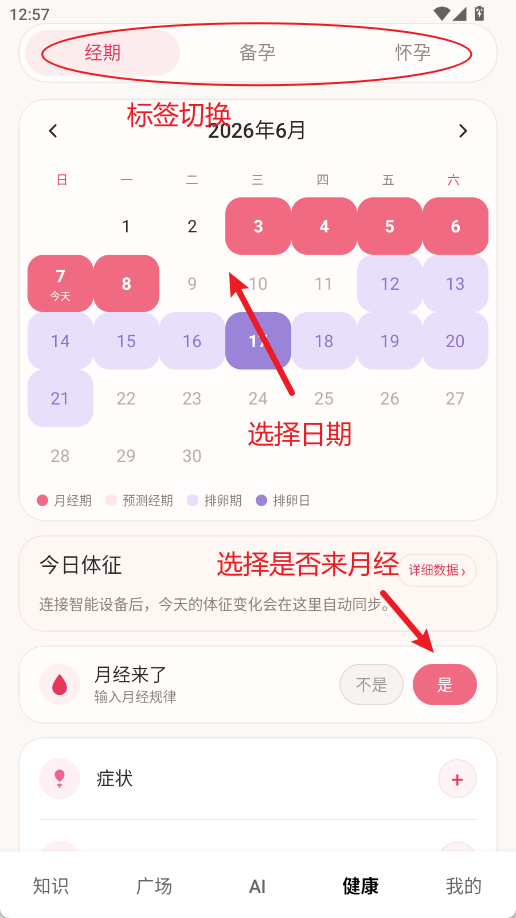

操作流程：

1. 进入记录模块。
2. 选择经期开始日期和结束日期。
3. 根据页面提示保存记录。
4. 持续记录多个周期后，可查看趋势和分析结果。

记录建议：

- 经期开始与结束日期应尽量按实际情况填写。
- 若周期长期异常、经量明显变化或伴随严重疼痛，应及时就医。
- 数据越连续，分析结果越具有参考价值。

### 4.10 记录身体状况

健康模块中的身体状况记录用于补充经期之外的健康事件，例如疼痛、情绪、睡眠、分泌物、用药或其他身体变化。该信息可帮助用户更完整地回顾身体状态。

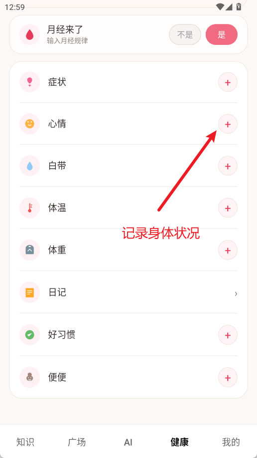

操作说明：

1. 进入健康或记录模块。
2. 选择需要记录的身体状况类型。
3. 按页面提示填写日期、状态、备注等信息。
4. 保存后，可在记录或分析页面查看历史数据。

### 4.11 分析报告

分析报告页面根据用户的经期记录、身体状况记录和相关数据生成概览结果，帮助用户了解周期变化、健康趋势和可能需要关注的事项。

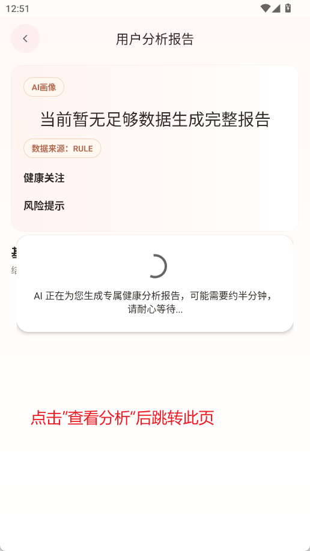

查看建议：

- 优先关注周期长度、经期持续时间和异常提示。
- 将报告作为自我观察工具，不作为医学诊断依据。
- 若报告提示异常或用户自身感到明显不适，应结合线下医疗咨询。

### 4.12 我的界面

我的界面是用户个人中心入口，集中展示账号资料、个人信息、隐私功能、关注粉丝、内容管理或其他个人服务入口。

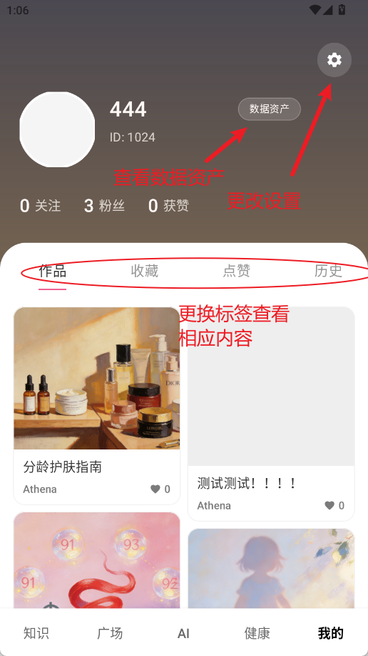

常见操作：

1. 查看当前登录账号信息。
2. 进入个人资料页面编辑头像、昵称或简介。
3. 查看关注、粉丝、收藏或发布记录。
4. 进入隐私保护、设置或其他个人服务入口。

### 4.13 个人信息管理

个人信息页面用于维护用户基础资料。用户可根据实际需要修改头像、昵称、性别、生日、简介等信息。资料修改后，部分信息可能会展示在社区或个人主页中，因此应注意隐私边界。

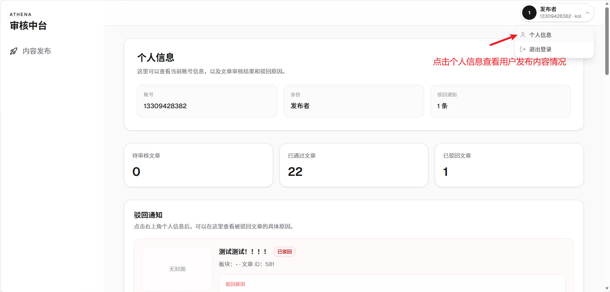

在编辑个人资料时，用户应确认页面中每项信息的展示范围，避免填写过多真实身份信息。

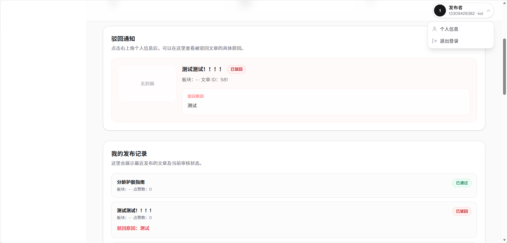

操作流程：

1. 从我的界面进入个人信息页面。
2. 点击需要修改的字段。
3. 按页面提示完成编辑。
4. 保存后返回个人中心，确认信息已更新。

资料填写建议：

- 昵称可使用非真实姓名。
- 头像应避免使用包含证件、住址、联系方式的图片。
- 简介不建议填写手机号、微信号、住址、学校班级、工作单位等敏感信息。

## 5. 常见问题与处理建议

### 5.1 登录状态异常

若出现无法进入页面、接口提示未授权或页面反复跳转登录页，可尝试退出账号后重新登录。若问题仍然存在，应联系管理员检查账号状态、权限配置和后端服务状态。

### 5.2 图片或视频无法加载

若图片、视频加载失败，优先检查网络连接是否正常，再确认服务端资源地址是否可访问。对于后台上传场景，应确认文件格式、文件大小和上传过程是否符合系统限制。

### 5.3 内容提交后未展示

内容提交后可能需要经过审核流程。若提交后未立即展示，属于正常情况。发布者可在后台或个人发布记录中查看审核状态。若被驳回，应根据驳回原因修改后重新提交。

### 5.4 AI 回答不符合预期

AI 回答依赖用户输入的问题描述。建议用户使用完整、清晰、具体的表达方式提问，例如说明问题持续时间、相关背景和希望获得的帮助类型。涉及诊疗、用药、急症或高风险健康问题时，应及时咨询专业医生。

## 6. 操作安全与隐私规范

- 后台管理员执行审核、删除、驳回等操作前，应完成二次确认。
- 内容发布者应确保发布内容真实、合规、来源清晰。
- App 用户不应公开发布身份证号、手机号、住址、病历编号、检查报告原图等敏感信息。
- 平台健康知识、AI 回答和分析报告均为辅助参考，不替代专业医疗诊断。
- 若账号、内容或数据出现异常，应保留问题截图、发生时间和操作路径，便于技术人员排查。

  