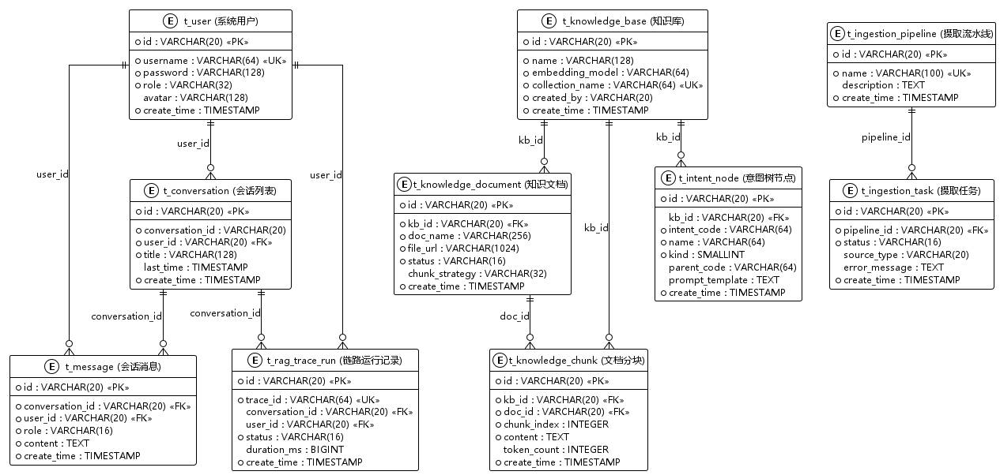

# Athena RAG (Ragent) 数据库设计文档

## 1. 文档说明
本文件详细记录了 `athena-rag` (代号 Ragent) 模块的数据库表结构设计。该模块主要负责知识库管理、RAG 摄取流水线、会话记录、意图识别配置以及系统链路追踪（Trace）。

### 技术栈
- **数据库**：PostgreSQL
- **扩展**：`pgvector` (用于向量存储与检索)
- **ID 策略**：雪花算法或分布式唯一 ID (VARCHAR(20))

---

## 2. 数据库概览

### 2.1 核心模块分类
1. **用户与会话**：管理用户、会话列表及消息历史。
2. **知识库管理**：管理知识库、文档、分块及定时任务。
3. **意图与查询**：意图树配置、关键词归一化。
4. **摄取流水线 (Ingestion)**：配置与执行文档处理任务。
5. **链路追踪 (Trace)**：记录 RAG 过程中的每一步执行状态与耗时。

### 2.2 表清单摘要
| 表名 | 说明 |
| :--- | :--- |
| `t_user` | 系统用户表 |
| `t_conversation` | 会话列表 |
| `t_message` | 会话消息记录 |
| `t_knowledge_base` | 知识库定义 |
| `t_knowledge_document` | 知识库文档 |
| `t_knowledge_chunk` | 文档分块信息 |
| `t_intent_node` | 意图树节点配置 |
| `t_rag_trace_run` | Trace 链路运行记录 |
| `t_ingestion_pipeline` | 摄取流水线定义 |

---

## 3. 表结构详解

### 3.1 用户与会话模块

#### 系统用户表 (`t_user`)
| 字段名 | 类型 | 说明 |
| :--- | :--- | :--- |
| `id` | VARCHAR(20) | 主键 ID |
| `username` | VARCHAR(64) | 用户名 (唯一) |
| `password` | VARCHAR(128)| 密码 |
| `role` | VARCHAR(32) | 角色 (admin/user) |
| `avatar` | VARCHAR(128)| 头像 URL |
| `create_time` | TIMESTAMP | 创建时间 |

#### 会话列表 (`t_conversation`)
| 字段名 | 类型 | 说明 |
| :--- | :--- | :--- |
| `id` | VARCHAR(20) | 主键 ID |
| `conversation_id` | VARCHAR(20) | 会话 ID |
| `user_id` | VARCHAR(20) | 用户 ID |
| `title` | VARCHAR(128)| 会话标题 |
| `last_time` | TIMESTAMP | 最近消息时间 |

#### 会话消息记录表 (`t_message`)
| 字段名 | 类型 | 说明 |
| :--- | :--- | :--- |
| `id` | VARCHAR(20) | 主键 ID |
| `conversation_id` | VARCHAR(20) | 会话 ID |
| `role` | VARCHAR(16) | 角色 (user/assistant) |
| `content` | TEXT | 消息内容 |

---

### 3.2 知识库模块

#### 知识库表 (`t_knowledge_base`)
| 字段名 | 类型 | 说明 |
| :--- | :--- | :--- |
| `id` | VARCHAR(20) | 主键 ID |
| `name` | VARCHAR(128)| 知识库名称 |
| `embedding_model` | VARCHAR(64) | 嵌入模型标识 |
| `collection_name` | VARCHAR(64) | 向量集合名称 (唯一) |

#### 知识库文档表 (`t_knowledge_document`)
| 字段名 | 类型 | 说明 |
| :--- | :--- | :--- |
| `id` | VARCHAR(20) | 主键 ID |
| `kb_id` | VARCHAR(20) | 所属知识库 ID |
| `doc_name` | VARCHAR(256)| 文档名称 |
| `status` | VARCHAR(16) | 状态 (pending/running/success/failed) |
| `file_url` | VARCHAR(1024)| 文件存储路径 |
| `chunk_strategy` | VARCHAR(32) | 分块策略 |

#### 知识库向量存储表 (`t_knowledge_vector`)
*注意：此表利用 pgvector 扩展存储向量数据。*
| 字段名 | 类型 | 说明 |
| :--- | :--- | :--- |
| `id` | VARCHAR(20) | 分块 ID |
| `content` | TEXT | 文本内容 |
| `metadata` | JSONB | 元数据 |
| `embedding` | vector(1536)| 向量数据 (1536 维) |

---

### 3.3 意图与查询模块

#### 意图树节点配置表 (`t_intent_node`)
用于定义 RAG 系统的路由逻辑与 Prompt 模板。
| 字段名 | 类型 | 说明 |
| :--- | :--- | :--- |
| `id` | VARCHAR(20) | 主键 ID |
| `intent_code` | VARCHAR(64) | 业务唯一标识 |
| `name` | VARCHAR(64) | 展示名称 |
| `kind` | SMALLINT | 类型 (0:RAG知识库, 1:SYSTEM系统交互) |
| `prompt_template` | TEXT | 提示词模板 |

---

### 3.4 链路追踪模块 (Trace)

#### Trace 运行记录表 (`t_rag_trace_run`)
| 字段名 | 类型 | 说明 |
| :--- | :--- | :--- |
| `id` | VARCHAR(20) | 主键 ID |
| `trace_id` | VARCHAR(64) | 全局链路 ID |
| `status` | VARCHAR(16) | 运行状态 |
| `duration_ms` | BIGINT | 总耗时 (毫秒) |

---

### 3.5 摄取流水线模块 (Ingestion)

#### 摄取任务表 (`t_ingestion_task`)
| 字段名 | 类型 | 说明 |
| :--- | :--- | :--- |
| `id` | VARCHAR(20) | 主键 ID |
| `pipeline_id` | VARCHAR(20) | 流水线 ID |
| `status` | VARCHAR(16) | 任务状态 |
| `error_message` | TEXT | 错误信息 |

---

## 4. 关键特性说明

### 4.1 向量检索 (pgvector)
系统利用 PostgreSQL 的 `pgvector` 插件进行向量存储。
- **索引类型**：HNSW (Hierarchical Navigable Small World)
- **距离度量**：余弦相似度 (`vector_cosine_ops`)

### 4.2 软删除机制
大部分业务表包含 `deleted` 字段：
- `0`：正常
- `1`：已删除

### 4.3 JSONB 支持
针对配置项（如 `chunk_config`）和链路追踪数据（如 `extra_data`），系统大量使用 `JSONB` 格式，以平衡存储灵活性与查询性能。
