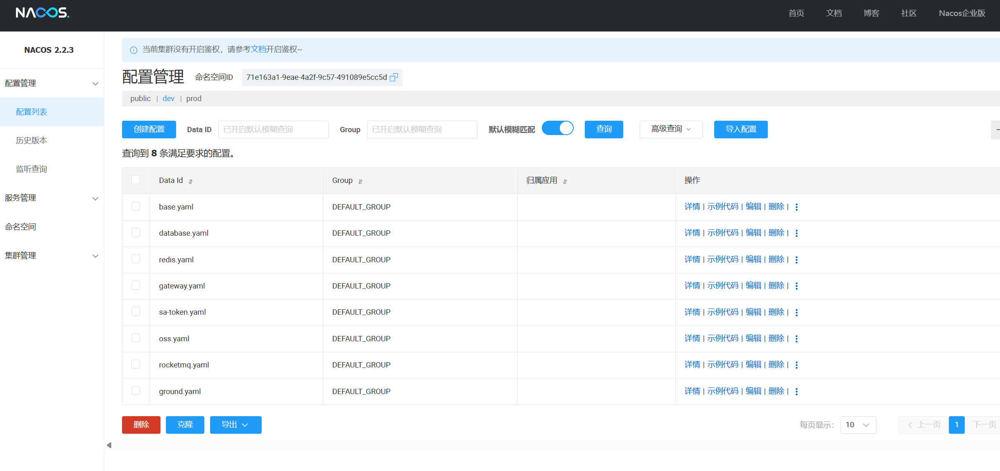

# Athena 双端系统总体架构文档

> 版本：v1.4  
> 更新时间：2026-06-07  
> 适用范围：管理员网站端 `admin_web_front`、Android 用户端 `athena_app_front`、后端微服务体系

---

## 1. 文档定位与阅读逻辑

本文档用于说明 Athena 系统的总体技术架构和双端协同关系。文档按“整体架构 -> 端侧架构 -> 后端支撑 -> 业务链路 -> 详细实现”的顺序组织，使读者能够先理解系统全貌，再进入各端实现细节。

阅读顺序建议如下：

1. 先阅读第 2 章，了解系统由哪些端、哪些后端服务和哪些基础设施组成。
2. 再阅读第 3 章，理解管理员网站端、Android 用户端与后端服务之间的职责分工。
3. 然后阅读第 4 章，掌握登录鉴权、内容、AI、健康记录、上传等关键链路如何跨端流转。
4. 需要了解后端微服务内部结构时，阅读第 6 章。该章节保留原后端架构内容，技术细节不做改写。
5. 需要了解两个前端工程内部结构时，阅读第 7 章和第 8 章。

与其他文档的边界：

- 《需求规格.md》说明系统要满足什么需求。
- 《功能设计.md》说明功能模块如何划分、业务状态如何设计。
- 《使用手册.md》说明最终用户如何使用系统。
- 本文档说明系统各端如何组织、如何通信、如何协同完成业务闭环。

---

## 2. 系统总体架构

Athena 是一个面向女性健康场景的双前端、多后端服务系统。整体由管理员网站端、Android 用户端、API 网关、后端微服务、AI/RAG 服务、对象存储、数据库和缓存等部分组成。

### 2.1 总体架构视图

```text
┌──────────────────────────────────────────────────────────────┐
│                          用户入口层                           │
├──────────────────────────────┬───────────────────────────────┤
│ admin_web_front               │ athena_app_front              │
│ 管理员网站端                   │ Android 用户端                 │
│ React + TypeScript            │ Native Android Java            │
│ 审核 / 管理 / 发布 / 设置       │ 浏览 / 互动 / 记录 / AI / 隐私   │
└───────────────┬──────────────┴───────────────┬───────────────┘
                │                              │
                │ HTTP + Bearer Token          │ HTTP/SSE + Bearer Token
                │                              │
┌───────────────▼──────────────────────────────▼───────────────┐
│                     athena-gateway API 网关                    │
│        统一入口 / 路由转发 / Sa-Token 鉴权 / userId 透传         │
└───────────────┬──────────────────────────────┬───────────────┘
                │                              │
┌───────────────▼──────────────────────────────▼───────────────┐
│                         后端业务服务层                         │
├──────────────┬─────────────┬─────────────┬──────────────────┤
│ userauth     │ ground      │ comment     │ relation         │
│ 登录与用户    │ 内容与广场   │ 评论互动     │ 关注粉丝关系       │
├──────────────┼─────────────┼─────────────┼──────────────────┤
│ record       │ insight     │ oss         │ rag              │
│ 健康记录      │ 洞察报告     │ 文件存储     │ AI/RAG 问答       │
└──────────────┴─────────────┴─────────────┴──────────────────┘
                │
┌───────────────▼──────────────────────────────────────────────┐
│                         基础设施层                            │
│ MySQL / Redis / Nacos / RocketMQ / 对象存储 / 向量库 / LLM      │
└──────────────────────────────────────────────────────────────┘
```

### 2.2 架构分层说明

| 层级 | 组成 | 核心职责 |
| --- | --- | --- |
| 用户入口层 | 管理员网站端、Android 用户端 | 承载不同角色的交互入口和端侧体验 |
| 前端应用层 | React SPA、Android Activity/Fragment | 页面组织、路由导航、状态展示、输入校验、调用接口 |
| 接入层 | Spring Cloud Gateway | 统一 API 入口、Token 校验、路由转发、用户上下文透传 |
| 业务服务层 | userauth、ground、comment、relation、record、insight、oss、rag | 分域承载登录、内容、互动、健康记录、AI 等业务能力 |
| 基础设施层 | MySQL、Redis、Nacos、RocketMQ、对象存储、向量库、LLM | 数据持久化、缓存、服务发现、异步消息、文件存储和 AI 能力支撑 |

### 2.3 架构设计原则

- 双端分工：Web 端负责平台治理和内容生产，App 端负责用户服务和健康数据记录。
- 网关统一：所有业务请求统一经过 `athena-gateway`，前端不直接感知具体微服务实例。
- 服务分域：后端按认证、内容、评论、关系、记录、洞察、文件、AI 拆分，降低模块耦合。
- 数据闭环：内容从发布、审核、展示、互动到治理形成闭环；健康数据从记录、同步、分析到报告形成闭环。
- 权限分层：前端负责体验层路由保护和操作引导，后端负责最终鉴权和业务权限校验。
- 隐私优先：健康记录、AI 咨询、私密图片等敏感数据遵循最小展示、最小上传和用户确认原则。

---

## 3. 前后端职责划分

### 3.1 管理员网站端职责

管理员网站端 `admin_web_front` 是平台运营侧入口，服务对象是管理员和内容发布者。

主要职责：

- 管理员登录和发布者登录。
- 根据 `admin`、`kol` 角色进行页面级权限分流。
- 管理员处理待审核内容、审核详情、驳回和删除。
- 管理员维护已发布或已入库内容。
- 内容发布者提交文章、视频和对应素材。
- 将文件上传、内容提交、审核处理等请求转发给后端服务。

它不直接承担普通用户健康记录、社区消费、AI 聊天体验等能力。

### 3.2 Android 用户端职责

Android 用户端 `athena_app_front` 是普通用户使用 Athena 的主要入口。

主要职责：

- 用户登录注册和本地登录态维护。
- 推荐、知识、广场内容浏览。
- 图文详情、视频详情、评论、点赞、收藏、关注等社区互动。
- App 端图文或视频发布。
- AI 问答、RAG 流式回复、会话历史和引用文章展示。
- 经期、备孕、身体状况等健康数据记录。
- 分析报告、健康趋势和洞察内容展示。
- 隐私守护、私密图库、本地 OCR 和脱敏处理。
- 个人中心、资料编辑、关注粉丝和设置。

它不直接承担后台审核、运营内容治理和管理员配置能力。

### 3.3 后端服务职责

后端微服务负责业务主数据、最终权限校验、服务协同和基础能力封装。

| 服务 | 面向前端能力 | 核心职责 |
| --- | --- | --- |
| `athena-gateway` | 两个前端共同入口 | 路由、鉴权、上下文透传 |
| `athena-userauth` | 登录、用户资料 | 认证、用户信息、Token 相关能力 |
| `athena-ground` | 内容、广场、发布、审核 | 笔记、文章、视频、审核、广场内容 |
| `athena-comment` | 评论与回复 | 评论发布、列表、二级回复、评论点赞 |
| `athena-relation` | 关注粉丝 | 关注、取消关注、关注列表、粉丝列表 |
| `athena-record` | 经期和健康记录 | 周期记录、日常健康记录、月视图与统计 |
| `athena-insight` | 推荐和分析报告 | 个性化推荐、健康洞察、分析报告 |
| `athena-oss` | 文件上传 | 图片、视频等资源上传与访问 URL 返回 |
| `athena-rag` | AI 问答和知识检索 | RAG 检索、LLM 调用、SSE 流式输出、引用生成 |

### 3.4 职责边界总结

```text
Web 端负责：后台运营动作、角色分流、内容审核、内容管理、正式内容发布。
App 端负责：用户体验、内容消费、社区互动、健康记录、AI 咨询、隐私处理。
后端负责：业务主数据、服务编排、权限校验、状态流转、文件存储、AI/RAG 能力。
网关负责：统一入口、Token 校验、路由转发、userId 透传。
```

---

## 4. 核心业务链路与跨端协同

### 4.1 登录鉴权链路

两个前端都通过后端认证体系获取 Token，并在后续请求中携带 `Authorization: Bearer <token>`。

```text
用户提交登录信息
  -> 前端调用登录接口
  -> athena-userauth 校验身份
  -> 返回 Token、用户信息和角色信息
  -> Web 存入 localStorage 会话
  -> App 存入本地数据库或 SharedPreferences
  -> 后续请求统一携带 Authorization
  -> athena-gateway 校验 Token
  -> 校验成功后透传 userId 到后端服务
```

Web 端重点使用角色信息控制后台页面访问；App 端重点使用 Token 判断是否展示完整主导航、是否允许发布、评论、记录和查看个人服务。

### 4.2 内容生产、审核与展示链路

内容链路是 Web 端和 App 端联系最紧密的部分。

```text
Web 发布者创建文章或视频
  -> 上传封面、图片或视频到 athena-oss
  -> 提交内容主体到 athena-ground
  -> 内容进入待审核或管理流程
  -> Web 管理员审核、驳回、删除或维护内容
  -> 审核通过内容进入 App 推荐、知识或广场
  -> App 用户浏览、点赞、收藏、评论、关注
  -> 互动数据写入 comment、relation、ground 等服务
  -> Web 管理员可继续对内容进行治理
```

该链路体现了平台内容治理闭环：Web 端负责入口和治理，App 端负责展示和互动，后端负责状态、数据和权限一致性。

### 4.3 App 用户发布与后台治理链路

App 用户也可以发布图文或视频内容，但其定位更偏社区分享。

```text
App 用户发布图文或视频
  -> App 上传图片或视频
  -> App 提交内容文本、资源 URL 和分类信息
  -> athena-ground 创建内容记录
  -> 内容根据规则进入审核或展示流程
  -> Web 管理员在审核或内容管理中治理该内容
  -> 合规内容继续展示在 App 广场或相关内容流
```

因此，App 发布不是孤立功能，而是内容中心的一部分，需要接入同一套内容状态和后台治理能力。

### 4.4 AI/RAG 问答链路

AI 能力以后端 `athena-rag` 为核心，App 端负责流式消费和展示。

```text
App 用户输入健康或科普问题
  -> RagSseClient 构造 SSE 请求
  -> 请求携带 Token、question、conversationId、deepThinking
  -> athena-gateway 完成鉴权和路由
  -> athena-rag 加载会话、问题改写、意图识别
  -> 检索知识库和相关内容
  -> 调用 LLM 生成回答
  -> 通过 SSE 返回 meta、message、finish、done 事件
  -> App 端增量展示回答
  -> finish 中的引用内容可跳转到文章或图文详情
```

这条链路把 AI 问答与内容中心连接起来：AI 不只是生成文本，还能返回可追溯的内容引用，帮助用户继续阅读系统内知识内容。

### 4.5 健康记录与分析报告链路

健康数据主要由 App 端产生，由后端记录和洞察服务支撑。

```text
App 用户记录经期、备孕或身体状况
  -> CycleApiService / HealthRecordApiService 提交数据
  -> athena-record 保存经期和日常健康记录
  -> App 请求月视图、历史记录、预测和统计
  -> athena-insight 基于记录生成分析报告或推荐内容
  -> AnalysisReportActivity 展示分析结果
```

健康数据属于敏感个人数据，不进入公开内容流。App 负责输入和展示，后端负责持久化和分析，Web 管理端不直接编辑普通用户健康记录。

### 4.6 文件上传与资源访问链路

两个前端都可能使用文件上传能力。

```text
Web 或 App 选择图片/视频/头像
  -> 前端进行基础类型和大小校验
  -> 调用 athena-oss 文件上传接口
  -> 后端返回资源 URL
  -> 前端将 URL 写入文章、视频、头像、社区内容或隐私处理结果
  -> 后续页面通过 URL 加载资源
```

文件本体由对象存储服务管理，业务服务只保存资源地址和业务关联关系。

### 4.7 隐私处理链路

隐私处理主要发生在 App 端，尤其是私密图库、图片 OCR、AI 咨询和健康记录场景。

```text
用户选择图片或输入敏感文本
  -> App 本地执行 OCR、遮挡、脱敏或敏感提示
  -> 用户预览和确认处理结果
  -> 必要时再上传处理后的数据
  -> 后端或 AI 服务只接收用户确认后的内容
```

该链路的关键是“本地优先、用户确认、最小上传”。

---

## 5. 工程组成与部署关系

### 5.1 工程组成

| 工程 | 类型 | 技术体系 | 主要产物 |
| --- | --- | --- | --- |
| `admin_web_front` | 管理员网站端 | Vite + React + TypeScript | 静态 Web 资源 |
| `athena_app_front` | Android 用户端 | Native Android Java | Android APK |
| `Back_End` | 后端微服务 | Spring Boot + Spring Cloud | 多个微服务进程 |
| `athena-rag` | AI/RAG 服务 | Java 后端 + AI 基础设施 | RAG 服务、知识库能力、SSE 接口 |

### 5.2 部署和访问关系

```text
浏览器访问 Web 静态资源
  -> admin_web_front 构建产物
  -> API 请求访问 athena-gateway

Android 用户安装 APK
  -> athena_app_front 本地运行
  -> REST/SSE 请求访问 athena-gateway

athena-gateway
  -> 通过 Nacos 发现后端服务
  -> 按路径转发到对应微服务
```

前端工程不直接部署为后端服务实例。Web 端产物是静态资源，App 端产物是 APK；它们运行后均通过 HTTP 或 SSE 接入后端网关。

### 5.3 数据所有权

| 数据类型 | 主要产生端 | 权威存储 | 说明 |
| --- | --- | --- | --- |
| 用户账号与资料 | Web / App | `athena-userauth` | 前端只保存必要会话和展示状态 |
| 平台内容与社区内容 | Web / App | `athena-ground` | Web 管理审核，App 展示互动 |
| 评论与回复 | App | `athena-comment` | 与内容详情和互动区关联 |
| 关注粉丝关系 | App | `athena-relation` | 个人中心和内容作者区展示 |
| 经期与健康记录 | App | `athena-record` | 敏感个人数据，不进入公开内容流 |
| 分析报告与推荐 | App 请求，后端生成 | `athena-insight` | 基于记录和行为生成 |
| 图片、视频、头像 | Web / App | `athena-oss` | 业务服务保存资源 URL |
| AI 会话与引用 | App 请求 | `athena-rag` | SSE 流式返回，App 可本地缓存历史 |

---

## 6. 后端微服务详细架构

> 本章保留原后端架构文档的技术内容，用于说明 Athena 后端微服务体系、网关、注册配置、服务调用、数据库和 RAG 核心链路。为纳入总体架构文档，本章仅调整为详细章节层级，后端架构技术内容保持不变。
`### 1. 系统概述

Athena 是一个基于 Spring Boot 3 的后端系统，采用微服务架构来打造女性的专属社区。

---

`### 2. 应用核心功能

主项目包含以下服务模块：

1. **athena-userauth** - 用户认证与授权
2. **athena-ground** - 笔记服务
3. **athena-record** - 记录管理
4. **athena-relation** - 关系管理
5. **athena-comment** - 评论服务
6. **athena-insight** - 数据洞察
7. **athena-oss** - 对象存储服务
8. **athena-gateway** - API 网关
9. **athena-framework** - 框架层（提供通用能力）
10. **athena-rag** - rag服务

---

`### 3. 技术栈

| 分类 | 技术 | 版本 |
|------|------|------|
| 编程语言 | Java | 17 |
| 核心框架 | Spring Boot | 3.0.2 |
| 微服务框架 | Spring Cloud | 2022.0.0 |
| 微服务框架 | Spring Cloud Alibaba | 2022.0.0.0 |
| 服务注册与发现 | Nacos | 2.2.3 |
| API 网关 | Spring Cloud Gateway | 4.0.0 |
| 数据库 | MySQL | 8.0.32 |
| ORM 框架 | MyBatis Plus | 3.5.7 |
| 数据库连接池 | Druid | 1.2.23 |
| 缓存 | Redis | 5.3.0 |
| 认证鉴权 | Sa-Token | 1.38.0 |
| 消息队列 | RocketMQ | 2.2.3 |
| 工具库 | Hutool | 5.7.17 |
| 跨线程传递 | Transmittable Thread Local | 2.14.2 |

`### 4. 项目结构

`#### 4.1 主项目模块结构

```
Back_End/
├── athena-framework/          # 框架层
│   ├── athena-framework-basic    # 基础工具
│   ├── athena-framework-filter   # 过滤器
│   └── athena-framework-mq       # 消息队列封装
├── athena-gateway/            # API 网关
├── athena-userauth/           # 用户认证授权
├── athena-ground/             # 基础服务
├── athena-record/             # 记录管理
├── athena-relation/           # 关系管理
├── athena-comment/            # 评论服务
├── athena-insight/            # 数据洞察
├── athena-oss/                # 对象存储
└── athena-rag/                # RAG 智能体
```

`#### 4.2 athena-rag 模块结构

```
athena-rag/
├── framework/                 # 基础设施层
├── infra-ai/                  # AI 基础设施层
├── bootstrap/                 # 业务应用层
│   ├── rag/                     # RAG 问答
│   ├── ingestion/               # 文档入库
│   ├── knowledge/               # 知识库管理
│   ├── admin/                   # 管理后台
│   └── user/                    # 用户管理
└── frontend/                  # React 前端
```

---

`### 5. 微服务架构

`#### 5.1 架构设计

Athena 采用基于 Spring Cloud 的微服务架构，各服务独立部署、独立扩展。

**架构图：**


`#### 5.2 Spring Cloud Gateway 统一网关

`##### 5.2.1 核心职责

**1. 统一路由转发**

所有外部请求通过网关统一入口，网关根据路径规则转发到后端服务：

```yaml
spring:
  cloud:
    gateway:
      routes:
        - id: ground
          uri: lb://athena-ground
          predicates:
            - Path=/athena/blog/**,/athena/admin/**
        - id: relation
          uri: lb://athena-relation
          predicates:
            - Path=/athena/relation/**
        - id: comment
          uri: lb://athena-comment
          predicates:
            - Path=/athena/comment/**
        - id: oss
          uri: lb://athena-oss
          predicates:
            - Path=/athena/file/**
        - id: record
          uri: lb://athena-record
          predicates:
            - Path=/athena/record/**,/athena/menstruation/**
        - id: userauth
          uri: lb://athena-userauth
          predicates:
            - Path=/athena/login/**,/athena/user/**

      discovery:
        locator:
          enabled: true
          lower-case-service-id: true

```

**路由规则说明：**
- `lb://service-name`：通过 Nacos 服务发现，自动负载均衡
- `predicates`：路径匹配规则，支持多个路径

**2. Sa-Token 统一认证**

网关层统一进行身份验证，验证通过后将 userId 注入请求头传递给后端服务。

```java
@Configuration
public class SaTokenConfigure {
    @Bean
    public SaReactorFilter getSaReactorFilter() {
        return new SaReactorFilter()
            .addInclude("/**")              // 拦截所有路径
            .setAuth(obj -> {
                SaRouter.match("/**")
                    .notMatch("/athena/login/**")  // 排除登录接口
                    .check(r -> StpUtil.checkLogin()); // 验证登录状态
            })
            .setError(e -> Result.fail(e.getMessage()));
    }
}
```

**认证流程：**
```
1. 前端请求携带 Token（Header: Authorization: Bearer <token>）
2. 网关验证 Token 有效性（查询 Redis）
3. 验证成功 → 提取 userId → 注入到请求头（Header: userId）
4. 转发请求到后端服务
5. 后端服务直接从请求头获取 userId，无需再次验证
```

**关键代码（AddUserId2HeaderFilter）：**
```java
@Component
@Order(-90)
public class AddUserId2HeaderFilter implements GlobalFilter {
    @Override
    public Mono<Void> filter(ServerWebExchange exchange, GatewayFilterChain chain) {
        // 1. 从请求头获取 Token
        String token = getTokenFromHeader(exchange);
        
        // 2. 从 Redis 查询 userId
        String userId = stringRedisTemplate.opsForValue()
            .get("sa:token:token:" + token);
        
        // 3. 将 userId 注入到新的请求头
        ServerWebExchange newExchange = exchange.mutate()
            .request(builder -> builder.header("userId", userId))
            .build();
        
        return chain.filter(newExchange);
    }
}
```

**白名单配置：**
- `/athena/login/**`：登录接口，无需验证
- 其他所有接口均需携带有效 Token

`#### 5.3 Nacos 服务注册与配置管理

`##### 5.3.1 服务注册与发现

**服务注册：**

- 每个微服务启动时自动注册到 Nacos
- 注册信息：服务名、IP、端口、健康状态
- 心跳上报：定期向 Nacos 发送心跳，保持在线状态

**服务发现：**

- Gateway 通过 `lb://service-name` 动态获取服务实例列表
- 实时感知：服务上下线自动推送更新

`##### 5.3.2 配置中心

**配置分层管理：**



```yaml
如：gateway的开发环境
# bootstrap.yml
spring:
  cloud:
    nacos:
      config:
        server-addr: 121.41.200.73:8848
        namespace: 71e163a1-9eae-4a2f-9c57-491089e5cc5d  # 环境隔离
        file-extension: yaml
        shared-configs:           # 共享配置
          - data-id: base.yaml       # 基础配置
            refresh: true
          - data-id: redis.yaml      # Redis 配置
            refresh: true
          - data-id: sa-token.yaml   # 认证配置
            refresh: true
```

**配置层级：**
```
共享配置（base.yaml, redis.yaml 等）
    ↓
服务配置（athena-userauth.yaml）
    ↓
环境配置（通过 namespace 区分）
    ↓
本地配置（application.yml）
```

**环境隔离：**
- **开发环境（dev）**：namespace = `71e163a1-9eae-4a2f-9c57-491089e5cc5d`
- **生产环境（prod）**：使用不同的 namespace
- 通过环境变量切换：`SPRING_PROFILES_ACTIVE=dev/prod`

**动态配置刷新：**

- 配置变更后自动推送到服务实例
- 无需重启服务即可生效
- `refresh: true` 开启动态刷新

`#### 5.4 OpenFeign 服务间调用

`##### 5.4.1 Feign 客户端定义

服务间通信使用 OpenFeign 进行 RPC 远程调用。

**示例：athena-comment 调用 athena-userauth**

**1. API 层定义接口（athena-userauth-api）：**

```java
@FeignClient(name = "athena-userauth")  // 服务名
public interface UserFeignApi {
    String PREFIX = "/athena/user";
    
    @GetMapping(value = PREFIX + "/findById")
    Result<UserDTO> findById(@RequestParam Long id);
    
    @GetMapping(value = PREFIX + "/findByUserIds")
    Result<List<UserDTO>> findByUserIds(@RequestParam List<Long> userIds);
}
```

**2. 业务层调用（athena-comment-biz）：**
```java
@Component
public class UserAuthFeignApi {
    @Resource
    private UserFeignApi userFeignApi;  // 注入 Feign 客户端
    
    public UserDTO findByUserId(Long userId) {
        Result<UserDTO> result = userFeignApi.findById(userId);
        if (result == null || result.getCode() != 200) {
            return null;
        }
        return result.getData();
    }
}
```

**调用流程：**
```
athena-comment
    ↓
调用 UserFeignApi.findById(userId)
    ↓
Feign 客户端发起 HTTP 请求
    ↓
Nacos 解析服务地址（athena-userauth）
    ↓
负载均衡选择实例
    ↓
发送 GET /athena/user/findById?id=123
    ↓
athena-userauth 处理请求并返回
```

`##### 5.4.2 Feign 请求拦截器

**上下文传递：**

网关层注入的 `userId` 需要在服务间调用时继续传递。

```java
@Component
public class FeignRequestInterceptor implements RequestInterceptor {
    @Override
    public void apply(RequestTemplate template) {
        // 从当前线程上下文获取 userId
        String userId = UserContext.getUserId();
        
        // 添加到 Feign 请求头
        if (userId != null) {
            template.header("userId", userId);
        }
    }
}
```

`#### 5.5 Sa-Token 统一认证鉴权

`##### 5.5.1 认证流程

**登录流程：**
```
1. 用户提交用户名密码
2. athena-userauth 验证通过
3. 生成 Token：StpUtil.login(userId)
4. Token 存入 Redis：
   Key: sa:token:token:<token>
   Value: <userId>
   TTL: 7天
5. 返回 Token 给前端
```

**访问流程：**
```
1. 前端请求携带 Token（Header: Authorization: Bearer <token>）
2. Gateway 拦截请求
3. Sa-Token 验证：StpUtil.checkLogin()
4. 从 Redis 查询 userId
5. 注入 userId 到请求头
6. 转发到后端服务
```

`##### 5.5.2 Token 管理

**Token 存储：**
- 存储位置：Redis
- Key 格式：`sa:token:token:<token>`
- Value：userId
- 过期时间：7 天（可配置）

**优势：**
- 无状态：Token 本身不携带用户信息，只是一个 key
- 可撤销：删除 Redis 中的 Token 即可强制用户下线
- 跨服务共享：所有服务共用同一个 Redis，Token 全局有效

---

`### 6. 各服务详细功能与职责

`#### 6.1 athena-userauth（用户认证与授权）

**核心职责：** 用户身份管理与认证

**主要功能：**
- 用户登录（手机号 + 验证码）
- 发送验证码
- 登录状态查询
- 用户信息查询（根据 ID、手机号等）
- 用户信息更新

**对外接口（UserFeignApi）：**
```java
@FeignClient(name = "athena-userauth")
public interface UserFeignApi {
    Result<UserDTO> findById(@RequestParam Long id);
    Result<List<UserDTO>> findByUserIds(@RequestParam List<Long> userIds);
}
```

**被依赖情况：** 几乎所有服务都需要调用 userauth 获取用户信息

---

`#### 6.2 athena-ground（广场/内容管理）

**核心职责：** 用户发布的笔记内容管理与展示

**主要功能：**
- **笔记发布**：用户提交笔记内容（`submitNote`）
- **笔记审核**：管理员审核待发布笔记（通过/拒绝）
- **广场列表**：分页查询已审核通过的笔记列表
- **笔记详情**：查询笔记完整内容
- **浏览记录**：记录用户浏览历史
- **笔记搜索**：搜索笔记内容

**关键路径：**
- `/athena/blog/list` - 广场笔记列表
- `/athena/blog/Detail` - 笔记详情
- `/athena/admin/blog/review/*` - 管理员审核接口

**说明：** ground 是内容广场，用户发布的健康笔记、经验分享等都在这里展示和管理。

---

`#### 6.3 athena-record（个人健康记录）

**核心职责：** 用户的私密健康数据记录

**主要功能：**

**1. 经期管理（MenstruationCycleController）：**
- 新增经期周期记录
- 编辑经期记录
- 删除经期记录
- 查询经期历史
- 经期预测
- 经期统计分析
- 月视图展示

**2. 日常记录（DailyRecordController）：**
- 创建日常健康记录
- 更新健康记录
- 删除记录
- 查询某日详情
- 查询月度标记（哪些日期有记录）

**关键路径：**
- `/athena/menstruation/*` - 经期管理
- `/athena/record/*` - 日常记录

**说明：** record 是私密的个人健康数据，与 ground 的公开笔记不同。

---

`#### 6.4 athena-comment（评论服务）

**核心职责：** 笔记的评论与互动

**主要功能：**
- 发布评论（支持一级评论、二级回复）
- 评论分页列表
- 展开二级评论
- 评论点赞
- 查询点赞状态

**关键路径：**
- `/athena/comment/publish` - 发布评论
- `/athena/comment/listPage` - 评论列表
- `/athena/comment/commentLike` - 点赞评论

**依赖服务：**
- athena-userauth：获取评论用户信息
- athena-ground：验证笔记是否存在

---

`#### 6.5 athena-relation（用户关系管理）

**核心职责：** 用户之间的社交关系

**主要功能：**
- 关注用户
- 取消关注
- 查询是否已关注
- 关注列表查询
- 粉丝列表查询
- 关注数/粉丝数统计

**关键路径：**
- `/athena/relation/follow` - 关注
- `/athena/relation/unfollow` - 取消关注
- `/athena/relation/followList` - 我的关注
- `/athena/relation/fanList` - 我的粉丝

---

`#### 6.6 athena-oss（对象存储）

**核心职责：** 文件上传与管理

**主要功能：**
- 文件上传（图片、视频等）
- 返回文件访问 URL

**关键路径：**
- `/athena/file/upload` - 文件上传

---

`#### 6.7 athena-insight（数据洞察分析）

**核心职责：** 用户行为分析与个性化推荐

**主要功能：**

**1. 个性化推荐：**

- 推荐笔记列表

2**. 数据报告：**

- 生成用户健康分析报告

**关键路径：**

- `/athena/insight/report` - 分析报告
- `/athena/insight/recommend/*` - 推荐接口

**说明：** insight 负责用户画像、个性化推荐等能力。

---

`#### 6.8 athena-rag

**核心职责：** 提供 AI 智能问答科普

`##### 6.8.1 RAG 问答系统**

为用户提供基于知识库的智能问答服务。

**主要能力：**
- 文档知识检索：从知识库中检索相关信息
- 多轮对话：支持上下文理解的连续对话
- 意图识别：理解用户提问意图，提供精准回答
- 问题重写：补全对话上下文，理解省略表达
- 会话记忆：记住对话历史，支持追问

**典型场景：**

- 用户提问："更年期怎么护肤？"
- 系统检索相关知识并生成回答
- 用户追问："我要怎么给小朋友传授性教育知识？"
- 系统结合上下文继续回答

`##### 6.8.2 技术架构

**两层架构设计：**

- **infra-ai 层**：AI 基础设施（模型调用封装、向量数据库封装）
- **bootstrap 层**：业务应用（RAG 问答、知识库管理）

**关键技术：**

- 向量数据库：PostgreSQL (PGVector) 存储文档向量
- 文档解析：Apache Tika 支持多种文档格式
- LLM 模型：支持多模型路由与降级

**说明：** 关于 athena-rag 的详细架构设计、技术实现，请参考 RAG 架构文档。

---

`### 7. 服务间 RPC 调用关系

`#### 7.1 调用依赖图

```
athena-comment
    ├─> athena-userauth (获取用户信息)
    └─> athena-ground (增加笔记的评论数量)

athena-ground
    ├─> athena-userauth (获取用户信息(头像名称))
    └─> athena-insight (广场推荐笔记)

athena-insight
    └─> athena-ground (获取笔记主题)

athena-relation
    └─> athena-userauth (获取用户信息)

athena-record
    └─> athena-userauth (获取用户信息)
```

`#### 7.2 典型 RPC 调用示例

**评论服务获取用户信息**

```java
// athena-comment-biz
@Component
public class UserAuthFeignApi {
    @Resource
    private UserFeignApi userFeignApi;  // Feign 客户端
    
    public UserDTO findByUserId(Long userId) {
        Result<UserDTO> result = userFeignApi.findById(userId);
        return result.getData();
    }
}
```

调用链路：
```
athena-comment
    ↓ (Feign 调用)
GET /athena/user/findById?id=123
    ↓
athena-userauth
    ↓
返回用户信息
```

`#### 7.3 服务间调用特点

**1. 统一的返回格式**
```java
public class Result<T> {
    private Integer code;    // 200 表示成功
    private String message;
    private T data;
}
```

**2. 上下文自动传递**
- userId 在网关层注入请求头
- Feign 拦截器自动携带 userId 到下游服务
- 下游服务通过 `UserIdHolder.getUserId()` 获取

---

`### 8. 数据流转示例

`#### 8.1 用户发布笔记流程

```
1. 用户编辑笔记内容
2. POST /athena/blog/submitNote → athena-ground
3. athena-ground 保存笔记（状态：待审核）
4. 返回笔记 ID

5. 管理员审核
6. POST /athena/admin/blog/review/approve → athena-ground
7. 更新笔记状态为"已通过"
8. 返回审核结果
```

**说明：** 当前代码中 ground 服务支持 RocketMQ 消息队列，包含以下生产者：
- `NoteInteractionProducer`：笔记互动事件（点赞、收藏等）
- `ViewRecordProducer`：浏览记录事件
- `AthenaNoteSyncProducer`：笔记同步到 RAG 系统

这些消息会被相应的消费者处理，实现异步解耦。

`#### 8.2 用户查看笔记并评论

```
1. GET /athena/blog/list → athena-ground
2. athena-ground 查询已审核笔记
3. Feign 调用 athena-userauth 批量获取用户信息
4. 返回笔记列表（包含作者信息）

5. 用户点击查看详情
6. GET /athena/blog/Detail?noteId=123 → athena-ground
7. 记录浏览历史（ViewRecordService）
8. 返回笔记详情
```

`#### 8.3 用户查看个性化推荐

```
1. GET /athena/insight/recommend/list → athena-insight
2. athena-insight 获取用户特征
3. 基于用户特征计算推荐笔记
4. Feign 调用 athena-ground 获取笔记内容
5. Feign 调用 athena-userauth 获取作者信息
6. 返回推荐列表
```


---

`### 9. 数据库设计

Athena 系统采用 MySQL 8.0 作为主数据库，各业务模块按服务拆分独立的数据库表。

`#### 9.1 数据库设计原则

**垂直拆分：** 按业务模块拆分表，每个服务管理自己的表
**读写分离：** 支持主从架构（配置在 Nacos）
**字段冗余：** 适当冗余以减少跨服务查询（如 NoteDO 中的 topicName）

`#### 9.2 笔记核心表设计

`##### 9.2.1 笔记基础表（tb_note_basic）

**说明：** 存储笔记的基础信息和审核状态，用于笔记列表查询和审核流程。

| 字段名 | 类型 | 说明 | 备注 |
|--------|------|------|------|
| note_id | BIGINT | 笔记ID（主键） | 雪花算法生成 |
| user_id | BIGINT | 作者ID | 外键关联 tb_user.id |
| title | VARCHAR(100) | 笔记标题 | 非空 |
| cover_url | VARCHAR(500) | 封面图URL | 列表展示用 |
| type | TINYINT | 笔记类型 | 1-图文，2-视频，3-0~12岁，4-0~12岁视频，5-12~22岁，6-12~22岁视频，7-22~55岁，8-22~55岁视频，9-55+，10-55+视频 |
| status | TINYINT | 审核状态 | 0-待审核，1-审核通过，2-审核拒绝 |
| review_remark | VARCHAR(500) | 审核备注 | 审核拒绝时填写原因 |
| review_time | DATETIME | 审核时间 | |
| reviewer_id | BIGINT | 审核员ID | 外键关联 tb_user.id |
| channel_id | INT | 频道ID | 1-健身指南，2-避孕指南，3-个性化护肤，4-科学养护生理期，5-私处护理 |
| channel_name | VARCHAR(50) | 频道名称 | 冗余字段 |
| create_time | DATETIME | 创建时间 | 默认当前时间 |
| update_time | DATETIME | 更新时间 | 自动更新 |

**索引设计：**
- PRIMARY KEY (`note_id`)
- INDEX `idx_user_id` (`user_id`) - 查询用户笔记列表
- INDEX `idx_status_create_time` (`status`, `create_time`) - 广场列表查询（审核通过 + 时间倒序）
- INDEX `idx_channel_status` (`channel_id`, `status`) - 按频道筛选
- INDEX `idx_type_status` (`type`, `status`) - 按类型筛选

`##### 9.2.2 笔记详细表（tb_note）

**说明：** 存储笔记的详细内容信息，与 tb_note_basic 是 1:1 关系。

| 字段名 | 类型 | 说明 | 备注 |
|--------|------|------|------|
| id | BIGINT | 笔记ID（主键） | 与 tb_note_basic.note_id 相同 |
| title | VARCHAR(100) | 笔记标题 | 冗余字段 |
| user_id | BIGINT | 作者ID | 冗余字段 |
| topic_id | BIGINT | 话题ID | 外键关联 tb_topic.id |
| topic_name | VARCHAR(50) | 话题名称 | 冗余字段，减少联表查询 |
| is_top | BOOLEAN | 是否置顶 | 默认 false |
| type | TINYINT | 笔记类型 | 同 tb_note_basic.type |
| img_urls | TEXT | 图片URL列表 | JSON 数组格式存储 |
| video_url | VARCHAR(500) | 视频URL | 当类型为视频时有值 |
| visible | TINYINT | 可见范围 | 0-私密，1-公开 |
| status | TINYINT | 审核状态 | 冗余字段，同 tb_note_basic.status |
| create_time | DATETIME | 创建时间 | |
| update_time | DATETIME | 更新时间 | |

**设计考量：**
- **双表设计**：tb_note_basic 用于列表查询，tb_note 用于详情查询
- **字段冗余**：title、user_id、status 等字段在两表都存在，避免联表查询

**索引设计：**
- PRIMARY KEY (`id`)
- INDEX `idx_topic_id` (`topic_id`) - 按话题查询

`##### 9.2.3 笔记内容表（tb_note_content）

**说明：** 存储笔记的正文内容，采用读写分离设计，提升大文本查询性能。

| 字段名 | 类型 | 说明 | 备注 |
|--------|------|------|------|
| content_id | BIGINT | 内容ID（主键） | 自增 |
| note_id | BIGINT | 笔记ID | 外键关联 tb_note.id，唯一索引 |
| content | TEXT | 笔记正文 | 富文本内容 |
| create_time | DATETIME | 创建时间 | |
| update_time | DATETIME | 更新时间 | |

**设计考量：**
- **垂直拆分**：将大文本字段独立存储，tb_note_basic 和 tb_note 只存基础信息，提升列表查询性能
- **1:1 关系**：一个笔记对应一条内容记录

**索引设计：**
- PRIMARY KEY (`content_id`)
- UNIQUE KEY `uk_note_id` (`note_id`) - 保证一对一关系

`##### 9.2.4 笔记统计表（tb_note_count）

**说明：** 存储笔记的互动统计数据（点赞、收藏、评论数），采用独立表设计支持高并发更新。

| 字段名 | 类型 | 说明 | 备注 |
|--------|------|------|------|
| id | BIGINT | 统计ID（主键） | 自增 |
| note_id | BIGINT | 笔记ID | 外键关联 tb_note.id，唯一索引 |
| like_total | BIGINT | 点赞总数 | 默认 0 |
| collect_total | BIGINT | 收藏总数 | 默认 0 |
| comment_total | BIGINT | 评论总数 | 默认 0 |

**设计考量：**
- **计数器独立表**：**避免频繁更新 tb_note 表，减少行锁竞争**
- **异步更新**：通过 RocketMQ 异步更新统计数据
- **最终一致性**：允许短暂的统计延迟

**索引设计：**
- PRIMARY KEY (`id`)
- UNIQUE KEY `uk_note_id` (`note_id`)

`#### 9.3 评论系统表设计

`##### 9.3.1 评论主表（tb_comment）

**说明：** 存储评论的基础信息，支持一级评论和二级回复。

| 字段名 | 类型 | 说明 | 备注 |
|--------|------|------|------|
| id | BIGINT | 评论ID（主键） | 雪花算法生成 |
| note_id | BIGINT | 笔记ID | 外键关联 tb_note.id |
| user_id | BIGINT | 评论者ID | 外键关联 tb_user.id |
| is_content_empty | BOOLEAN | 内容是否为空 | 纯图片评论为 true |
| image_url | VARCHAR(500) | 图片URL | 可选 |
| level | INT | 评论层级 | 1-一级评论，2-二级回复 |
| reply_total | BIGINT | 回复总数 | 仅一级评论有值 |
| like_total | BIGINT | 点赞总数 | |
| parent_id | BIGINT | 父评论ID | 二级回复时指向一级评论ID |
| reply_comment_id | BIGINT | 回复的评论ID | 二级回复时指向被回复的评论ID |
| reply_user_id | BIGINT | 回复的用户ID | 二级回复时指向被回复的用户ID |
| is_top | BOOLEAN | 是否置顶 | 默认 false |
| first_reply_comment_id | BIGINT | 首条回复ID | 一级评论的第一条回复 |
| heat | BIGINT | 热度值 | 用于排序（点赞数 + 回复数） |
| create_time | DATETIME | 创建时间 | |
| update_time | DATETIME | 更新时间 | |

**评论层级设计：**
```
一级评论（level=1, parent_id=null）
  ├─ 二级回复 A（level=2, parent_id=一级评论ID, reply_comment_id=一级评论ID）
  ├─ 二级回复 B（level=2, parent_id=一级评论ID, reply_comment_id=二级回复A的ID）
  └─ 二级回复 C（level=2, parent_id=一级评论ID, reply_comment_id=二级回复B的ID）
```

**索引设计：**
- PRIMARY KEY (`id`)
- INDEX `idx_note_level_heat` (`note_id`, `level`, `heat`) - 笔记评论列表（按热度排序）
- INDEX `idx_parent_time` (`parent_id`, `create_time`) - 二级回复列表（按时间倒序）
- INDEX `idx_user_id` (`user_id`) - 用户评论列表

`##### 9.3.2 评论内容表（tb_comment_content）

**说明：** 存储评论的文本内容，垂直拆分设计。

| 字段名 | 类型 | 说明 | 备注 |
|--------|------|------|------|
| id | BIGINT | 内容ID（主键） | 自增 |
| comment_id | BIGINT | 评论ID | 外键关联 tb_comment.id，唯一索引 |
| content | TEXT | 评论内容 | |
| create_time | DATETIME | 创建时间 | |
| update_time | DATETIME | 更新时间 | |

**索引设计：**
- PRIMARY KEY (`id`)
- UNIQUE KEY `uk_comment_id` (`comment_id`)

`#### 9.4 关系系统表设计

`##### 9.4.1 关注表（tb_follow）

**说明：** 记录用户之间的关注关系。

| 字段名 | 类型 | 说明 | 备注 |
|--------|------|------|------|
| id | BIGINT | 关注ID（主键） | 自增 |
| user_id | BIGINT | 关注者ID | 我关注了谁 |
| follow_user_id | BIGINT | 被关注者ID | |
| create_time | DATETIME | 关注时间 | |

**业务逻辑：**
- 关注 → 插入记录
- 取消关注 → 删除记录（物理删除）

**索引设计：**
- PRIMARY KEY (`id`)
- UNIQUE KEY `uk_user_follow` (`user_id`, `follow_user_id`) - 防止重复关注
- INDEX `idx_follow_user` (`follow_user_id`) - 查询粉丝列表

`##### 9.4.2 粉丝表（tb_fans）

**说明：** 冗余设计，加速粉丝列表查询。

| 字段名 | 类型 | 说明 | 备注 |
|--------|------|------|------|
| id | BIGINT | 粉丝ID（主键） | 自增 |
| user_id | BIGINT | 被关注者ID | 谁关注了我 |
| fans_user_id | BIGINT | 关注者ID | |
| create_time | DATETIME | 关注时间 | |

**设计考量：**
- tb_follow 和 tb_fans 存储同一关系的两个视角
- 插入 tb_follow 时同步插入 tb_fans
- 空间换时间，避免复杂的双向查询

**索引设计：**
- PRIMARY KEY (`id`)
- INDEX `idx_user_fans` (`user_id`, `create_time`) - 粉丝列表查询

`#### 9.5 数据库设计要点总结

`##### 9.5.1 读写分离设计

- **大文本垂直拆分**：**笔记内容、评论内容独立存储**
- **统计数据独立表**：点赞数、收藏数、评论数独立表，减少锁竞争

`##### 9.5.2 高并发优化

- **冗余字段**：topic_name 等冗余字段减少联表查询
- **异步更新**：统计数据通过 RocketMQ 异步更新

`##### 9.5.3 索引设计原则

- **复合索引**：覆盖常用查询场景（user_id + status + create_time）
- **外键约束**：代码层面维护，不使用数据库外键约束

`### 10. 核心链路

`#### 10.1 athena 科普笔记自动同步至对应知识库

`##### 10.1.1 这条链路解决什么问题

Athena 里的笔记在用户提交后，需要经过后台审核。只有审核通过且符合权威的笔记，才会进入 RAG 知识库，后续才能被智能问答、知识检索等能力使用。

所以这条链路的核心问题是：

> 当一篇 Athena 笔记审核通过后，系统如何把这篇笔记转换成 RAG 可以检索的知识文档？

当前实现中，上传 RAG 的触发点不是用户发布笔记时，而是后台管理员点击“审核通过”之后。

---

`##### 10.1.2 总体流程

整体可以理解为两大阶段：

1. **Athena 侧：审核通过后，把笔记作为 document 上传给 RAG。**
2. **RAG 侧：接收 document 后，解析、分块、向量化，最终写入向量库。**

流程图如下


---

`##### 10.1.3 涉及哪些系统

| 系统            | 作用                                                         |
| --------------- | ------------------------------------------------------------ |
| `athena-ground` | 负责笔记审核、读取笔记内容、判断是否需要上传 RAG、发起 document 上传 |
| `athena-rag`    | 负责接收文档、保存文件、解析分块、生成向量、写入向量库       |
| 线程池          | 在 Athena 侧异步执行 RAG 上传，避免审核接口被 RAG 上传拖慢   |
| RocketMQ        | 在 RAG 内部异步执行耗时的文档分块和向量化任务                |
| 向量库          | 存储文档分块后的 embedding，用于后续相似度检索               |

---

`##### 10.1.4 第一步：后台审核通过

后台审核入口是：

```text
POST /athena/admin/blog/review/approve
```

对应控制器：

```java
@PostMapping("/approve")
public Result approve(@RequestBody NoteApproveDTO request) {
    return noteReviewService.approve(request);
}
```

也就是说，管理员点击审核通过后，会进入 `NoteReviewServiceImpl.approve` 方法。

---

`##### 10.1.5 第二步：更新笔记审核状态

在 `approve` 方法里，系统首先会做这些事情：

1. 校验 `noteId` 是否存在。
2. 查询笔记基础信息。
3. 判断当前笔记是否仍处于“待审核”状态。
4. 将笔记状态更新为“审核通过”。
5. 查询笔记正文内容。
6. 组装后续上传 RAG 需要的数据。

笔记审核状态大致是：

```text
0 = 待审核
1 = 审核通过
2 = 审核拒绝
```

审核通过时，状态会从：

```text
待审核 -> 审核通过
```

---

`##### 10.1.6 第三步：判断这篇笔记是否需要进入 RAG

不是所有笔记都会上传到 RAG。

当前代码里通过笔记类型 `type` 判断：

```java
private boolean shouldUploadAsRagentDocument(Byte type) {
    return type != null && type != 0 && type != 1 && type != 2;
}
```

可以理解为：

| 笔记类型    | 是否上传 RAG |
| ----------- | ------------ |
| `null`      | 不上传       |
| `0 / 1 / 2` | 不上传       |
| 其他类型    | 上传         |

这样做的目的，是只把需要进入知识库的笔记同步给 RAG。

---

`##### 10.1.7 第四步：提交异步上传任务

逻辑如下：

```text
审核状态更新成功
  -> 等事务提交成功
  -> 再把上传 RAG 的任务放入线程池
  -> 后台线程异步上传
```

关键代码如下：

```java
if (shouldUploadAsRagentDocument(payload.type())) {
    athenaNoteRagAsyncUploadService.submitAfterCommit(
            payload.noteId(),
            payload.title(),
            payload.content(),
            payload.type(),
            payload.authorId()
    );
}
```

这里有一个重要点：RAG 上传不是立即执行，而是在数据库事务提交成功之后才提交到线程池。

这样可以避免一种错误情况：笔记审核事务最终回滚了，但 RAG 已经提前上传了文档。

---

`##### 10.1.8 为什么要用线程池

RAG 上传本身涉及 HTTP 调用、文件上传、RAG 文档创建和触发分块。如果这些都放在审核接口里同步执行，会带来两个问题：

1. **审核接口变慢。**
2. **如果 RAG 慢或者短暂不可用，审核流程容易被影响。**

因此现在使用线程池异步处理。

线程池配置如下：

```java
executor.setCorePoolSize(8);
executor.setMaxPoolSize(8);
executor.setQueueCapacity(1000);
executor.setThreadNamePrefix("athena-note-rag-upload-");
executor.setRejectedExecutionHandler(new ThreadPoolExecutor.AbortPolicy());
```

可以简单理解为：

| 配置                   | 含义                                           |
| ---------------------- | ---------------------------------------------- |
| `corePoolSize = 8`     | 固定 8 个线程并发上传                          |
| `maxPoolSize = 8`      | 最多也是 8 个线程                              |
| `queueCapacity = 1000` | 最多排队 1000 个上传任务                       |
| `AbortPolicy`          | 队列满了就拒绝任务，并记录日志，不拖慢审核接口 |

这样可以控制对 RAG 的并发压力，避免短时间大量审核通过时把 RAG 打爆。

---

`##### 10.1.9 第五步：Athena 把笔记包装成 document

线程池中的后台任务最终会调用：

```java
athenaNoteDocumentUploadService.upload(noteId, title, contentHtml, type, authorId);
```

这个方法会把笔记正文包装成一个 HTML 文件。

文件名格式类似：

```text
athena-note-{noteId}-{title}.html
```

例如：

```text
athena-note-12345-高血压饮食建议.html
```

同时，还会带上一些元数据 metadata：

```json
{
  "noteId": 12345,
  "title": "高血压饮食建议",
  "type": 50,
  "authorId": 10001,
  "source": "athena-note"
}
```

这些 metadata 的作用是：后续 RAG 分块、检索、溯源时，可以知道这个知识来自哪篇 Athena 笔记。

---

`##### 10.1.10 第六步：选择目标知识库和 Pipeline

不同类型的笔记，可能要进入不同的知识库，也可能使用不同的 RAG 处理 Pipeline。

Athena 通过 `type` 做路由：

```text
笔记 type
  -> 找到对应的知识库 kbId
  -> 找到对应的 pipelineId
```

核心逻辑是：

```java
AthenaKnowledgeRouteService.KnowledgeTarget target =
        knowledgeRouteService.resolveTarget(Integer.valueOf(type));
```

最终会得到：

| 字段         | 含义                                  |
| ------------ | ------------------------------------- |
| `kbId`       | RAG 知识库 ID                         |
| `kbCode`     | 业务知识库编码                        |
| `pipelineId` | RAG 处理文档时使用的数据处理 Pipeline |

---

`##### 10.1.11 第七步：调用 RAG 上传接口

Athena 会调用 RAG 的 document upload 接口：

```text
POST /api/ragent/knowledge-base/{kbId}/docs/upload
```

上传时主要传这些参数：

| 参数          | 说明                                 |
| ------------- | ------------------------------------ |
| `file`        | 笔记 HTML 文件                       |
| `sourceType`  | 固定为 `file`                        |
| `processMode` | 固定为 `pipeline`                    |
| `pipelineId`  | 前面路由出来的 Pipeline ID           |
| `metadata`    | noteId、title、type、authorId 等信息 |

RAG 收到后，会创建一条文档记录。

这时 RAG 文档状态是：

```text
PENDING
```

表示文档已经上传，但还没有完成分块和向量化。

---

`##### 10.1.12 第八步：触发 RAG 文档分块

RAG 上传接口返回成功后，会返回一个 `docId`。

Athena 拿到 `docId` 后，会继续调用 RAG 的分块接口：

```text
POST /api/ragent/knowledge-base/docs/{docId}/chunk
```

这个接口不会直接在当前请求里完成所有分块和向量化，而是会在 RAG 内部发送 MQ 消息。

也就是说：

```text
Athena 触发 startChunk
  -> RAG 把文档状态改为 RUNNING
  -> RAG 发送 MQ 消息
  -> RAG 消费者异步处理文档
```

---

`##### 10.1.13 第九步：RAG 内部异步处理文档

RAG 内部消费者收到 MQ 消息后，会开始真正处理文档。

主要步骤是：

```text
读取原始 HTML 文件
  -> 解析成纯文本或结构化文本
  -> 根据 Pipeline 做清洗、增强等处理
  -> 将长文本切成多个 chunk
  -> 为每个 chunk 生成 embedding
  -> 保存 chunk
  -> 写入向量库
```

可以理解为：

> 上传 document 只是把原始材料交给 RAG；真正让它能被检索，还需要分块和向量化。

---

`##### 10.1.14 RAG 里的文档状态变化

一篇文档在 RAG 中大致会经历这些状态：

```text
PENDING -> RUNNING -> SUCCESS
                 \-> FAILED
```

含义如下：

| 状态      | 含义                             |
| --------- | -------------------------------- |
| `PENDING` | 文档刚上传，还没开始分块         |
| `RUNNING` | 正在分块、向量化                 |
| `SUCCESS` | 分块和向量写入完成，可以用于检索 |
| `FAILED`  | 分块或向量化失败，需要排查日志   |

---

`##### 10.1.15 当前架构设计特点

这条链路采用“审核主流程”和“知识库处理流程”分阶段执行的方式。

审核通过时，系统优先完成笔记审核状态更新；事务提交成功后，再由后台线程池负责把笔记上传到 RAG。RAG 收到文档后，再通过内部异步任务完成分块和向量化。

这样设计有几个好处：

| 设计点                  | 好处                                                         |
| ----------------------- | ------------------------------------------------------------ |
| 事务提交后再上传        | 保证只有审核真正通过的笔记才会进入 RAG 上传流程              |
| Athena 侧线程池异步上传 | 审核接口响应更快，用户操作体验更稳定                         |
| 固定 8 个上传线程       | 控制上传并发，避免短时间大量请求冲击 RAG 服务                |
| 有界队列 1000           | 上传任务可以排队处理，同时避免任务无限堆积                   |
| RAG 侧异步分块          | 文档解析、分块、embedding 等耗时操作在后台完成               |
| RAG 文档状态流转        | 可以通过 `PENDING / RUNNING / SUCCESS / FAILED` 观察文档处理进度 |

整体上，这个设计把“内容审核”和“知识库加工”拆成两个阶段：

```text
审核阶段：快速完成审核状态更新
知识库阶段：后台完成 document 上传、分块、向量化
```

这样既保证审核流程清晰，也让 RAG 的文档处理更加可控。

---

`##### 10.1.16 Athena 侧和 RAG 侧的异步分工

当前链路里有两处异步处理，各自承担不同职责：

| 位置      | 异步方式 | 主要作用                                |
| --------- | -------- | --------------------------------------- |
| Athena 侧 | 线程池   | 负责把审核通过的笔记上传为 RAG document |
| RAG 侧    | RocketMQ | 负责文档解析、分块、embedding、向量写入 |

可以理解为：

```text
Athena 侧线程池：负责“把材料送进 RAG”
RAG 侧 MQ：负责“把材料加工成可检索知识”
```

这种分工让两个系统职责更清楚：

- `athena-ground` 专注于笔记审核和上传任务调度；
- `athena-rag` 专注于知识库文档处理和向量检索准备。

`##### 10.1.17 总结

Athena 笔记进入 RAG 的过程可以概括为：

> 管理员审核通过笔记后，Athena 在事务提交成功后把上传任务交给线程池异步执行；线程池把笔记内容作为 HTML document 上传给 RAG；RAG 保存文档后通过 MQ 异步完成解析、分块、embedding 和向量库写入，最终让这篇笔记可以被 RAG 检索使用。

这条链路通过“审核事务提交后上传 + Athena 侧线程池 + RAG 侧异步分块”的方式，把笔记审核和知识库加工两个阶段清晰拆开，提高了审核接口响应速度，也让 RAG 文档处理过程更加可控。


`#### 10.2 一次 AI 科普请求调用链路

`##### 10.2.1 流程图

RAG Chat 的主链路是：


`##### 10.2.2 HTTP 入口：`RAGChatController`

入口接口为 `GET /rag/v3/chat`，返回 `text/event-stream`。接口参数包括：

- `question`：用户问题，必填。
- `conversationId`：会话 ID，可选；为空时后续服务层生成。
- `deepThinking`：是否开启 thinking，默认 `false`。

关键代码：

```java
@GetMapping(value = "/rag/v3/chat", produces = "text/event-stream;charset=UTF-8")
public SseEmitter chat(@RequestParam String question,
                       @RequestParam(required = false) String conversationId,
                       @RequestParam(required = false, defaultValue = "false") Boolean deepThinking) {
    log.info("[RAGChatController] 开始 RAG 对话, question={}, conversationId={}, deepThinking={}",
            question, conversationId, deepThinking);
    SseEmitter emitter = new SseEmitter(ragDefaultProperties.getSseTimeoutMs());
    ragChatService.streamChat(question, conversationId, deepThinking, emitter);
    return emitter;
}
```

停止接口是 `POST /rag/v3/stop`，通过 `taskId` 取消正在运行的流式任务：

```java
@PostMapping(value = "/rag/v3/stop")
public Result<Void> stop(@RequestParam String taskId) {
    ragChatService.stopTask(taskId);
    return Results.success();
}
```

`##### 10.2.3 服务入口：生成会话、任务、SSE callback

`RAGChatServiceImpl.streamChat` 做了四件事：

1. 如果前端没有传 `conversationId`，用雪花 ID 生成一个新的会话 ID。
2. 每次请求生成一个新的 `taskId`。
3. 创建 `StreamCallback`，后续 LLM 的内容、thinking、完成、异常都通过它转成 SSE。
4. 进入 `ChatQueueLimiter.enqueue`，再进入 trace 包装，最后调用 `StreamChatPipeline.execute`。

关键代码：

```java
public void streamChat(String question, String conversationId, Boolean deepThinking, SseEmitter emitter) {
    String actualConversationId = StrUtil.isBlank(conversationId) ? IdUtil.getSnowflakeNextIdStr() : conversationId;
    String taskId = IdUtil.getSnowflakeNextIdStr();
    StreamCallback callback = callbackFactory.createChatEventHandler(emitter, actualConversationId, taskId);
    log.info("[RAGChatService] 收到流式对话请求, conversationId={}, taskId={}, deepThinking={}, question={}",
            actualConversationId, taskId, Boolean.TRUE.equals(deepThinking), question);

    chatQueueLimiter.enqueue(question, actualConversationId, emitter,
            () -> traceRunner.run(question, actualConversationId, taskId, callback, traceAware -> {
                StreamChatContext ctx = StreamChatContext.builder()
                        .question(question)
                        .conversationId(actualConversationId)
                        .taskId(taskId)
                        .deepThinking(Boolean.TRUE.equals(deepThinking))
                        .userId(UserContext.getUserId())
                        .callback(traceAware)
                        .build();
                chatPipeline.execute(ctx);
            }));
}
```

这里有一个很重要的设计点：`RAGChatServiceImpl` 不决定走系统问答还是 RAG 检索，它只构建上下文并交给 pipeline。真正的分支判断都在 `StreamChatPipeline` 内。

`##### 10.2.4 Pipeline 主流程

`StreamChatPipeline.execute` 是 RAG Chat 的主编排函数。代码注释中已经明确了完整链路：

```java
public void execute(StreamChatContext ctx) {
    log.info("[StreamChatPipeline] 开始执行对话流水线, conversationId={}, taskId={}, question={}",
            ctx.getConversationId(), ctx.getTaskId(), ctx.getQuestion());

    loadMemory(ctx);
    rewriteQuery(ctx);
    resolveIntents(ctx);

    if (handleGuidance(ctx)) {
        return;
    }
    if (handleSystemOnly(ctx)) {
        return;
    }

    RetrievalContext retrievalCtx = retrieve(ctx);
    if (handleEmptyRetrieval(ctx, retrievalCtx)) {
        return;
    }

    ctx.setRetrievedChunks(retrievalCtx.getAllChunks());

    streamRagResponse(ctx, retrievalCtx);
}
```

这段代码可以理解成一个短路式 pipeline：前面的阶段准备上下文；后面的阶段根据场景短路返回，只有真正需要知识库回答时才进入检索和 RAG Prompt。

`##### 10.2.5 阶段一：加载并追加会话记忆

`loadMemory` 调用 `ConversationMemoryService.loadAndAppend`：先加载历史，再把当前用户问题追加到会话。

```java
private void loadMemory(StreamChatContext ctx) {
    List<ChatMessage> history = memoryService.loadAndAppend(
            ctx.getConversationId(),
            ctx.getUserId(),
            ChatMessage.user(ctx.getQuestion())
    );
    ctx.setHistory(history);
}
```

接口默认实现说明了这一点：

```java
default List<ChatMessage> loadAndAppend(String conversationId, String userId, ChatMessage message) {
    List<ChatMessage> history = load(conversationId, userId);
    append(conversationId, userId, message);
    return history;
}
```

这个阶段的作用：

- 给后续 query rewrite 提供最近上下文。
- 给最终 LLM 回答提供多轮历史。
- 确保用户消息先落入会话历史，assistant 完成后再追加回答。

如果缺少这一层，会导致多轮追问无法利用历史，例如“那这个怎么办？”无法还原指代对象。

`##### 10.2.6 阶段二：问题改写与多问句拆分

Pipeline 调用：

```java
private void rewriteQuery(StreamChatContext ctx) {
    RewriteResult rewriteResult = queryRewriteService.rewriteWithSplit(ctx.getQuestion(), ctx.getHistory());
    ctx.setRewriteResult(rewriteResult);
}
```

当前实现类是 `MultiQuestionRewriteService`。它的逻辑是：

1. 如果关闭 query rewrite：只做术语归一化和规则拆分。
2. 如果开启 query rewrite：先做术语归一化，再调用 LLM，根据 prompt 输出 JSON。
3. 如果 LLM 调用或解析失败：回退到归一化问题。

关键代码：

```java
@Override
@RagTraceNode(name = "query-rewrite-and-split", type = "REWRITE")
public RewriteResult rewriteWithSplit(String userQuestion, List<ChatMessage> history) {
    if (!ragConfigProperties.getQueryRewriteEnabled()) {
        String normalized = queryTermMappingService.normalize(userQuestion);
        List<String> subs = ruleBasedSplit(normalized);
        return new RewriteResult(normalized, subs);
    }

    String normalizedQuestion = queryTermMappingService.normalize(userQuestion);

    return callLLMRewriteAndSplit(normalizedQuestion, userQuestion, history);
}
```

LLM 改写请求只保留最近 1-2 轮 User/Assistant 消息，避免历史过长，也避免摘要是System消息导致大模型更多注意这里，改写到背景上去了，改写更多的是靠最近的轮次。这样也会更快更省token。

```java
if (CollUtil.isNotEmpty(history)) {
    List<ChatMessage> recentHistory = history.stream()
            .filter(msg -> msg.getRole() == ChatMessage.Role.USER
                    || msg.getRole() == ChatMessage.Role.ASSISTANT)
            .skip(Math.max(0, history.size() - 4))
            .toList();
    messages.addAll(recentHistory);
}
```

这个阶段的作用：

- 把口语化问题改写成更适合检索的 query。
- 拆分复合问题，让每个子问题可以独立做意图识别与检索。
- 通过术语映射提升命中率。

如果缺少这一层，检索会更依赖用户原句，长问题、多问句、指代问题的召回效果会下降。

`##### 10.2.7 阶段三：意图识别

Pipeline 调用：

```java
private void resolveIntents(StreamChatContext ctx) {
    List<SubQuestionIntent> subIntents = intentResolver.resolve(ctx.getRewriteResult());
    ctx.setSubIntents(subIntents);
}
```

`IntentResolver.resolve` 会对每个子问题并行分类：

```java
public List<SubQuestionIntent> resolve(RewriteResult rewriteResult) {
    List<String> subQuestions = CollUtil.isNotEmpty(rewriteResult.subQuestions())
            ? rewriteResult.subQuestions()
            : List.of(rewriteResult.rewrittenQuestion());
    List<CompletableFuture<SubQuestionIntent>> tasks = subQuestions.stream()
            .map(q -> CompletableFuture.supplyAsync(
                    () -> {
                        try {
                            return new SubQuestionIntent(q, classifyIntents(q));
                        } catch (Exception e) {
                            log.error("子问题意图分类失败，降级为空意图，question：{}", q, e);
                            return new SubQuestionIntent(q, List.of());
                        }
                    },
                    intentClassifyExecutor
            ))
            .toList();
    List<SubQuestionIntent> subIntents = tasks.stream()
            .map(CompletableFuture::join)
            .toList();
    return capTotalIntents(subIntents);
}
```

意图过滤规则：分数必须达到 `INTENT_MIN_SCORE`，总数受 `MAX_INTENT_COUNT` 限制。

```java
private List<NodeScore> classifyIntents(String question) {
    List<NodeScore> scores = intentClassifier.classifyTargets(question);
    return scores.stream()
            .filter(ns -> ns.getScore() >= INTENT_MIN_SCORE)
            .limit(MAX_INTENT_COUNT)
            .toList();
}
```

这个阶段的作用：

- 判断问题属于系统类、知识库类等意图节点。
- 后续系统问答、歧义引导、检索范围、Prompt 模板都会依赖意图结果。

如果缺少这一层，系统无法区分“你好/你是谁”和真实知识问答，也无法做定向检索。

`##### 10.2.8 阶段四：歧义引导短路

Pipeline 会先检查是否需要引导用户补充问题：

```java
private boolean handleGuidance(StreamChatContext ctx) {
    GuidanceDecision decision = guidanceService.detectAmbiguity(
            ctx.getRewriteResult().rewrittenQuestion(),
            ctx.getSubIntents()
    );
    if (!decision.isPrompt()) {
        return false;
    }
    StreamCallback callback = ctx.getCallback();
    callback.onContent(decision.getPrompt());
    callback.onComplete();
    return true;
}
```

一旦 `decision.isPrompt()` 为 true，就直接把引导语通过 SSE 返回并完成，不再检索、不再调用 RAG Prompt。

这个阶段的作用：

- 对意图不清、问题过宽或需要澄清的问题先追问。
- 避免拿模糊问题直接检索，导致回答偏题。

如果缺少这一层，系统可能在信息不足时强行回答，增加误导风险。目前是两个意图的差距在0.8以内会进行触发。不过这个不是很重要。

`##### 10.2.9 阶段五：System-only 分支

如果所有子问题都是 system-only，例如“你好”“你是谁”“你能做什么”，系统不走知识库检索，直接用系统提示词调用 LLM：

```java
private boolean handleSystemOnly(StreamChatContext ctx) {
    List<SubQuestionIntent> subIntents = ctx.getSubIntents();
    boolean allSystemOnly = subIntents.stream()
            .allMatch(si -> intentResolver.isSystemOnly(si.nodeScores()));
    if (!allSystemOnly) {
        return false;
    }
    String customPrompt = subIntents.stream()
            .flatMap(si -> si.nodeScores().stream())
            .map(ns -> ns.getNode().getPromptTemplate())
            .filter(StrUtil::isNotBlank)
            .findFirst()
            .orElse(null);
    StreamCancellationHandle handle = streamSystemResponse(
            ctx.getRewriteResult().rewrittenQuestion(),
            ctx.getHistory(),
            customPrompt,
            ctx.getCallback()
    );
    taskManager.bindHandle(ctx.getTaskId(), handle);
    return true;
}
```

`isSystemOnly` 的判断非常严格：只有一个意图，且该意图节点 kind 是 `SYSTEM`。

```java
public boolean isSystemOnly(List<NodeScore> nodeScores) {
    return nodeScores.size() == 1
            && nodeScores.get(0).getNode() != null
            && nodeScores.get(0).getNode().getKind() == SYSTEM;
}
```

系统回复的消息构造方式：

```java
private StreamCancellationHandle streamSystemResponse(String question, List<ChatMessage> history,
                                                      String customPrompt, StreamCallback callback) {
    String systemPrompt = StrUtil.isNotBlank(customPrompt)
            ? customPrompt
            : promptTemplateLoader.load(CHAT_SYSTEM_PROMPT_PATH);

    List<ChatMessage> messages = new ArrayList<>();
    messages.add(ChatMessage.system(systemPrompt));
    if (CollUtil.isNotEmpty(history)) {
        messages.addAll(history);
    }
    messages.add(ChatMessage.user(question));

    ChatRequest req = ChatRequest.builder()
            .messages(messages)
            .temperature(0.7D)
            .thinking(false)
            .build();
    return llmService.streamChat(req, callback);
}
```

默认系统提示词路径为 `answer-chat-system.st`。该模板定义了女性健康科普助手的人设、服务范围、闲聊/自我介绍/越界问题的回答策略。

`##### 10.2.10 阶段六：知识检索

如果没有命中引导或 system-only，就进入检索：

```java
private RetrievalContext retrieve(StreamChatContext ctx) {
    RetrievalContext retrievalCtx = retrievalEngine.retrieve(ctx.getSubIntents(), searchProperties.getDefaultTopK());
    log.info("[StreamChatPipeline] 检索完成, conversationId={}, taskId={}, topK={}, chunkCount={}, hasMcp={}, hasKb={}",
            ctx.getConversationId(), ctx.getTaskId(), searchProperties.getDefaultTopK(),
            retrievalCtx.getAllChunks() != null ? retrievalCtx.getAllChunks().size() : 0,
            retrievalCtx.hasMcp(), retrievalCtx.hasKb());
    return retrievalCtx;
}
```

`RetrievalEngine.retrieve` 对每个子问题并行构建上下文：

```java
List<CompletableFuture<SubQuestionContext>> tasks = subIntents.stream()
        .map(si -> CompletableFuture.supplyAsync(
                () -> {
                    try {
                        return buildSubQuestionContext(
                                si,
                                resolveSubQuestionTopK(si, finalTopK)
                        );
                    } catch (Exception e) {
                        log.error("子问题上下文构建失败，降级为空上下文，question：{}", si.subQuestion(), e);
                        return new SubQuestionContext(si.subQuestion(), "", "", Map.of());
                    }
                },
                ragContextExecutor
        ))
        .toList();
```

每个子问题会拆出 KB 意图。

```java
private SubQuestionContext buildSubQuestionContext(SubQuestionIntent intent, int topK) {
    List<NodeScore> kbIntents = NodeScoreFilters.kb(intent.nodeScores());
    List<NodeScore> mcpIntents = NodeScoreFilters.mcp(intent.nodeScores());

    KbResult kbResult = retrieveAndRerank(intent, kbIntents, topK);

    String mcpContext = CollUtil.isNotEmpty(mcpIntents)
            ? executeMcpAndMerge(intent.subQuestion(), mcpIntents)
            : "";

    return new SubQuestionContext(intent.subQuestion(), kbResult.groupedContext(), mcpContext, kbResult.intentChunks());
}
```

KB 检索调用 `MultiChannelRetrievalEngine.retrieveKnowledgeChannels`，然后按意图节点分组并格式化上下文：

```java
private KbResult retrieveAndRerank(SubQuestionIntent intent, List<NodeScore> kbIntents, int topK) {
    List<SubQuestionIntent> subIntents = List.of(intent);
    List<RetrievedChunk> chunks = multiChannelRetrievalEngine.retrieveKnowledgeChannels(subIntents, topK);

    if (CollUtil.isEmpty(chunks)) {
        return KbResult.empty();
    }

    Map<String, List<RetrievedChunk>> intentChunks = new HashMap<>();

    if (CollUtil.isNotEmpty(kbIntents)) {
        for (NodeScore ns : kbIntents) {
            intentChunks.put(ns.getNode().getId(), chunks);
        }
    } else {
        intentChunks.put(MULTI_CHANNEL_KEY, chunks);
    }

    String groupedContext = contextFormatter.formatKbContext(kbIntents, intentChunks, topK);
    return new KbResult(groupedContext, intentChunks);
}
```

`MultiChannelRetrievalEngine` 的职责是多通道并行检索 + 后置处理链：

```java
public List<RetrievedChunk> retrieveKnowledgeChannels(List<SubQuestionIntent> subIntents, int topK) {
    SearchContext context = buildSearchContext(subIntents, topK);

    List<SearchChannelResult> channelResults = executeSearchChannels(context);
    if (CollUtil.isEmpty(channelResults)) {
        return List.of();
    }

    return executePostProcessors(channelResults, context);
}
```

多通道执行时，会筛选启用的通道，并按优先级排序后并行执行：

```java
List<SearchChannel> enabledChannels = searchChannels.stream()
        .filter(channel -> channel.isEnabled(context))
        .sorted(Comparator.comparingInt(SearchChannel::getPriority))
        .toList();

List<CompletableFuture<SearchChannelResult>> futures = enabledChannels.stream()
        .map(channel -> CompletableFuture.supplyAsync(
                () -> {
                    try {
                        return channel.search(context);
                    } catch (Exception e) {
                        log.error("检索通道 {} 执行失败", channel.getName(), e);
                        return emptyResult(channel);
                    }
                },
                ragRetrievalExecutor
        ))
        .toList();
```

这个阶段的作用：

- 根据意图和子问题做定向知识检索。
- 支持多个检索通道并行召回。
- 通过后置处理器做去重、rerank 等处理。
- 输出两类数据：给 LLM 的文本上下文，以及给前端 finish 事件用的 `RetrievedChunk` 引用。

如果缺少这一层，后续回答只能靠模型自身知识，无法“基于知识库内容回答”。

`##### 10.2.11 阶段七：空检索兜底

如果检索结果为空（每个分块的得分都不超过0.3），pipeline 不调用 LLM，直接返回固定提示：

```java
private boolean handleEmptyRetrieval(StreamChatContext ctx, RetrievalContext retrievalCtx) {
    if (!retrievalCtx.isEmpty()) {
        return false;
    }
    StreamCallback callback = ctx.getCallback();
    callback.onContent("未检索到与问题相关的文档内容。");
    callback.onComplete();
    return true;
}
```

这个设计可以避免在没有证据的情况下仍然构造 RAG Prompt，让 LLM 自行发挥。

`##### 10.2.12 阶段八：RAG Prompt 组装

检索非空后进入 `streamRagResponse`：

```java
private void streamRagResponse(StreamChatContext ctx, RetrievalContext retrievalCtx) {
    IntentGroup mergedGroup = intentResolver.mergeIntentGroup(ctx.getSubIntents());

    List<RetrievedChunk> chunks = ctx.getRetrievedChunks();
    ctx.getCallback().setRetrievedChunks(chunks);

    StreamCancellationHandle handle = streamLLMResponse(
            ctx.getRewriteResult(),
            retrievalCtx,
            mergedGroup,
            ctx.getHistory(),
            ctx.isDeepThinking(),
            ctx.getCallback()
    );
    taskManager.bindHandle(ctx.getTaskId(), handle);
}
```

这里有两个关键动作：

1. 合并所有子问题的意图，供 Prompt 规划使用。
2. 把 retrieved chunks 设置到 callback，后续 finish 事件会从这里生成引用。（用于展示卡片！）

`streamLLMResponse` 构造 `PromptContext`，然后调用 `RAGPromptService.buildStructuredMessages`：

```java
private StreamCancellationHandle streamLLMResponse(RewriteResult rewriteResult, RetrievalContext ctx,
                                                   IntentGroup intentGroup, List<ChatMessage> history,
                                                   boolean deepThinking, StreamCallback callback) {
    PromptContext promptContext = PromptContext.builder()
            .question(rewriteResult.rewrittenQuestion())
            .mcpContext(ctx.getMcpContext())
            .kbContext(ctx.getKbContext())
            .mcpIntents(intentGroup.mcpIntents())
            .kbIntents(intentGroup.kbIntents())
            .intentChunks(ctx.getIntentChunks())
            .build();

    List<ChatMessage> messages = promptBuilder.buildStructuredMessages(
            promptContext,
            history,
            rewriteResult.rewrittenQuestion(),
            rewriteResult.subQuestions()
    );
    ChatRequest chatRequest = ChatRequest.builder()
            .messages(messages)
            .thinking(deepThinking)
            .temperature(ctx.hasMcp() ? 0.3D : 0D)
            .topP(ctx.hasMcp() ? 0.8D : 1D)
            .build();

    return llmService.streamChat(chatRequest, callback);
}
```

`RAGPromptService.buildStructuredMessages` 的结构是：

1. system prompt。
2. conversation history。
3. evidence + question 合并成一条 user message。

```java
public List<ChatMessage> buildStructuredMessages(PromptContext context,
                                                 List<ChatMessage> history,
                                                 String question,
                                                 List<String> subQuestions) {
    List<ChatMessage> messages = new ArrayList<>();

    String systemPrompt = buildSystemPrompt(context);
    if (StrUtil.isNotBlank(systemPrompt)) {
        messages.add(ChatMessage.system(systemPrompt));
    }

    if (CollUtil.isNotEmpty(history)) {
        messages.addAll(history);
    }

    String evidenceBody = buildEvidenceBody(context);
    String userQuestion = buildUserQuestion(question, subQuestions);
    String userContent = mergeEvidenceAndQuestion(evidenceBody, userQuestion);
    if (StrUtil.isNotBlank(userContent)) {
        messages.add(ChatMessage.user(userContent));
    }

    return messages;
}
```

Prompt 模板选择规则：

```java
private String defaultTemplate(PromptScene scene) {
    return switch (scene) {
        case KB_ONLY -> templateLoader.load(RAG_ENTERPRISE_PROMPT_PATH);
        case MCP_ONLY -> templateLoader.load(MCP_ONLY_PROMPT_PATH);
        case MIXED -> templateLoader.load(MCP_KB_MIXED_PROMPT_PATH);
        case EMPTY -> "";
    };
}
```

证据正文会把 MCP 和 KB 上下文分别渲染成 section：

```java
private String buildEvidenceBody(PromptContext context) {
    StringBuilder sb = new StringBuilder();
    if (StrUtil.isNotBlank(context.getMcpContext())) {
        sb.append(renderSection("mcp-evidence", Map.of("body", context.getMcpContext().trim())));
    }
    if (StrUtil.isNotBlank(context.getKbContext())) {
        if (!sb.isEmpty()) {
            sb.append("\n\n");
        }
        sb.append(renderSection("kb-evidence", Map.of("body", context.getKbContext().trim())));
    }
    return sb.toString().trim();
}
```

这个阶段的作用：

- 把检索证据转成模型可读上下文。
- 根据 KB / MCP / Mixed 场景选择不同系统模板。
- 保留历史对话，使回答符合上下文。
- 对多问句，用编号形式呈现子问题。

如果缺少这一层，检索结果无法稳定地进入 LLM，模型也无法知道回答约束和证据格式。

`##### 10.2.13 阶段九：LLM 调用

业务层只依赖 `LLMService` 接口，不直接关心底层模型供应商：

```java
public interface LLMService {
    String chat(ChatRequest request);

    StreamCancellationHandle streamChat(ChatRequest request, StreamCallback callback);
}
```

其中：

- query rewrite 使用同步 `chat(req)`，因为需要一次性拿 JSON。
- system-only 和 RAG 回答使用 `streamChat(req, callback)`，因为前端需要 SSE 增量输出。
- 返回的 `StreamCancellationHandle` 会绑定到 `StreamTaskManager`，供 `/rag/v3/stop` 取消。

`##### 10.2.14 阶段十：SSE 输出、完成事件与持久化

`StreamCallbackFactory` 创建 `StreamChatEventHandler`：

```java
public StreamCallback createChatEventHandler(SseEmitter emitter,
                                             String conversationId,
                                             String taskId) {
    StreamChatHandlerParams params = StreamChatHandlerParams.builder()
            .emitter(emitter)
            .conversationId(conversationId)
            .taskId(taskId)
            .modelProperties(modelProperties)
            .memoryService(memoryService)
            .conversationGroupService(conversationGroupService)
            .taskManager(taskManager)
            .searchChannelProperties(searchChannelProperties)
            .build();

    return new StreamChatEventHandler(params);
}
```

`StreamChatEventHandler` 初始化时会立刻发送 `meta` 事件，并注册任务：

```java
private void initialize() {
    sender.sendEvent(SSEEventType.META.value(), new MetaPayload(conversationId, taskId));
    taskManager.register(taskId, sender, this::buildCompletionPayloadOnCancel);
}
```

LLM 普通内容通过 `onContent` 进入：

```java
@Override
public void onContent(String chunk) {
    if (taskManager.isCancelled(taskId)) {
        return;
    }
    if (StrUtil.isBlank(chunk)) {
        return;
    }
    if (thinkingStartMs > 0 && thinkingDurationSeconds == 0) {
        thinkingDurationSeconds = Math.max(1, Math.round((System.currentTimeMillis() - thinkingStartMs) / 1000.0f));
    }
    answer.append(chunk);
    sendChunked(TYPE_RESPONSE, chunk);
}
```

thinking 内容通过 `onThinking` 进入：

```java
@Override
public void onThinking(String chunk) {
    if (taskManager.isCancelled(taskId)) {
        return;
    }
    if (StrUtil.isBlank(chunk)) {
        return;
    }
    if (thinkingStartMs == 0) {
        thinkingStartMs = System.currentTimeMillis();
    }
    thinking.append(chunk);
    sendChunked(TYPE_THINK, chunk);
}
```

`sendChunked` 会按配置的 `messageChunkSize` 拆分成 SSE `message` 事件：

```java
private void sendChunked(String type, String content) {
    int length = content.length();
    int idx = 0;
    int count = 0;
    StringBuilder buffer = new StringBuilder();
    while (idx < length) {
        int codePoint = content.codePointAt(idx);
        buffer.appendCodePoint(codePoint);
        idx += Character.charCount(codePoint);
        count++;
        if (count >= messageChunkSize) {
            sender.sendEvent(SSEEventType.MESSAGE.value(), new MessageDelta(type, buffer.toString()));
            buffer.setLength(0);
            count = 0;
        }
    }
    if (!buffer.isEmpty()) {
        sender.sendEvent(SSEEventType.MESSAGE.value(), new MessageDelta(type, buffer.toString()));
    }
}
```

完成时会：

1. 把 assistant 回答追加到会话记忆。
2. 生成标题信息。
3. 根据 retrieved chunks 生成笔记引用。
4. 发送 `finish` 事件。
5. 发送 `done` 事件。
6. 注销任务并 complete emitter。

```java
@Override
public void onComplete() {
    if (taskManager.isCancelled(taskId)) {
        return;
    }
    String messageId = null;
    try {
        String thinkingContent = thinking.isEmpty() ? null : thinking.toString();
        ChatMessage message = ChatMessage.assistant(answer.toString(), thinkingContent, resolveThinkingDuration());
        messageId = memoryService.append(conversationId, userId, message);
    } catch (Exception e) {
        log.error("对话完成时持久化消息失败，conversationId：{}", conversationId, e);
    }
    String title = resolveTitleForEvent();
    String messageIdText = StrUtil.isBlank(messageId) ? null : messageId;
    List<CompletionPayload.NoteReference> references = buildNoteReferences();
    sender.sendEvent(SSEEventType.FINISH.value(), new CompletionPayload(messageIdText, title, references));
    sender.sendEvent(SSEEventType.DONE.value(), "[DONE]");
    taskManager.unregister(taskId);
    sender.complete();
}
```

`##### 10.2.15 前端可观察到的 SSE 事件

| 事件      | 发送位置                            | 说明                                          |
| --------- | ----------------------------------- | --------------------------------------------- |
| `meta`    | `StreamChatEventHandler.initialize` | 返回 `conversationId` 和 `taskId`             |
| `message` | `sendChunked`                       | 流式内容片段，`type=response` 或 `type=think` |
| `finish`  | `onComplete` 或取消时 payload       | 返回 `messageId`、标题、引用                  |
| `done`    | `onComplete`                        | 固定 `[DONE]`，表示 SSE 正常结束              |

`##### 10.2.16 笔记引用生成逻辑

RAG 分支会在调用 LLM 前执行：

```java
ctx.getCallback().setRetrievedChunks(chunks);
```

完成时 `buildNoteReferences` 从 retrieved chunks 里筛选引用：

```java
List<CompletionPayload.NoteReference> references = retrievedChunks.stream()
        .filter(chunk -> {
            boolean hasMetadata = chunk.getMetadata() != null;
            boolean scoreAboveThreshold = chunk.getScore() >= minScoreThreshold;
            return hasMetadata && scoreAboveThreshold;
        })
        .map(chunk -> {
            Long noteId = extractNoteId(chunk.getMetadata());
            if (noteId == null) {
                return null;
            }
            String title = extractTitle(chunk.getMetadata(), noteId);
            String snippet = buildSnippet(chunk.getText());
            return new CompletionPayload.NoteReference(noteId, title, snippet, chunk.getScore());
        })
        .filter(ref -> ref != null)
        .collect(java.util.stream.Collectors.toMap(
                CompletionPayload.NoteReference::noteId,
                ref -> ref,
                (ref1, ref2) -> ref1.score() > ref2.score() ? ref1 : ref2
        ))
        .values()
        .stream()
        .sorted((r1, r2) -> Double.compare(r2.score(), r1.score()))
        .limit(maxCount)
        .toList();
```

筛选条件：

- chunk 必须有 metadata。
- chunk score 必须大于等于 `searchChannelProperties.noteReference.minScoreThreshold`。（目前设置的是0.5）
- metadata 中必须能提取 `noteId`。
- 同一个 noteId 多个 chunk 时保留分数更高的。
- 最终按分数降序，限制最大数量。

`##### 10.2.17 Trace 链路

入口服务用 `StreamChatTraceRunner.run` 包住 pipeline：

```java
chatQueueLimiter.enqueue(question, actualConversationId, emitter,
        () -> traceRunner.run(question, actualConversationId, taskId, callback, traceAware -> {
            StreamChatContext ctx = StreamChatContext.builder()
                    .question(question)
                    .conversationId(actualConversationId)
                    .taskId(taskId)
                    .deepThinking(Boolean.TRUE.equals(deepThinking))
                    .userId(UserContext.getUserId())
                    .callback(traceAware)
                    .build();
            chatPipeline.execute(ctx);
        }));
```

同时多个核心阶段标注了 `@RagTraceNode`，例如：

- `MultiQuestionRewriteService.rewriteWithSplit`：`query-rewrite-and-split`
- `IntentResolver.resolve`：`intent-resolve`
- `RetrievalEngine.retrieve`：`retrieval-engine`
- `MultiChannelRetrievalEngine.retrieveKnowledgeChannels`：`multi-channel-retrieval`

记录 RAG 运行链路，用于后续 trace 查询和排障。

`##### 10.2.18 三条典型执行路径

`###### 10.2.18.1 闲聊 / 自我介绍

```text
/rag/v3/chat
  -> loadMemory
  -> rewriteQuery
  -> resolveIntents
  -> handleGuidance false
  -> handleSystemOnly true
  -> streamSystemResponse
  -> LLM stream
  -> SSE message/finish/done
```

特点：不检索知识库，使用 `answer-chat-system.st` 或意图节点自定义 prompt。

`###### 10.2.18.2 正常知识库问答

```text
/rag/v3/chat
  -> loadMemory
  -> rewriteQuery
  -> resolveIntents
  -> handleGuidance false
  -> handleSystemOnly false
  -> RetrievalEngine.retrieve
  -> MultiChannelRetrievalEngine.retrieveKnowledgeChannels
  -> RAGPromptService.buildStructuredMessages
  -> LLM stream
  -> SSE message/finish/done + noteReferences
```

特点：检索结果进入 Prompt，finish 事件可能带笔记引用。

`###### 10.2.18.3 检索为空

```text
/rag/v3/chat
  -> loadMemory
  -> rewriteQuery
  -> resolveIntents
  -> handleGuidance false
  -> handleSystemOnly false
  -> retrieve empty
  -> callback.onContent("未检索到与问题相关的文档内容。")
  -> callback.onComplete
```

特点：不调用 LLM，直接返回兜底文案。

`##### 10.2.19 总结

当前 RAG Chat 的核心是 `StreamChatPipeline`：它先用会话历史和 LLM/规则做查询改写，再做意图识别；如果是澄清或系统闲聊就短路返回，否则进入多通道知识检索，把检索上下文通过 `RAGPromptService` 组装进 Prompt，最后通过统一 `LLMService.streamChat` 流式生成，并由 `StreamChatEventHandler` 转成 SSE、落库和引用信息。
---

---

## 7. 管理员网站端详细架构

本节补充 `admin_web_front` 管理员网站端的前端架构。该前端面向管理员和内容发布者，承担后台登录、角色分流、内容审核、内容管理、内容发布、文件上传和运营配置入口等职责。它与后端微服务通过统一 HTTP API 交互，并通过 Token 鉴权接入网关认证体系。

### 7.1 技术栈

| 分类 | 技术 | 说明 |
| --- | --- | --- |
| 构建工具 | Vite | 负责本地开发服务器、模块构建和生产打包 |
| 语言 | TypeScript | 提供静态类型约束，降低接口字段和组件参数错误 |
| UI 框架 | React | 以组件化方式组织页面和交互逻辑 |
| 路由 | React Router | 负责登录页、审核页、发布页、内容管理页等页面路由 |
| HTTP 客户端 | Axios | 负责统一请求发送、Token 注入和响应异常拦截 |
| 样式体系 | Tailwind CSS、shadcn 风格组件 | 负责后台页面样式、按钮、Tabs 等基础 UI 组件 |
| 富文本编辑 | react-quill-new | 负责文章类内容的富文本编辑能力 |
| 图标与动效 | lucide-react、framer-motion | 负责图标表达和局部交互动效 |

管理员网站端采用单页应用架构。浏览器首次加载 React 应用后，由前端路由控制页面切换；业务数据通过 Axios 调用后端接口获取，页面不直接依赖服务端模板渲染。

### 7.2 目录结构

`admin_web_front/src` 目录按职责分层组织，主要结构如下：

```text
admin_web_front/src
├── main.tsx                      # React 应用挂载入口
├── App.tsx                       # 路由、权限守卫和全局 Provider 组合
├── index.css                     # 全局样式入口
├── api/                          # 后端接口访问层
│   ├── axios.ts                  # Axios 实例、Token 注入和响应拦截
│   ├── audit.ts                  # 内容审核相关接口
│   ├── blogSubmit.ts            # 内容提交相关接口
│   ├── contentManage.ts         # 内容管理相关接口
│   ├── fileUpload.ts            # 文件上传接口
│   └── myBlogs.ts               # 发布者内容查询相关接口
├── components/                   # 可复用 UI 和业务组件
│   ├── admin/ArticleRichEditor.tsx
│   └── ui/button.tsx、tabs.tsx
├── contexts/AuthContext.tsx      # 登录状态、用户角色和会话管理
├── layouts/MainLayout.tsx        # 后台主布局和导航容器
├── lib/                          # 纯工具、常量和业务映射
│   ├── auth-constants.ts
│   ├── category-map.ts
│   ├── content-management.ts
│   ├── article-content.ts
│   └── utils.ts
└── pages/                        # 页面级组件
    ├── LoginPage.tsx
    ├── AuditPage.tsx
    ├── ContentManagePage.tsx
    ├── PublishPage.tsx
    ├── SettingsPage.tsx
    ├── audit/AuditList.tsx、AuditDashboard.tsx
    └── publish/KolPublishHub.tsx、ContentPublisher.tsx
```

该结构体现了典型前端分层思想：页面负责业务编排，组件负责局部复用，接口层负责网络交互，Context 负责跨页面状态，lib 负责无副作用的工具与业务映射。

### 7.3 应用启动与路由架构

Web 端启动链路如下：

```text
main.tsx
  -> 挂载 React 根组件
  -> App.tsx
  -> AuthProvider
  -> BrowserRouter
  -> AppRoutes
  -> MainLayout / 页面组件
```

`App.tsx` 是网站端的路由与权限中枢。系统路由分为公开路由和受保护路由两类：

| 路由 | 页面 | 权限要求 | 说明 |
| --- | --- | --- | --- |
| `/login` | LoginPage | 无 | 登录入口 |
| `/` | MainLayout | 已登录 | 登录后的后台主框架 |
| `/audit` | AuditPage | `admin` | 管理员审核入口 |
| `/content-manage` | ContentManagePage | `admin` | 管理员内容管理入口 |
| `/publish` | PublishPage | `kol` | 内容发布者发布入口 |
| `/settings` | SettingsPage | 已登录 | 设置与扩展入口 |

路由守卫由三个组件完成：

- `RequireAuth`：校验是否存在登录用户，不存在则跳转 `/login`。
- `AdminOnly`：校验用户角色是否为 `admin`，否则跳转到角色允许访问的页面。
- `KolOnly`：校验用户角色是否为 `kol`，否则根据角色回退到审核页或首页。

首页重定向由 `HomeRedirect` 完成。登录用户进入根路径时，系统根据角色自动进入对应工作台：管理员进入审核页，发布者进入发布页。

### 7.4 权限与会话架构

网站端会话由 `AuthContext.tsx` 统一管理。核心数据结构包括：

```text
AuthUser
├── username      # 展示用账号，一般为手机号
├── role          # admin 或 kol
└── token         # 后端返回的鉴权凭证
```

会话生命周期：

```text
登录成功
  -> establishSession(token, phone, role)
  -> 写入 React state
  -> 持久化到 localStorage: athena-auth-session
  -> 路由根据 role 进入对应页面

页面刷新
  -> AuthProvider 初始化
  -> 从 localStorage 读取 athena-auth-session
  -> 恢复用户登录态和角色信息

退出登录
  -> logout()
  -> 清空 React state
  -> 移除 localStorage 会话
  -> 回到登录流程
```

设计要点：

- 登录态存储在统一 key `athena-auth-session` 中，避免多个页面各自维护 Token。
- 角色由会话上下文统一提供，页面不直接解析 Token 或重复读取本地存储。
- 前端路由守卫只负责体验层访问控制，最终权限仍应以后端网关和业务接口校验为准。
- 登录状态恢复失败时，系统应回退到登录页，而不是进入半登录状态。

### 7.5 HTTP 通信架构

Web 端通过 `api/axios.ts` 创建统一 Axios 实例。请求发出前，拦截器从本地存储读取 Token，并注入请求头：

```text
Authorization: Bearer <token>
```

HTTP 调用链路如下：

```text
页面组件
  -> api 模块函数
  -> axiosInstance
  -> request interceptor 注入 Authorization
  -> Gateway
  -> 后端微服务
  -> response interceptor 统一处理异常
  -> 页面根据结果更新状态
```

接口层按业务域拆分：

| 文件 | 负责领域 | 典型能力 |
| --- | --- | --- |
| `audit.ts` | 审核流程 | 待审核列表、审核详情、通过、驳回、删除 |
| `contentManage.ts` | 内容管理 | 内容列表、筛选、详情、删除 |
| `blogSubmit.ts` | 内容提交 | 文章或视频内容提交 |
| `fileUpload.ts` | 文件上传 | 图片、视频、封面资源上传 |
| `myBlogs.ts` | 发布者内容 | 发布者内容查询和辅助展示 |

该设计使页面不直接拼接复杂 HTTP 细节。页面只关心业务参数和返回结果，鉴权、基础请求配置和异常拦截由接口层统一处理。

### 7.6 页面层架构

页面层以业务流程为中心划分，主要包括登录、审核、内容管理、发布和设置。

#### 7.6.1 登录页面

登录页负责账号输入、登录接口调用、角色识别和会话建立。登录成功后，页面调用 `establishSession` 写入用户信息，再交由路由层根据角色跳转。

架构职责：

- 收集登录表单数据。
- 调用登录接口。
- 将后端返回的 Token、手机号、角色交给 `AuthContext`。
- 不直接承担后续页面权限判断。

#### 7.6.2 审核页面

审核页面面向管理员，是后台内容治理的入口。它由页面容器和审核列表、审核详情等局部组件共同组成。

职责划分：

- `AuditPage`：组织审核模块整体布局与页面状态。
- `AuditList`：展示待审核内容集合，负责列表选择和状态呈现。
- `AuditDashboard`：承载审核统计、快捷筛选或审核工作区能力。
- `api/audit.ts`：封装审核相关接口。

审核页面的数据流：

```text
进入审核页
  -> 请求待审核列表
  -> 渲染列表
  -> 选择某条内容
  -> 请求或展示详情
  -> 执行通过、驳回、删除
  -> 后端更新内容状态
  -> 刷新列表和当前详情
```

#### 7.6.3 内容管理页面

内容管理页负责已入库内容的运营维护。它与审核页的区别在于：审核页关注“能否发布”，内容管理页关注“已存在内容是否仍然可维护、可展示、可删除”。

架构职责：

- 按类型、分类、状态等条件筛选内容。
- 展示内容列表与核心字段。
- 打开内容详情进行核对。
- 对违规或错误内容执行删除处理。
- 调用 `contentManage.ts` 完成数据读写。

#### 7.6.4 发布页面

发布页面向 `kol` 角色，负责文章和视频内容提交。发布能力由发布入口、内容编辑器、文件上传和提交接口共同组成。

组成结构：

- `PublishPage`：发布模块主入口。
- `KolPublishHub`：发布者工作台或发布类型选择。
- `ContentPublisher`：内容表单和提交编排。
- `ArticleRichEditor`：富文本编辑器，用于文章正文编辑。
- `fileUpload.ts`：上传封面、图片、视频等资源。
- `blogSubmit.ts`：提交内容主体数据。

发布数据流：

```text
选择发布类型
  -> 填写标题、分类、正文或视频信息
  -> 上传封面、图片或视频
  -> 获得资源 URL
  -> 提交内容主体
  -> 后端创建内容记录
  -> 内容进入审核或管理流程
```

### 7.7 组件与样式架构

组件层分为基础 UI 组件和业务组件。

基础 UI 组件：

- `components/ui/button.tsx`：按钮基础组件。
- `components/ui/tabs.tsx`：Tabs 切换组件。

业务组件：

- `components/admin/ArticleRichEditor.tsx`：后台文章富文本编辑组件。
- `pages/audit/*`：审核业务组件。
- `pages/publish/*`：发布业务组件。

样式设计：

- 全局样式由 `index.css` 引入。
- 工具类样式由 Tailwind CSS 提供。
- 组件样式优先封装在组件内部或局部 CSS 文件中，例如 `article-rich-editor.css`。
- `clsx`、`tailwind-merge` 和 `class-variance-authority` 用于组合和规整 className，降低条件样式冲突。

### 7.8 数据模型与映射层

`lib` 目录承担轻量领域模型和映射职责：

- `category-map.ts`：维护内容分类与展示标签之间的映射。
- `content-management.ts`：沉淀内容管理相关类型、状态或工具方法。
- `article-content.ts`：处理文章内容展示、解析或编辑辅助逻辑。
- `auth-constants.ts`：维护认证相关常量。
- `utils.ts`：通用工具函数。

设计原则：

- 与接口返回字段强相关的转换逻辑应集中在 `api` 或 `lib` 层。
- 页面组件不应散落大量分类映射、状态翻译和字段兜底逻辑。
- 当后端字段变化时，应优先修改接口适配层，减少页面层连锁改动。

### 7.9 Web 端与后端接口协同

Web 端调用后端微服务时，主要通过网关暴露的 HTTP API 完成。前端无需感知具体微服务实例，只需要面向业务路径请求。

协同关系如下：

| Web 功能 | 后端服务 | 数据方向 |
| --- | --- | --- |
| 登录 | athena-userauth | 提交账号信息，接收 Token 和角色 |
| 内容审核 | athena-ground / 管理接口 | 获取待审核内容，提交审核结果 |
| 内容管理 | athena-ground / 管理接口 | 获取内容列表、详情，执行删除 |
| 文件上传 | athena-oss | 上传文件，接收资源 URL |
| 文章/视频发布 | athena-ground | 提交内容主体和资源地址 |
| AI/RAG 扩展入口 | athena-rag | 后续可接入后台知识库或内容辅助能力 |

Web 端不保存业务主数据，业务主数据以后端为准。前端只保存必要的登录态、临时表单状态和页面展示状态。

### 7.10 Web 端异常处理架构

异常处理分为四层：

1. 路由层：未登录或权限不符时重定向。
2. 请求层：Axios 拦截器捕获请求和响应异常。
3. 页面层：根据接口失败状态展示错误提示、空状态或重试入口。
4. 业务层：删除、驳回、提交等关键操作应有确认和结果反馈。

重点场景：

- Token 不存在或过期：返回登录页。
- 审核列表为空：展示空状态而不是错误。
- 文件上传失败：保留表单输入，允许重新上传。
- 提交失败：展示失败原因，避免用户误以为已提交成功。
- 权限不符：路由层阻止访问，接口层仍由后端二次校验。

### 7.11 Web 端可维护性设计

为保证后台持续扩展，Web 端应遵循以下维护规则：

- 新增页面统一放入 `pages`，可复用部分抽到 `components`。
- 新增接口统一放入 `api`，避免页面直接写 `fetch` 或裸 `axios`。
- 新增跨页面状态时优先评估是否需要 Context，避免滥用全局状态。
- 新增内容分类、状态文案和字段映射时优先维护在 `lib`。
- 高风险操作如删除、驳回、下架，应统一交互模式和错误反馈。

---

## 8. Android 用户端详细架构

本节补充 `athena_app_front` Android 用户端架构。App 端采用原生 Android Java 技术体系，围绕 Activity、Fragment、RecyclerView Adapter、Service/Manager、SQLite/SharedPreferences 和 OkHttp 网络层组织功能。整体架构以移动端用户体验为中心，支持内容浏览、社区互动、AI 问答、健康记录、分析报告、隐私守护和个人中心。

### 8.1 技术栈

| 分类 | 技术 | 说明 |
| --- | --- | --- |
| 开发语言 | Java | App 主体业务逻辑使用 Java 编写 |
| 构建系统 | Gradle Kotlin DSL | Android 项目构建、依赖管理和打包 |
| Android SDK | compileSdk 36、minSdk 24、targetSdk 36 | 覆盖 Android 7.0 及以上设备 |
| UI 基础 | AppCompat、Material Components、ConstraintLayout | 提供兼容性、Material 控件和响应式布局能力 |
| 列表组件 | RecyclerView、ViewPager2 | 内容流、评论、轮播、分页模块展示 |
| 网络通信 | OkHttp | REST 接口、文件上传、SSE 流式请求 |
| JSON 处理 | Gson、org.json | 业务实体解析、动态 JSON 处理 |
| 图片加载 | Glide | 网络图片、本地图片和封面加载 |
| Markdown 渲染 | Markwon | AI 回复或富文本内容中的 Markdown 展示 |
| OCR 与隐私 | ML Kit Text Recognition | 图片文字识别、隐私脱敏辅助 |
| 视频播放 | GSYVideoPlayer | 视频详情、视频流播放能力 |
| 健康设备 | HeyTap Health SDK | 智能手环或健康数据扩展接入 |
| 本地存储 | SQLiteOpenHelper、SharedPreferences | 登录态、缓存、搜索历史、周期设置等本地数据 |

### 8.2 App 总体分层

App 端采用面向页面和功能域的分层结构。虽然项目不是严格的 MVVM 或 Clean Architecture，但已经形成较清晰的职责分离。

```text
UI 展示层
  Activity / Fragment / XML Layout / Dialog / BottomSheet

列表适配层
  RecyclerView.Adapter / FragmentStateAdapter

业务编排层
  Activity、Fragment 中的页面流程控制
  Manager、Helper、Service 中的复用业务逻辑

网络访问层
  OkHttp、ApiConfig、各类 ApiService、RequestManager

本地数据层
  SQLiteOpenHelper、SharedPreferences、LocalConversationStore、本地图片管理

基础工具层
  TokenManager、UploadUtil、ImageUtil、PrivacyUtil、Calculator、CacheManager
```

分层目标：

- 页面层负责用户交互和生命周期控制。
- Adapter 层负责列表数据到视图的绑定。
- Service/Manager/Helper 层负责可复用业务逻辑。
- 网络层负责接口地址、请求构造、Token 注入和响应解析。
- 本地存储层负责离线缓存、登录状态和用户本地数据。
- 工具层负责图片、隐私、周期计算、上传、缓存等通用能力。

### 8.3 Android 目录结构

主要源码目录如下：

```text
athena_app_front/app/src/main
├── AndroidManifest.xml                 # Activity、权限和应用配置
├── java/com/whu/software/athena
│   ├── AthenaApplication.java          # 应用级初始化入口
│   ├── MainActivity.java               # 主导航和 Fragment 容器
│   ├── LoginActivity.java              # 登录页面
│   ├── RegisterActivity.java           # 注册页面
│   ├── KnowledgeFragment.java          # 知识模块
│   ├── RecommendFragment.java          # 推荐页
│   ├── SquareFragment.java             # 广场模块
│   ├── AIActivity.java                 # AI 模块容器
│   ├── RecordFragment.java             # 记录模块入口
│   ├── ProfileFragment.java            # 我的模块
│   ├── ArticleDetailActivity.java      # 文章详情
│   ├── NoteDetailActivity.java         # 图文详情
│   ├── VideoDetailActivity.java        # 视频详情
│   ├── PublishActivity.java            # 图文发布
│   ├── PublishVideoActivity.java       # 视频发布
│   ├── AnalysisReportActivity.java     # 分析报告
│   ├── PrivateGalleryActivity.java     # 私密图库
│   ├── config/ApiConfig.java           # API 地址和请求配置
│   ├── core/                           # AI/RAG 核心通信和消息模型
│   ├── db/                             # 搜索历史等数据库帮助类
│   ├── entity/                         # 接口实体和业务实体
│   ├── features/                       # AI、隐私、分诊、监测等功能域
│   ├── net/                            # 网络请求管理器
│   └── utils/                          # Token、上传、记录、缓存、计算等工具
└── res
    ├── layout/                         # Activity、Fragment、列表项、弹窗布局
    ├── menu/                           # 底部导航和 AI 抽屉菜单
    ├── drawable/、color/、values/       # 图标、背景、颜色、字符串和主题
    └── xml/                            # 文件共享、备份和数据提取配置
```

### 8.4 主入口与导航架构

`MainActivity` 是 App 登录后主界面的导航中枢。它通过 `BottomNavigationView` 管理一级模块，使用 `FragmentManager` 将不同 Fragment 替换到主内容容器。

主导航包括：

| 导航项 | 承载组件 | 架构说明 |
| --- | --- | --- |
| 知识 | `KnowledgeFragment` | 健康知识、推荐、分类文章和视频入口 |
| 广场 | `SquareFragment` | 社区图文和视频内容流 |
| AI | `AIActivity` | 独立 AI 页面，承载聊天、历史和隐私/分诊扩展 |
| 记录 | `RecordFragment` | 经期、备孕、健康记录和分析入口 |
| 我的 | `ProfileFragment` | 个人资料、关注粉丝、设置和个人内容入口 |

主导航加载逻辑：

```text
MainActivity.onCreate
  -> 执行必要本地数据迁移
  -> 初始化 BottomNavigationView
  -> 检查本地 Token
  -> 已登录：显示底部导航，默认进入 KnowledgeFragment
  -> 未登录：隐藏底部导航，进入 ProfileFragment 或登录引导
```

该设计将登录态与主导航可见性绑定。未登录状态下，App 不展示完整底部导航，避免用户进入依赖身份的功能后再频繁失败。

### 8.5 登录认证与本地会话架构

App 端登录态主要由本地数据库、`SharedPreferences` 和 `TokenManager` 协同维护。

认证数据流：

```text
用户登录或注册
  -> 调用登录/注册接口
  -> 后端返回 Token 和用户信息
  -> UserDao 持久化当前登录用户
  -> TokenManager 从本地数据库读取 Token
  -> 网络请求添加 Authorization: Bearer <token>
  -> MainActivity 根据本地 Token 显示主导航
```

`TokenManager` 的职责：

- 从本地数据库读取当前用户 Token。
- 从本地数据库读取或解析用户 ID。
- 更新 Token 时同步保存手机号、Token 和 userId。
- 对 Token 解析失败场景提供兜底，避免页面直接崩溃。

本地会话设计要点：

- 页面不应重复解析 Token，应通过 `TokenManager` 获取身份信息。
- 用户 ID 优先从本地数据库读取，必要时从 Token payload 解析补齐。
- Token 为空时，依赖登录态的功能应引导登录或禁用提交。
- 登录态失效最终以后端接口响应为准，前端负责清理或提示重新登录。

### 8.6 网络通信架构

App 端网络层以 `ApiConfig` 为接口地址中心，以 OkHttp 为主要请求执行工具。`ApiConfig` 统一维护后端网关基础地址和业务接口路径。

接口域划分：

| 接口域 | `ApiConfig` 代表路径 | 对应后端能力 |
| --- | --- | --- |
| 内容列表与详情 | `blog/list`、`blog/Detail` | athena-ground |
| 内容发布与互动 | `blog/submit`、`blog/like`、`blog/collect` | athena-ground |
| AI/RAG | `rag/rag/v3/chat`、`rag/conversations` | athena-rag |
| 用户信息 | `user/getUserInfo`、`user/update*` | athena-userauth |
| 关注粉丝 | `relation/follow`、`relation/fanList` | athena-relation |
| 评论 | `comment/listPage`、`comment/publish` | athena-comment |
| 文件上传 | `file/upload` | athena-oss |
| 经期记录 | `menstruation/*` | athena-record |
| 日常记录 | `record/*` | athena-record |
| 分析报告 | `insight/report`、`insight/recommend` | athena-insight |

网络请求的通用设计：

- 统一从 `ApiConfig` 获取接口地址，避免页面硬编码 URL。
- 通过 `TokenManager` 获取 Token 并注入请求头。
- 使用 OkHttp 异步请求，避免阻塞主线程。
- 使用 Gson 或 org.json 解析响应。
- 回调回到 UI 层时应注意 Activity/Fragment 生命周期，避免页面销毁后继续更新视图。

### 8.7 AI 与 SSE 通信架构

AI 模块是 App 端最复杂的通信场景之一。普通 REST 请求无法满足流式输出，因此项目通过 `RagSseClient` 封装 SSE 事件流。

SSE 请求链路：

```text
ChatFragment / AIActivity
  -> RagSseClient.streamQuestion
  -> 构造 GET 请求参数 question、conversationId、deepThinking
  -> Header: Accept: text/event-stream
  -> Header: Authorization: Bearer <token>
  -> OkHttp 长连接读取响应流
  -> parseEventStream 按 event/data 分发
  -> Listener.onDelta 增量更新消息
  -> Listener.onFinish 接收 messageId、title、references
  -> Listener.onClosed 收尾
```

`RagSseClient` 支持的事件语义：

| 事件 | 前端处理 | 用途 |
| --- | --- | --- |
| `meta` | `onMeta` | 获取 conversationId、taskId、title |
| `message` | `onDelta` | 增量展示 AI 回复文本 |
| `finish` | `onFinish` | 获取最终消息 ID、标题和引用文章 |
| `error` | `onError` | 展示错误信息 |
| `[DONE]` | 忽略或结束 | 表示后端流式输出结束 |

AI 模块相关结构：

- `AIActivity`：AI 页面容器。
- `features/chat/ChatFragment`：聊天主界面。
- `features/chat/MessageAdapter`：聊天消息列表适配器。
- `features/chat/history/*`：会话历史、本地会话存储和历史弹窗。
- `core/RagSseClient`：SSE 通信客户端。
- `core/ArticleReferenceResolver`、`ArticleReference`：AI 回复引用内容解析。
- `core/Message`：消息模型。

设计要点：

- SSE 读取超时时间设置为 0，避免长回复被客户端提前中断。
- 发送新问题前取消旧请求，避免多个流同时写入同一个消息区域。
- `finish` 事件中的引用文章应解析为可点击内容卡片，形成 AI 与知识内容闭环。
- 网络失败、解析失败、后端错误都应通过 `onError` 给 UI 层处理。

### 8.8 内容浏览与社区架构

内容浏览和社区模块围绕 `KnowledgeFragment`、`RecommendFragment`、`SquareFragment`、详情 Activity 和 Adapter 组织。

#### 8.8.1 知识模块

知识模块负责健康科普内容入口。其页面结构包括分类卡片、Banner、视频卡片、专题列表和文章列表。

主要组件：

- `KnowledgeFragment`：知识首页和分页容器。
- `RecommendFragment`：推荐内容流。
- `ScienceTimelineFragment`：科普时间线或分类内容。
- `Age0To12RoleActivity`、`Age12To22Activity`、`Age55PlusActivity`：年龄阶段专题。
- `MenstrualArticleListActivity`、`PrepareArticleListActivity`、`PreventArticleListActivity` 等：主题文章列表。
- `ArticleDetailActivity`：文章详情页。

数据流：

```text
知识入口
  -> 选择年龄阶段或健康主题
  -> 请求文章列表
  -> RecyclerView Adapter 渲染卡片
  -> 点击进入 ArticleDetailActivity
  -> 详情页加载正文、图片和关联信息
```

#### 8.8.2 广场模块

广场模块负责社区内容流，包括图文、视频、互动入口和发布入口。

主要组件：

- `SquareFragment`：广场内容流主页面。
- `BlogCardAdapter`：广场卡片列表适配器。
- `NoteDetailActivity`：图文详情和评论互动。
- `VideoDetailActivity`：视频详情和播放。
- `CommentAdapter`、`ReplyAdapter`：评论与回复列表。
- `CommentBottomSheetFragment`、`ReplyBottomSheetFragment`：评论和回复弹层。
- `PublishActivity`、`PublishVideoActivity`：用户发布入口。

社区数据流：

```text
SquareFragment 请求内容列表
  -> BlogCardAdapter 渲染卡片
  -> 图文进入 NoteDetailActivity
  -> 视频进入 VideoDetailActivity
  -> 详情页请求评论和互动状态
  -> 用户点赞、收藏、评论、回复
  -> 接口返回后更新 UI 状态
```

### 8.9 健康记录与分析架构

健康记录模块由日历、周期计算、记录保存、服务同步和分析报告组成。

主要组件：

- `RecordFragment`：记录模块入口。
- `PeriodFragment`：经期记录和周期展示。
- `PregnancyPrepFragment`：备孕相关记录。
- `PregnancyFragment`：孕期扩展记录。
- `CalendarDayAdapter`、`CycleWheelView`：日历和周期可视化。
- `GenericInputBottomSheetFragment`：通用记录输入弹层。
- `AnalysisReportActivity`：分析报告页。
- `InsightReportAdapter`：报告卡片列表适配器。

服务与工具：

- `CycleApiService`：经期接口访问。
- `CycleDataManager`：周期数据管理。
- `CycleSettingsDialogHelper`：周期设置弹窗。
- `HealthRecordApiService`：日常健康记录接口。
- `HealthRecordSaver`：记录保存流程封装。
- `HealthRecordUiAggregator`：记录 UI 聚合。
- `HealthSyncManager`：本地与服务端同步协调。
- `MenstrualCalculator`、`PeriodCalculator`：周期计算逻辑。
- `InsightApiService`：分析报告和洞察接口。

健康记录数据流：

```text
用户选择日期或记录项
  -> BottomSheet / Dialog 收集输入
  -> HealthRecordSaver 或 CycleApiService 保存
  -> 本地状态和服务端状态同步
  -> 日历标记刷新
  -> InsightApiService 请求分析报告
  -> AnalysisReportActivity 展示报告卡片
```

设计要点：

- 记录数据既影响当前日历 UI，也影响后续分析报告。
- 经期预测数据应与用户真实记录区分，避免误导。
- 本地设置、服务端记录和 UI 标记需要明确同步边界。
- `MainActivity` 中的数据迁移逻辑用于清理旧版本耦合的日历标记缓存，体现记录数据模型演进需求。

### 8.10 隐私守护与本地处理架构

隐私模块位于 `features/privacy`，负责图片、文字和敏感数据的本地处理与用户确认。

主要组件：

- `PrivacyFragment`：隐私守护入口。
- `MLKitAnonymizeService`：基于 ML Kit 的文字识别和脱敏处理。
- `LocalAnonymizeView`：本地遮挡或脱敏结果展示。
- `DataAssetBottomSheet`：数据资产说明与确认弹层。
- `PrivacyMathEngine`、`ShapleyMathEngine`：隐私贡献、评分或解释相关计算。
- `RLHFDialogHelper`、`RLHFMemory`：反馈采集和本地偏好记忆。
- `PrivateGalleryActivity`：私密图库管理。
- `LocalPhotoManager`：本地图片保存、读取和管理。

隐私处理链路：

```text
用户选择图片或输入内容
  -> 本地读取图片或文本
  -> ML Kit OCR 识别敏感文字
  -> 本地遮挡、脱敏或提示
  -> 用户预览处理结果
  -> 用户确认后保存、上传或进入 AI 分析
```

设计原则：

- 能在本地完成的脱敏和预处理优先在本地完成。
- 涉及相册、文件、相机和上传时，应有明确权限申请和用户确认。
- 隐私处理结果应可预览，避免用户不知道上传了什么。
- 私密图库与公开社区发布应有清晰边界，避免私密图片误发布。

### 8.11 文件、图片与视频架构

App 端涉及大量媒体资源，包括头像、图文图片、私密图库、文章封面和视频内容。

图片相关能力：

- `ImageUtil`、`ImageUtils`：图片处理工具。
- `ImageCacheManager`：图片缓存管理。
- `Glide`：网络图和本地图加载。
- `UploadUtil`：文件上传封装。
- `LocalPhotoManager`：本地图片管理。

视频相关能力：

- `VideoDetailActivity`：视频详情页面。
- GSYVideoPlayer：视频播放内核。
- `PublishVideoActivity`：视频选择、上传和提交。

文件上传链路：

```text
用户选择图片或视频
  -> 本地校验文件类型和路径
  -> 必要时压缩、缓存或预览
  -> UploadUtil 调用 file/upload
  -> 后端返回资源 URL
  -> 内容发布、头像更新或隐私分析使用资源 URL
```

### 8.12 本地存储与缓存架构

App 端本地存储用于提升体验、保存登录态、缓存内容和支持离线或弱网场景。

主要本地存储组件：

| 组件 | 存储内容 | 说明 |
| --- | --- | --- |
| `UserDao` | 当前登录用户、Token、userId | 登录态与身份信息 |
| `DBHelper` | 基础本地数据库 | 通用数据库帮助类 |
| `BlogCacheDBHelper` | 内容缓存 | 广场或内容列表缓存 |
| `SearchHistoryDBHelper` | 搜索历史 | 搜索页面历史记录 |
| `LocalConversationStore` | AI 会话历史 | 聊天历史本地存储 |
| `SharedPreferences` | 周期设置、迁移标记、轻量状态 | 轻量配置和开关 |
| `LocalPhotoManager` | 私密图库本地图片 | 隐私图片管理 |

设计要点：

- 结构化列表和历史记录使用 SQLite。
- 简单配置和布尔标记使用 SharedPreferences。
- 图片文件使用本地文件系统管理，数据库只保存路径或元数据。
- 缓存数据必须允许刷新，不能覆盖服务端权威数据。

### 8.13 个人中心与社交关系架构

个人中心由 `ProfileFragment`、`ProfileGridFragment`、`EditProfileActivity` 和关注粉丝页面组成。

主要组件：

- `ProfileFragment`：我的首页。
- `ProfileGridFragment`：个人内容网格。
- `EditProfileActivity`：资料编辑。
- `FollowingListActivity`：关注列表。
- `FollowerListActivity`：粉丝列表。
- `UserAdapter`：用户列表适配器。
- `FollowRequestManager`：关注、取消关注和关注状态请求。

数据流：

```text
ProfileFragment 加载用户信息
  -> 请求 user/getUserInfo
  -> 展示头像、昵称、关注数、粉丝数
  -> 进入编辑资料或关注粉丝页面
  -> 修改资料或关注状态
  -> 接口成功后刷新个人中心状态
```

设计要点：

- 个人资料展示依赖登录态。
- 头像上传和资料修改复用上传与用户接口能力。
- 关注状态应避免重复点击造成并发状态错乱。
- 个人内容列表应与广场内容模型保持一致，减少重复适配。

### 8.14 App 端异常处理架构

App 端异常来源包括网络失败、Token 失效、JSON 解析失败、图片加载失败、上传失败、权限拒绝、Activity 生命周期变化等。

处理策略：

- 网络失败：展示 Toast、空状态或重试入口。
- Token 缺失：引导登录，不直接执行写操作。
- JSON 解析失败：记录日志并展示兜底文案。
- 图片加载失败：使用默认图或占位图。
- 上传失败：保留已选文件，允许重新提交。
- SSE 中断：终止当前消息加载态，允许重新提问。
- 权限拒绝：提示用户开启对应系统权限。
- 页面销毁：异步回调更新 UI 前检查上下文是否仍然有效。

### 8.15 App 端可维护性设计

为降低后续扩展成本，App 端应遵循以下原则：

- 新增接口地址统一加入 `ApiConfig`。
- 新增网络请求优先封装为 `ApiService` 或 `RequestManager`，避免页面散落 OkHttp 细节。
- 新增列表页面时使用独立 Adapter，并将数据模型放入 `entity` 或功能域目录。
- 新增健康记录类型时优先复用 `GenericInputBottomSheetFragment`、`HealthRecordSaver` 和记录聚合逻辑。
- 新增 AI 功能时复用 `RagSseClient`、消息模型和会话历史能力。
- 新增隐私能力时优先放入 `features/privacy`，保持隐私处理闭环。

---

## 9. 双前端与后端协同细节

两个前端虽然使用不同技术栈，但都通过后端网关访问统一业务能力。Web 端偏运营治理，App 端偏用户服务，两者通过内容、用户、评论、关系、记录、洞察和 RAG 服务形成业务闭环。

### 9.1 总体交互关系

```text
管理员网站端 admin_web_front
  -> Axios + Bearer Token
  -> Athena Gateway
  -> userauth / ground / oss / rag 等后端服务

用户 Android 端 athena_app_front
  -> OkHttp + Bearer Token
  -> Athena Gateway
  -> userauth / ground / comment / relation / record / insight / oss / rag 等后端服务
```

统一点：

- 两端均通过 `Authorization: Bearer <token>` 接入后端鉴权体系。
- 两端均不直接访问具体微服务实例，而是通过网关暴露路径访问。
- 两端均将业务主数据交由后端保存，前端只维护展示态、本地缓存和临时状态。
- 内容资源上传统一走对象存储服务，业务数据中保存资源 URL。

差异点：

| 维度 | 管理员网站端 | Android 用户端 |
| --- | --- | --- |
| 技术体系 | React + TypeScript + Vite | 原生 Android Java |
| 主要用户 | 管理员、内容发布者 | 普通用户 |
| 核心职责 | 审核、管理、发布、运营 | 浏览、互动、记录、AI、隐私 |
| 状态保存 | localStorage 会话 | SQLite、SharedPreferences、本地文件 |
| 网络封装 | Axios 拦截器 | OkHttp、ApiService、Manager |
| 页面组织 | React Router + Layout | Activity + Fragment + BottomNavigationView |

### 9.2 内容生命周期闭环

```text
Web 发布者提交内容
  -> athena-ground 创建内容记录
  -> Web 管理员审核内容
  -> 审核通过后进入 App 推荐、知识或广场
  -> App 用户浏览、点赞、收藏、评论、关注
  -> 评论和互动写入后端服务
  -> 管理员可在 Web 端继续治理内容
```

该闭环保证：

- 内容生产有入口。
- 内容发布有审核。
- 用户消费有展示。
- 用户互动有记录。
- 违规内容有治理能力。

### 9.3 AI 能力协同

后端 `athena-rag` 提供 RAG 问答和流式输出能力。App 端通过 `RagSseClient` 消费 SSE 事件；Web 端当前主要承担后台内容与运营能力，后续可以接入 RAG 的知识库管理、内容辅助生成或审核辅助能力。

AI 协同链路：

```text
App 用户输入问题
  -> RagSseClient 发送 SSE 请求
  -> athena-rag 检索知识、调用模型、流式返回
  -> App 增量展示回答
  -> finish 事件返回引用内容
  -> 用户点击引用进入文章或图文详情
```

架构价值：

- RAG 逻辑集中在后端，前端只负责流式消费和交互展示。
- 引用内容将 AI 问答与内容中心连接起来。
- SSE 事件格式为后续多端接入提供统一协议基础。

### 9.4 健康数据协同

健康数据主要由 App 端产生，后端 `athena-record` 和 `athena-insight` 负责保存与分析。

```text
App 记录经期或身体状况
  -> athena-record 保存记录
  -> App 请求月视图、预测和统计
  -> athena-insight 生成分析报告或推荐内容
  -> App 展示报告、趋势和建议
```

设计边界：

- Web 端不直接承载普通用户健康记录编辑能力。
- App 端负责用户授权、输入、展示和本地缓存。
- 后端负责数据持久化、统计计算和报告生成。
- 隐私数据不应进入公开内容流。

### 9.5 前端架构质量要求

双前端后续维护应共同遵循以下要求：

- 接口地址集中管理，避免硬编码散落。
- 鉴权逻辑集中封装，避免页面重复读取和拼接 Token。
- 业务状态变化以后端返回为准，前端本地状态只做展示和临时缓存。
- 列表、详情、表单、上传和 AI 请求均应有加载、成功、失败、空状态反馈。
- 敏感数据处理遵循最小展示、最小上传和用户确认原则。
- 文档更新应与功能变更同步，尤其是接口路径、状态模型、页面入口和本地存储策略。
