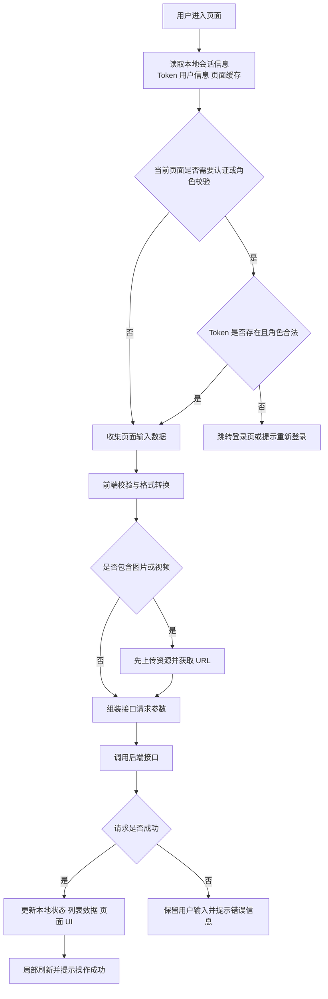
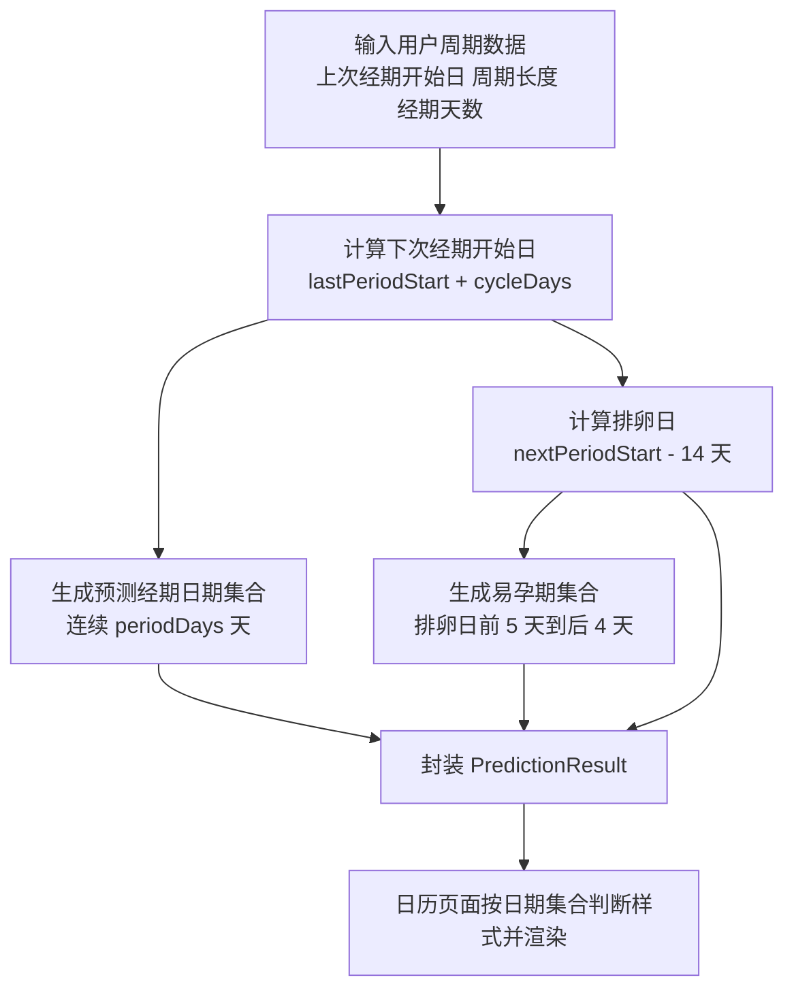
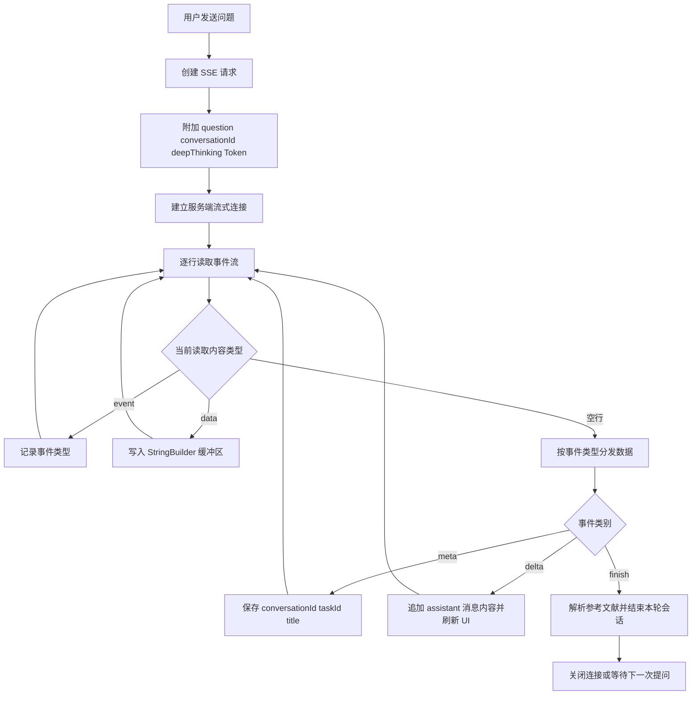
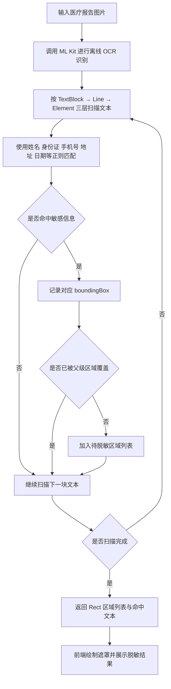

# 项目实践个人报告

## 摘要

本项目实践围绕“Athena”女性全周期健康服务平台展开，项目由管理员网站端与安卓 App 前端两部分组成。其中，`admin_web_front` 主要承担平台内容审核、内容管理、KOL 发布、系统设置与后台权限控制等管理端功能；`athena_app_front` 主要面向移动端用户，提供健康记录、经期与备孕管理、科普知识浏览、社区互动、AI 问答、隐私保护、内容发布、个人中心等核心前端能力。本人在项目实践中主要负责管理员网站端和安卓 App 前端代码的设计、开发、联调与优化工作，覆盖从需求理解、功能拆解、界面设计、前端架构搭建、接口对接、状态管理、交互实现到问题排查的完整流程。

在管理员网站端，我基于 React、TypeScript、Vite、React Router、Axios、Tailwind CSS、Radix UI、shadcn 风格组件体系等技术，完成了后台登录认证、角色路由控制、内容审核、内容管理、文章富文本编辑、文件上传、KOL 发布流程以及页面布局等功能。在安卓 App 前端，我基于原生 Android Java、Gradle Kotlin DSL、Material Components、RecyclerView、ViewPager2、OkHttp、Gson、Glide、Markwon、ML Kit、GSYVideoPlayer 等技术，完成了多页面移动端功能模块开发，包括首页推荐、知识科普、AI 搜索、健康记录、经期/备孕周期管理、社区广场、评论回复、发布图文/视频、个人主页、关注粉丝、隐私保护、本地匿名化、对话历史、分析报告以及多种健康数据展示组件。

通过本次项目实践，我不仅提升了前端工程化开发能力，也进一步掌握了复杂业务系统中跨端协作、接口联调、组件复用、状态同步、用户体验优化、数据安全与隐私保护等关键能力。项目难点集中在多角色权限控制、后台审核发布链路、移动端复杂页面组织、健康周期算法可视化、AI 对话与内容引用展示、图片与视频资源处理、隐私脱敏交互以及前后端数据一致性等方面。针对这些问题，我通过模块化设计、公共工具封装、统一接口管理、局部缓存、异步请求优化、UI 组件分层、单元级验证和异常兜底机制进行了系统性解决，最终形成了较完整、可运行、可维护的前端实现。

---

## 1 项目背景与我的角色

### 1.1 项目总体介绍

Athena 项目定位为面向女性用户的全周期健康管理与知识服务平台，围绕女性在青春期、备孕期、经期、孕期、成熟期等不同生命阶段的健康需求，提供个性化健康记录、知识科普、社区交流、智能问答、隐私保护和内容运营管理等服务。项目整体具有较强的业务综合性，既包含面向普通用户的移动端 App，也包含面向管理员和内容创作者的后台网站端。

从系统形态上看，项目主要包括以下两个前端子项目：

1. 管理员网站端 `admin_web_front`  
   该端面向平台管理员和 KOL 内容创作者，核心目标是支撑平台内容生产、内容审核、内容管理和后台运营。管理员可以审核用户或 KOL 提交的内容，管理平台内已有文章、笔记等内容资源；KOL 用户可以通过后台进行内容编辑、图文发布和投稿。该端强调后台操作效率、权限边界清晰、表单与富文本编辑体验、审核流程可控以及与服务端接口的数据一致性。

2. 安卓 App 前端 `athena_app_front`  
   该端面向最终用户，核心目标是提供完整的移动端使用体验。用户可以进行登录注册、查看推荐内容、浏览健康科普文章、使用 AI 搜索和智能问答、记录经期与备孕相关数据、管理个人资料、参与社区互动、发布图文或视频内容、查看评论回复、使用隐私保护工具以及查看分析报告等。该端强调移动端交互流畅性、页面层级清晰、健康数据展示直观、图片视频处理稳定、隐私保护体验可信以及弱网或异常情况下的可用性。

从功能层面看，项目并非单一页面或简单 CRUD 系统，而是一个具有内容平台、健康管理、社区互动、AI 能力和隐私计算展示特征的综合型应用。管理员网站端负责平台运营闭环，安卓 App 前端负责用户服务闭环，两端之间通过统一业务数据与接口规范相互配合，共同构成 Athena 项目的前端体系。

### 1.2 团队组成与我的角色

在本次项目实践中，团队共 3 名成员，采用小团队协作方式推进开发。我主要负责前端开发、产品设计和前后端联调，承担管理员网站端与安卓 App 前端的页面实现、交互设计、原型细化、接口对接以及联调问题排查；另一位成员负责后端开发，承担除前端与测试之外的主要功能开发工作，包括用户、内容、审核、健康记录、评论、AI 问答等服务接口与业务逻辑实现；另一位成员负责测试工作，主要完成功能测试、回归验证、问题记录和结果反馈。

因此，我在项目中的角色并不局限于页面编写，还需要从产品设计到工程落地再到联调闭环全程参与。具体包括：根据需求设计页面原型和交互流程，完成前端工程结构与公共能力封装，对接后端接口并处理参数格式、状态同步和异常兜底，在联调阶段持续定位页面、接口和数据映射问题，确保管理员网站端与安卓 App 前端功能稳定交付。在 Scrum 协作过程中，我也参与需求评审、任务拆分和阶段验收，保证所负责模块按迭代计划推进。

具体而言，我在项目中的职责主要包括以下几个方面：

1. 需求理解与功能拆解  
   根据 Athena 平台的整体目标，将业务需求拆解为管理员网站端和安卓 App 前端的具体功能模块。例如，后台端拆分为登录认证、审核管理、内容管理、发布管理、设置页面等模块；App 端拆分为首页推荐、知识科普、健康记录、经期管理、备孕管理、社区广场、AI 搜索、个人中心、隐私保护等模块。

2. 管理员网站端开发  
   负责 `admin_web_front` 中 React + TypeScript 前端工程的搭建与业务实现，包括路由配置、认证上下文、角色权限控制、主布局、审核页、内容管理页、发布页、设置页、富文本编辑器、接口请求封装、文件上传等功能。

3. 安卓 App 前端开发  
   负责 `athena_app_front` 中 Android 原生前端页面与业务逻辑开发，包括 Activity、Fragment、Adapter、自定义 View、XML 布局、Drawable 样式资源、网络请求工具类、本地缓存工具、图片加载、视频播放、评论交互、健康记录展示和隐私保护相关页面等。

4. 前后端接口联调  
   根据后端接口格式完成请求参数组织、Token 认证、响应数据解析、异常处理和界面状态更新，保证管理员网站端和 App 端均能与后端服务稳定交互。

5. 用户体验与界面优化  
   结合女性健康类产品的视觉风格，设计并实现柔和、清晰、具有亲和力的界面样式；同时优化表单输入、列表加载、图片预览、内容详情、评论弹窗、底部导航、卡片布局等移动端与后台端交互体验。

6. 问题定位与质量保障  
   在开发过程中持续处理页面跳转异常、接口数据不一致、图片上传失败、Token 丢失、列表刷新、状态同步、布局适配等问题，通过日志、断点、代码审查和模块化重构提高代码稳定性。

总体来说，我在项目中承担的是前端核心开发者角色，负责将业务需求转化为可交互、可运行、可维护的前端系统，并保证两个前端项目在功能、体验和工程结构上的完整性。

### 1.3 项目的难点和创新点

本项目的难点主要体现在业务复杂度高、终端类型多、页面数量多、数据交互链路长以及用户隐私要求高等方面。

首先，项目同时包含后台网站端和安卓 App 前端，两个端的技术栈完全不同。后台端采用 React 生态，强调组件化、路由守卫、后台管理效率和数据表单操作；App 端采用 Android 原生 Java 开发，强调生命周期管理、布局适配、列表性能、原生交互和移动端资源处理。这要求我在不同技术栈之间切换，并保持统一的业务理解和代码质量。

其次，项目业务模块覆盖范围较广。管理员网站端需要处理管理员和 KOL 两类角色，不同角色可访问的页面和业务流程不同；App 端既有内容浏览和社区互动，又有健康记录、经期计算、备孕管理、AI 搜索、隐私脱敏、视频播放等复杂功能。各模块之间存在数据依赖和交互关联，例如用户发布内容后需要进入审核流程，审核结果会影响 App 端内容展示；健康记录数据会影响周期展示和分析报告；AI 问答结果需要与参考文章、对话历史等能力结合。

再次，健康类应用对用户体验与数据可信度要求较高。经期、备孕、孕期等场景涉及用户个人健康信息，界面既要直观易用，又要避免信息过载；隐私保护相关功能需要在交互上体现安全感，让用户理解本地匿名化、数据资产、联邦学习或反馈机制等较抽象的概念。因此，在页面设计和交互实现中，我不仅关注功能可用，还关注表达方式、视觉层级和操作反馈。

项目的创新点主要体现在以下几个方面：

1. 管理端与移动端联动的内容运营闭环  
   管理员网站端支持内容发布、富文本编辑、审核管理和内容维护，移动端支持内容浏览、互动与发布，两端共同构成从内容生产、审核、分发到用户反馈的闭环。

2. 女性全周期健康场景融合  
   App 端围绕不同年龄阶段与健康阶段设置页面和内容，包括青春期、经期、备孕、孕期、成熟期等，形成纵向覆盖较完整的健康服务体系。

3. AI 搜索与知识问答结合  
   项目中包含 AI 搜索、RAG SSE 客户端、LLM 客户端、文章引用解析等模块，使用户能够通过自然语言获取健康知识，并结合参考内容提升回答可信度。

4. 隐私保护与本地匿名化能力  
   App 端实现了隐私保护相关功能，包括本地脱敏、图片文字识别、数据资产展示、隐私计算可视化、RLHF 反馈等，使健康数据处理更强调安全性与透明度。

5. 原生移动端复杂交互实现  
   项目包含底部导航、多 Fragment 页面切换、BottomSheet 弹窗、图片选择与预览、视频播放、评论回复、富卡片布局、周期日历、自定义 CycleWheelView 等交互组件，体现了较完整的 Android 前端实现能力。

---

## 2 个人负责的模块设计

### 2.1 模块功能描述

#### 2.1.1 管理员网站端模块

在 `admin_web_front` 中，我负责的功能模块主要包括以下内容。该端模块的输入主要包括管理员或 KOL 的登录信息、内容查询条件、审核操作、富文本正文、图片文件和内容分类等；输出主要包括认证后的后台页面、审核结果、内容列表、发布提交结果、错误提示和页面状态反馈。管理员网站端与后端内容服务、用户认证服务和文件服务交互，同时与 App 端内容展示链路形成业务闭环。

1. 登录认证模块  
   登录认证模块负责管理员和 KOL 用户的身份识别。系统通过登录页面获取用户凭证，并在前端保存认证状态和 Token。认证状态由 `AuthContext` 统一管理，页面路由根据用户登录状态和角色信息进行访问控制。未登录用户会被重定向到登录页，已登录用户根据角色进入不同默认页面。

2. 角色权限与路由控制模块  
   后台系统存在管理员和 KOL 两类角色。管理员可以访问审核管理和内容管理页面，KOL 主要访问发布页面。为保证权限清晰，我设计了 `RequireAuth`、`AdminOnly`、`KolOnly` 等路由守卫组件，根据用户状态和角色动态决定页面访问权限，避免无权限用户进入敏感页面。

3. 主布局与导航模块  
   主布局负责后台整体页面框架，包括顶部区域、侧边导航、内容展示区域等。不同角色看到的导航入口不同，系统会根据当前用户角色调整默认跳转路径和可见功能，提升后台使用效率。

4. 内容审核模块  
   内容审核模块主要面向管理员，用于查看待审核内容、审核详情和审核状态。该模块包括审核列表、审核仪表盘、审核操作入口等，用于支撑平台内容质量控制。管理员可以对提交内容进行查看、判断和处理。

5. 内容管理模块  
   内容管理模块用于维护平台已有内容，包括文章、笔记或其他内容资源。该模块需要与后端内容管理接口交互，实现内容查询、状态展示、分类映射、内容详情查看等能力。

6. 发布管理模块  
   发布模块面向 KOL 或内容创作者，支持内容编辑、封面/图片上传、正文编辑和提交。模块中集成了富文本编辑器，支持较复杂的文章内容组织。发布流程与审核模块形成衔接，提交后的内容进入后台审核链路。

7. 富文本编辑与文件上传模块  
   项目中使用 `react-quill-new` 实现富文本编辑，并通过文件上传接口处理图片等媒体资源。该模块解决了后台内容生产中较核心的编辑体验问题，使用户能够以较低成本完成图文内容制作。

8. 网络请求封装模块  
   通过 Axios 实例统一管理请求行为，在请求拦截器中自动读取本地 Token 并注入 Authorization 请求头，在响应拦截器中统一捕获异常。这一设计减少了重复代码，提高了接口调用一致性。

#### 2.1.2 安卓 App 前端模块

在 `athena_app_front` 中，我负责的功能模块更偏向移动端用户体验和业务闭环。该端模块的输入包括用户账号信息、健康记录数据、周期设置、搜索问题、社区发布内容、图片/视频资源、评论回复内容和隐私处理对象；输出包括移动端页面展示、健康日历、AI 回答、内容详情、发布结果、评论列表、个人主页、分析报告和隐私脱敏结果。App 端与后端用户服务、内容服务、健康记录服务、AI 服务、文件上传服务等交互，同时通过本地缓存、图片处理和设备能力提升移动端使用体验。主要包括以下内容：

1. 登录注册与用户状态模块  
   包括 `LoginActivity`、`RegisterActivity`、`TokenManager`、`UserDao`、`UserEntity` 等相关页面和工具类。该模块负责用户登录、注册、Token 保存、用户信息读取和本地状态维护，是整个 App 访问后端接口和展示个性化内容的基础。

2. 主界面与底部导航模块  
   包括 `MainActivity`、底部导航菜单和多个 Fragment 页面。主界面负责组织推荐、知识、记录、社区、个人中心等一级入口，保证用户可以在核心模块之间快速切换。

3. 推荐与内容浏览模块  
   包括 `RecommendFragment`、`ArticleDetailActivity`、`NoteDetailActivity`、`ArticleListParseHelper`、`BlogEntity`、`BlogCacheDBHelper` 等。该模块负责首页推荐内容展示、文章详情、笔记详情、内容缓存和列表解析，支撑用户获取健康知识和社区内容。

4. 知识科普与分龄内容模块  
   包括 `KnowledgeFragment`、`Age0To12RoleActivity`、`Age12To22Activity`、`Age55PlusActivity`、`KidsArticleListActivity`、`ParentsArticleListActivity`、`MenstrualArticleListActivity`、`PrepareArticleListActivity`、`PreventArticleListActivity`、`SkincareArticleListActivity`、`SignArticleListActivity` 等。该模块围绕不同年龄阶段和健康主题组织文章入口，帮助用户根据自身阶段快速获取对应知识。

5. AI 搜索与智能问答模块  
   包括 `ScienceAISearchActivity`、`DeepSeekApiService`、`QwenApiService`、`LLMClient`、`RagSseClient`、`Message`、`MessageAdapter`、`ArticleReferenceResolver`、`ArticleReference`、对话历史相关类等。该模块支持用户通过自然语言提问，前端负责请求发送、流式内容接收、消息列表渲染、参考文章解析、历史会话展示等工作。

6. 健康记录模块  
   包括 `RecordFragment`、`HealthRecordEntity`、`HealthRecordApiService`、`HealthRecordSaver`、`HealthRecordUiAggregator`、`RecordActionExtraBinder`、多个记录弹窗和记录项布局。该模块支持用户记录体重、体温、症状、情绪、同房、孕检、营养、习惯等健康数据，并将数据组织为可展示、可提交、可同步的结构。

7. 经期与备孕周期管理模块  
   包括 `PeriodFragment`、`PregnancyPrepFragment`、`PregnancyFragment`、`CycleDataManager`、`CycleApiService`、`CycleSettingsDialogHelper`、`PeriodCalculator`、`MenstrualCalculator`、`CalendarDayAdapter`、`CycleWheelView` 等。该模块负责经期设置、周期计算、排卵期预测、备孕记录和日历可视化展示，是女性健康管理场景中的重点模块。

8. 社区广场与互动模块  
   包括 `SquareFragment`、`PublishActivity`、`PublishVideoActivity`、`CommentBottomSheetFragment`、`ReplyBottomSheetFragment`、`CommentAdapter`、`ReplyAdapter`、`CommentBean`、`CommentResponse`、`PublishCommentRequest`、`FollowRequestManager` 等。该模块支持用户发布图文或视频、浏览社区内容、点赞收藏、评论回复、关注用户等互动行为。

9. 个人中心与资料管理模块  
   包括 `ProfileFragment`、`ProfileGridFragment`、`EditProfileActivity`、`PrivateGalleryActivity`、`FollowerListActivity`、`FollowingListActivity`、`SettingsActivity`、`UserAdapter`、`WorkAdapter` 等。该模块负责用户资料展示、个人作品、关注粉丝、设置、私密相册等功能。

10. 图片、视频与本地资源处理模块  
    包括 `ImageUtil`、`ImageUtils`、`ImageCacheManager`、`LocalPhotoManager`、`UploadUtil`、视频详情页和 GSYVideoPlayer 相关依赖。该模块处理图片压缩、缓存、上传、预览以及视频播放等移动端资源问题。

11. 隐私保护与本地匿名化模块  
    包括 `PrivacyFragment`、`PrivacyUtil`、`MLKitAnonymizeService`、`LocalAnonymizeView`、`DataAssetBottomSheet`、`PrivacyMathEngine`、`ShapleyMathEngine`、`RLHFDialogHelper` 等。该模块围绕敏感数据保护展开，实现本地文字识别、脱敏展示、隐私工具切换、数据资产说明、隐私计算指标展示和用户反馈。

12. 分析报告与智能设备模块  
    包括 `AnalysisReportActivity`、`InsightReportAdapter`、`InsightApiService`、`InsightReportEntity`、`SmartBandActivity`、`OppoBandManager`、`HealthSyncManager` 等。该模块用于展示健康分析报告、同步智能设备数据或呈现健康洞察结果。

### 2.2 核心算法或业务逻辑

结合我的实际分工，这一部分重点说明我负责的前端业务逻辑和联调逻辑，而不是简单罗列全部功能模块。总体上，我的工作主要集中在三个方面：一是管理员网站端的认证、角色分流与内容提交流程；二是安卓 App 端的健康周期预测、AI 流式对话与本地隐私脱敏；三是前后端联调中的数据组织、状态同步和异常处理。

#### 2.2.1 前后端联调整体流程

我在管理员网站端和安卓 App 前端中采用了较一致的处理流程，其核心目标是把“页面展示”“数据校验”“接口调用”“状态更新”拆开，降低耦合，便于联调和定位问题。整体流程如下：



  
  
  
  
  
 
  
  
  

上述流程虽然不是复杂算法，但它是前后端联调能否顺利推进的基础。其关键在于：前端必须在请求发出前完成参数约束，在响应返回后完成状态回写，并在异常场景下保证页面可恢复。

#### 2.2.2 管理员网站端：认证与角色分流逻辑

管理员网站端的核心业务逻辑是“先鉴权，再分流”。也就是说，用户进入系统后，前端先判断是否存在有效会话，再根据角色决定可访问的页面范围。这样可以把权限控制前置到路由层，而不是分散写在每个页面内部。

核心伪代码如下：

```text
读取 Session
if Session 不存在:
    跳转 /login
else if Session.role == admin:
    允许访问 /audit、/content、/settings
    默认首页跳转到 /audit
else if Session.role == kol:
    允许访问 /publish、/settings
    默认首页跳转到 /publish
else:
    清空异常会话并返回登录页

发送接口请求前:
    token = AuthContext.token or localStorage.token or sessionStorage.token
    if token 存在:
        headers.Authorization = "Bearer " + token
```

这里的实现思路是“会话集中管理 + 路由守卫 + 请求拦截器自动注入 Token”。我在项目中通过 `AuthContext` 维护用户会话，通过路由组件完成角色分流，通过 Axios 拦截器统一注入认证头，减少了重复代码。

在数据结构选择上，我使用了结构化的会话对象保存登录状态，例如：

```ts
type Session = {
  token: string
  phone: string
  role: 'admin' | 'kol'
}
```

之所以采用这种结构，是因为当前业务状态维度固定、字段较少，使用对象可以直接按字段读取；角色则使用枚举式字符串，便于在路由判断和页面渲染中直接分支处理，不需要额外的数据表或复杂映射。

#### 2.2.3 安卓 App：健康周期预测与日历标记逻辑

在经期与备孕模块中，我负责的核心逻辑是依据用户输入的上次经期开始日期、周期长度和经期持续天数，计算预测经期、排卵日和易孕期，并将结果映射到日历界面中。这个问题本质上是规则驱动的日期计算问题，不依赖模型推理，而依赖稳定、可解释的时间运算。

流程图如下：



核心代码片段如下：

```java
LocalDate nextPeriodStart = lastPeriodStart.plusDays(cycleDays);

for (int i = 0; i < periodDays; i++) {
    predictedPeriodDates.add(nextPeriodStart.plusDays(i));
}

LocalDate ovulationDay = nextPeriodStart.minusDays(14);
for (int i = -5; i <= 4; i++) {
    LocalDate d = ovulationDay.plusDays(i);
    if (!d.equals(ovulationDay)) {
        ovulationWindowDates.add(d);
    }
}
```

这一算法的思路比较直接：先用“上次经期开始日 + 周期天数”得到下次预测经期开始日，再根据医学上的常见规则，用“下次经期前 14 天”近似计算排卵日，并向前后扩展形成易孕期区间。其优点是可解释性强、计算量小、端侧即可完成，不依赖网络。

在数据结构上，我使用 `LocalDate` 表示日期，使用 `Set<LocalDate>` 保存预测经期、排卵日和易孕期三个日期集合，并用 `PredictionResult` 统一封装结果。这里选择集合而不是列表，主要是因为日历渲染时最常见的操作是判断“某一天是否属于某个状态区间”，集合查询更直接，也能避免重复日期被加入。这样页面在绘制日历单元格时，只需判断日期是否属于对应集合即可完成样式渲染。

#### 2.2.4 安卓 App：AI 搜索的流式响应逻辑

AI 搜索模块的难点不在于一次性拿到完整结果，而在于如何处理服务端持续返回的流式数据，并把这些增量内容平滑地展示到聊天界面中。为此，我在前端使用了基于 SSE 的事件流解析逻辑。

流程图如下：


-------------------------------------------------------

核心伪代码如下：

```text
建立 SSE 连接
发送 question、conversationId、deepThinking 等参数

while 连接未关闭:
    逐行读取服务端返回内容
    if 行以 "event:" 开头:
        记录当前事件类型
    else if 行以 "data:" 开头:
        追加到当前数据缓冲区
    else if 读取到空行:
        根据 event 类型分发数据
        meta 事件：保存 conversationId、taskId、title
        delta 事件：把增量文本追加到最后一条 assistant 消息
        finish 事件：解析参考文献并结束本次会话
        清空缓冲区，继续下一轮读取
```

对应的关键代码片段可以概括为：

```java
StringBuilder dataBuilder = new StringBuilder();
while (!source.exhausted()) {
    String line = source.readUtf8Line();
    if (line.startsWith("event:")) currentEvent = line.substring(6).trim();
    else if (line.startsWith("data:")) dataBuilder.append(line.substring(5).trim());
    else if (line.isEmpty()) dispatchEvent(currentEvent, dataBuilder.toString());
}
```

这一逻辑的算法思路是典型的事件驱动增量更新：网络层持续接收数据，解析层按事件类型拆包，UI 层只负责把新的文本片段追加到消息列表中。这样做的好处是用户不需要等待完整答案生成完毕，就可以实时看到回复内容，交互体验更接近自然对话。

在数据结构选择上，我使用 `List<Message>` 维护聊天消息顺序，因为消息展示具有天然的时序性；使用 `StringBuilder` 作为流式数据缓冲区，避免高频字符串拼接带来的额外开销；使用 `List<ArticleReference>` 保存参考文章信息，因为参考文献需要按解析顺序展示。整体上，这是一种“顺序表 + 缓冲区 + 元信息对象”的组合，比较适合流式聊天场景。

#### 2.2.5 安卓 App：本地隐私脱敏逻辑

隐私保护模块的目标是在不上传原始敏感图片的前提下，对医疗报告中的姓名、身份证号、手机号、地址等敏感信息进行端侧识别和遮挡。这个过程的关键不只是 OCR，而是 OCR 之后的文本匹配与区域去重。

整体流程如下：



核心代码片段如下：

```java
for (Text.TextBlock block : visionText.getTextBlocks()) {
    if (matchesAnyPII(block.getText())) {
        addRegion(block.getBoundingBox());
        continue;
    }
    scanLinesAndElements(block);
}
```

这个算法采用了“先粗后细”的分层扫描思路：如果整块文本已经命中敏感规则，就直接记录块级区域，减少无意义的细粒度遍历；只有块级未命中时，才继续向行级和元素级下钻。这样既降低了重复检测的概率，也减少了遮挡框过多导致的界面混乱。

在数据结构上，我使用 `Pattern[]` 保存多类敏感信息的正则规则，便于统一遍历；使用 `List<Rect>` 存储待遮挡区域，因为遮挡框不仅需要坐标信息，还需要保留绘制顺序；使用 `List<String>` 存储命中的原始文本，便于调试和结果核对。对于去重逻辑，则通过矩形包含关系判断新区域是否已被已有区域覆盖，这比简单的字符串去重更适合图像标注场景。

综合来看，我负责的这些逻辑虽然分布在不同模块中，但它们有一个共同特点：都强调前端本地状态组织、数据结构选择和交互过程控制。也正因为如此，我在项目中的工作不仅是实现界面，更是在前端层完成业务规则落地、数据流组织和联调闭环。

### 2.3 前端实现（如涉及）

#### 2.3.1 管理员网站端前端实现

管理员网站端采用现代 React 前端工程结构，核心技术包括 React 19、TypeScript、Vite、React Router、Axios、Tailwind CSS、Radix UI、shadcn 风格组件、lucide-react 图标、framer-motion 动画和 react-quill-new 富文本编辑器。

在工程结构上，我将代码划分为 `api`、`components`、`contexts`、`layouts`、`lib`、`pages` 等目录：

1. `api` 目录  
   用于存放接口请求封装，例如审核接口、内容管理接口、文件上传接口、博客提交接口等。通过接口层隔离页面与后端请求细节，使页面更关注业务交互。

2. `contexts` 目录  
   用于存放认证上下文。通过 React Context 管理登录用户、Token 和认证状态，避免多层组件传参。

3. `layouts` 目录  
   用于存放后台主布局。主布局统一承载导航、页面容器和公共结构，使各业务页面风格一致。

4. `pages` 目录  
   用于存放登录页、审核页、内容管理页、发布页、设置页等业务页面。每个页面围绕具体业务场景实现。

5. `components` 目录  
   用于存放可复用组件，包括基础 UI 组件和后台富文本编辑器等。

6. `lib` 目录  
   用于存放工具函数、分类映射、内容管理辅助逻辑、认证常量和文章内容处理逻辑。

在路由实现上，我采用嵌套路由模式，登录页独立于后台主布局，其他业务页面均在登录认证后进入主布局。路由守卫组件负责根据用户状态进行重定向，保证访问控制清晰。

在样式实现上，我使用 Tailwind CSS 与组件库相结合的方式：Tailwind 用于快速实现布局、间距、颜色、响应式和状态样式；Radix UI 和 shadcn 风格组件用于保证按钮、标签页等基础控件的一致性与可访问性；lucide-react 提供统一图标风格；framer-motion 用于增强页面过渡和交互反馈。

在富文本编辑方面，我使用 `react-quill-new` 实现文章正文编辑，并结合自定义样式文件优化编辑器展示效果。该部分使 KOL 或管理员可以进行更接近真实内容运营场景的图文编辑。

在网络请求方面，我将 Axios 实例独立封装，并通过请求拦截器自动注入 Token。这样页面调用接口时不需要重复处理认证头，降低了出错概率。

后台端前端交互流程主要包括以下几个步骤：用户进入系统后首先触发认证状态恢复；路由守卫根据认证状态和角色决定可访问页面；业务页面加载时调用对应 API 函数获取数据；用户进行审核、发布、上传等操作时先在前端进行字段校验；如果包含文件，则先完成上传并取得 URL；最后将整理后的结构化数据提交给后端，并根据返回结果刷新列表、跳转页面或展示错误提示。

#### 2.3.2 安卓 App 前端实现

安卓 App 前端采用原生 Android Java 技术栈，项目使用 Gradle Kotlin DSL 构建，应用包名为 `com.whu.software.athena`，最低支持 Android 7.0，对应 `minSdk 24`，目标和编译 SDK 为 36。前端实现主要由 Java 代码、XML 布局资源、Drawable 样式资源、颜色选择器、菜单资源和本地 assets 构成。

在页面组织上，我采用 Activity + Fragment + Adapter 的常见 Android 架构模式：

1. Activity  
   用于承载完整页面流程，例如登录注册、文章详情、笔记详情、AI 搜索、发布、视频详情、个人资料编辑、分析报告等。

2. Fragment  
   用于主页面中的功能分区，例如推荐、知识、健康记录、社区广场、个人中心、隐私保护、经期、备孕和孕期页面等。

3. Adapter  
   用于 RecyclerView、列表、网格和消息流渲染，例如文章列表、评论列表、回复列表、消息列表、报告列表、用户列表、作品列表等。

4. 工具类与服务类  
   用于封装网络请求、图片处理、Token 管理、数据库缓存、健康记录保存、周期计算、隐私处理和设备同步等能力。

在 UI 实现上，我大量使用 XML 布局和 Drawable 资源构建界面。项目中包含多种卡片背景、按钮样式、图标资源、选择器、圆角背景、渐变背景和状态颜色，使 App 视觉风格更统一。对于健康类产品，我采用柔和的色彩、卡片式结构、清晰的信息层级和适合移动端点击的控件尺寸，提升用户体验。

在列表实现上，项目大量使用 RecyclerView。为了保证代码可维护性，我根据业务对象设计不同 Adapter，例如内容卡片、评论、回复、聊天消息、健康报告、用户列表、日历日期等。每个 Adapter 负责绑定对应数据和处理局部点击事件，避免页面类过于臃肿。

在网络通信上，项目使用 OkHttp 作为核心请求工具，并结合 Gson 和 org.json 处理 JSON 数据。对于普通 REST 接口，前端负责构造请求、添加 Token、解析响应并更新 UI；对于 AI 流式响应，前端通过 SSE 客户端逐步读取内容并刷新消息列表。

在图片处理上，项目使用 Glide 加载网络图片和本地图片，并通过图片工具类处理压缩、缓存、上传等问题。对于图文发布、头像、私密相册、内容详情等场景，图片处理能力是保证体验稳定的关键。

在视频处理上，项目集成 GSYVideoPlayer，用于视频详情页和视频内容播放。相比直接使用原生 VideoView，该方案更便于处理播放控制、不同格式兼容和页面生命周期。

在 Markdown 或富文本展示上，项目使用 Markwon 支持内容渲染，使 AI 回答或文章内容可以以更清晰的格式展示。

在隐私保护方面，项目集成 ML Kit 文本识别能力，对本地图片或文本中的敏感内容进行识别和匿名化展示。该能力与自定义 View、底部弹窗和隐私指标展示结合，形成较完整的隐私保护交互流程。

App 端前端交互流程主要体现为“页面事件—数据处理—接口请求—状态刷新”的闭环。用户在 Activity 或 Fragment 中触发点击、输入、刷新、上传等事件后，页面层先完成输入合法性判断，再调用工具类或服务类处理图片、Token、日期、健康记录等数据。随后通过 OkHttp 请求后端接口，接口返回后切换到 UI 线程更新 RecyclerView、TextView、Dialog 或 BottomSheet 等界面组件。对于 AI 流式问答、视频播放和隐私识别等耗时任务，则通过异步回调逐步更新页面，避免阻塞主线程。

---

## 3 个人实现的关键技术

### 3.1 技术选型（个人负责部分）

#### 3.1.1 管理员网站端技术选型

管理员网站端的技术选型以高开发效率、类型安全、组件化和后台管理体验为主要目标，具体如下：

1. React 19  
   React 适合构建组件化前端应用，能够将后台系统拆分为登录页、布局、审核页、发布页、内容管理页等独立组件，提高复用性和维护性。

2. TypeScript  
   后台端涉及用户信息、内容数据、审核状态、接口响应等多类数据结构。TypeScript 能够在开发阶段提供类型检查，减少字段拼写错误和数据结构不一致带来的问题。

3. Vite  
   Vite 启动速度快、热更新体验好，适合中小型后台管理系统快速迭代。项目通过 Vite 构建，提高了开发效率。

4. React Router  
   后台端存在多页面路由和权限控制需求。React Router 能够清晰组织登录页、审核页、内容管理页、发布页和设置页，并支持嵌套路由和重定向。

5. Axios  
   Axios 用于统一处理 HTTP 请求，配合请求拦截器和响应拦截器实现 Token 注入、错误捕获和接口调用封装。

6. Tailwind CSS  
   Tailwind CSS 适合快速构建统一风格的后台页面，能够通过原子类高效完成布局、颜色、边距、圆角、阴影和响应式样式。

7. Radix UI 与 shadcn 风格组件  
   后台系统需要稳定、易用且风格统一的按钮、标签页等基础组件。Radix UI 提供良好的可访问性基础，shadcn 风格组件便于快速定制。

8. react-quill-new  
   内容发布需要富文本编辑能力，因此选用 react-quill-new 支持文章正文编辑、格式化输入和图文排版。

9. framer-motion 与 lucide-react  
   framer-motion 用于增强页面动效和交互反馈，lucide-react 用于保持图标风格统一。

#### 3.1.2 安卓 App 前端技术选型

安卓 App 前端的技术选型以原生能力、兼容性、复杂交互实现和移动端性能为主要目标，具体如下：

1. 原生 Android Java  
   Java 生态成熟，适合实现 Activity、Fragment、Adapter、自定义 View、工具类和复杂业务逻辑。项目采用原生开发方式，有利于控制页面生命周期和系统能力调用。

2. Gradle Kotlin DSL  
   使用 Kotlin DSL 管理 Android 构建配置，能够以更结构化的方式配置 SDK 版本、依赖项和构建类型。

3. AndroidX 与 Material Components  
   AndroidX AppCompat、Activity、ConstraintLayout、RecyclerView、CardView、SwipeRefreshLayout、ViewPager2 等组件为现代 Android 页面开发提供基础能力。Material Components 用于构建更符合移动端规范的交互控件。

4. OkHttp  
   OkHttp 是稳定高效的 HTTP 客户端，适合处理 App 中大量 REST 请求和部分流式请求场景。

5. Gson 与 org.json  
   用于 JSON 序列化和反序列化，支持接口响应数据解析和请求参数构造。

6. Glide  
   Glide 用于图片加载、缓存和显示，适合内容流、头像、封面、详情图、私密相册等高频图片场景。

7. Markwon  
   Markwon 用于 Markdown 渲染，适合 AI 回答、文章引用或格式化文本展示。

8. ML Kit Text Recognition  
   用于本地文字识别和隐私脱敏场景，能够识别图片中的文本内容，为本地匿名化提供基础能力。

9. GSYVideoPlayer  
   用于视频播放场景，支持更完整的视频播放控制和格式兼容。

10. HeyTap Health SDK  
    用于智能健康设备相关能力，为健康数据同步与智能手环功能提供扩展基础。

11. Core Library Desugaring  
    通过脱糖支持部分 Java 8 语言特性，提高代码表达能力并兼容较低 Android 版本。

### 3.2 核心算法或业务逻辑实现

#### 3.2.1 后台端权限路由实现

管理员网站端的权限控制是项目后台安全性和可用性的关键。我将权限逻辑集中在路由层处理，避免各页面重复编写权限判断。实现思路如下：

1. 使用认证上下文保存当前用户状态；
2. 通过 `RequireAuth` 判断用户是否登录；
3. 通过 `AdminOnly` 判断是否为管理员角色；
4. 通过 `KolOnly` 判断是否为 KOL 角色；
5. 根据不同角色设置默认跳转目标；
6. 对未知路径统一重定向到根路径，再由根路径进行角色分流。

这种设计的优势是权限逻辑集中、页面职责单一、路由行为可预测。当未来新增角色或新增页面时，只需要扩展路由守卫或角色映射即可。

#### 3.2.2 后台端统一请求认证实现

后台端接口请求需要携带 Token。为了提高稳定性，我没有在每个 API 函数中单独拼接认证头，而是通过 Axios 请求拦截器统一处理。实现逻辑包括：

1. 优先从认证会话中读取 Token；
2. 如果认证会话不存在，则尝试从 localStorage 读取；
3. 如果 localStorage 中不存在，则尝试从 sessionStorage 读取；
4. 如果 Token 有效，则注入 Authorization 请求头；
5. 如果 Token 不存在，则放行请求并记录调试信息；
6. 响应异常统一进入响应拦截器，便于后续扩展全局错误提示或登录失效处理。

该实现提高了请求层的一致性，也方便排查接口认证问题。

#### 3.2.3 安卓端经期与备孕周期计算实现

经期与备孕模块是 App 的核心健康能力之一。该模块需要根据用户输入的周期信息推算不同日期状态，并在日历中进行可视化展示。实现思路如下：

1. 用户通过周期设置弹窗输入或调整基础数据；
2. `CycleDataManager` 负责保存和读取周期配置；
3. `PeriodCalculator` 和 `MenstrualCalculator` 根据开始日期、周期长度、经期长度等参数计算经期、预测经期、排卵日和易孕期；
4. `CalendarDayAdapter` 将计算结果映射到日历单元格；
5. 不同日期状态使用不同 Drawable 或颜色进行展示；
6. 用户切换日期时，页面刷新当日记录和状态说明。

该逻辑的难点在于日期边界处理，例如跨月展示、周期预测、今天标记、选中日期、经期与排卵期重叠时的优先级等。通过将计算逻辑与 UI 渲染分离，可以降低复杂度并提高可测试性。

#### 3.2.4 安卓端健康记录聚合实现

健康记录模块涉及多种记录类型，例如体温、体重、症状、情绪、同房、排卵试纸、孕检、饮食、运动、睡眠等。如果每一种记录都单独实现完整流程，会造成大量重复代码。我的实现思路是：

1. 用统一实体类描述健康记录数据；
2. 用不同记录动作项表达不同输入入口；
3. 用 BottomSheet 或 Dialog 承载具体输入表单；
4. 用保存工具类统一提交或缓存记录；
5. 用 UI 聚合器将不同类型记录转换为页面展示所需结构；
6. 页面根据聚合结果刷新卡片、标签、图标和当日记录列表。

这种方式既保留了不同健康记录的差异化输入，又保证了保存和展示流程的统一。

#### 3.2.5 安卓端 AI 流式问答实现

AI 搜索与问答模块需要实现类似对话应用的体验。用户发送问题后，页面需要立即显示用户消息，再显示 AI 正在生成，并随着服务端返回持续更新内容。实现思路如下：

1. 用户输入问题并点击发送；
2. 前端将用户问题加入消息列表；
3. 构造 AI 请求参数，并通过 LLM 或 RAG 客户端发送；
4. 如果服务端返回 SSE 流式数据，则逐段读取生成内容；
5. 每收到一段内容，更新 AI 消息并刷新 RecyclerView；
6. 如果回答中包含参考文章信息，则通过解析器识别并展示引用卡片；
7. 对话结束后保存会话摘要或更新历史记录；
8. 如果请求失败，则展示错误状态并允许用户重试。

该实现的难点在于异步线程与 UI 线程协作、流式内容增量刷新、消息列表滚动控制、异常中断处理和历史会话恢复。通过将网络客户端、消息实体、Adapter 和历史记录模块分离，可以使整体逻辑更清晰。

#### 3.2.6 安卓端隐私脱敏与数据资产展示实现

隐私保护模块是本项目较具特色的部分。其核心目标是在用户感知层面展示“数据可控、隐私安全、处理透明”。实现思路如下：

1. 用户选择隐私工具或上传/选择待处理内容；
2. 如果是图片文字脱敏，则调用 ML Kit 进行本地 OCR 识别；
3. 根据识别结果定位敏感文本区域；
4. 使用自定义 View 展示脱敏前后效果或遮罩区域；
5. 使用数据资产 BottomSheet 展示数据类型、价值、敏感等级等信息；
6. 使用隐私计算引擎组织指标结果，例如贡献度、风险等级、保护强度等；
7. 通过 RLHF 反馈弹窗收集用户对结果的评价。

该逻辑结合了本地识别、UI 可视化、指标计算和反馈交互，使隐私保护不只是后台概念，而是用户可以直接理解和操作的功能。

#### 3.2.7 安卓端社区评论与发布实现

社区模块需要支持用户发布内容、查看内容、评论、回复、点赞、收藏和关注等行为。实现思路如下：

1. 发布页面负责收集标题、正文、图片或视频等内容；
2. 图片或视频通过上传工具处理后获得资源地址；
3. 前端将文本内容和资源地址组合为请求参数提交；
4. 内容详情页展示正文、图片、作者和互动数据；
5. 评论弹窗负责展示评论列表和发布评论；
6. 回复弹窗负责展示某条评论下的回复；
7. 关注请求通过独立请求管理器封装；
8. 操作成功后局部刷新互动状态，避免整个页面重复加载。

该模块强调交互连续性，因此我在设计时尽量使用弹窗和局部刷新减少页面跳转，提高社区使用体验。

### 3.3 我解决的技术难点

#### 3.3.1 多端技术栈并行开发问题

项目同时包含 React 网站端和 Android 原生端，二者在工程结构、状态管理、路由/页面组织、构建方式和调试方法上差异较大。为解决这一问题，我采用了分层思维进行开发：后台端重点关注组件、路由、接口和页面状态；App 端重点关注 Activity/Fragment 生命周期、布局资源、Adapter 和本地能力。通过明确两个端的职责边界，我能够在不同技术栈之间快速切换，并保证代码结构相对清晰。

#### 3.3.2 后台多角色权限控制问题

后台端存在管理员和 KOL 两类用户，如果权限控制分散在各页面中，不仅容易遗漏，也会导致维护困难。我将权限判断集中到路由层，通过路由守卫统一实现登录校验和角色校验。这样既保证了访问安全，也减少了业务页面复杂度。

#### 3.3.3 Token 存储与接口认证一致性问题

在前后端联调过程中，容易出现 Token 存储位置不一致、请求头遗漏、页面刷新后登录态丢失等问题。为此，我在后台端封装 Token 读取逻辑，按优先级从认证会话、localStorage 和 sessionStorage 中读取；在 App 端通过 Token 管理工具统一保存和获取 Token。这样提高了认证逻辑的一致性。

#### 3.3.4 移动端复杂页面和大量布局维护问题

App 端页面数量多、布局类型多，如果没有良好组织，代码会很快变得难以维护。我的解决方式是将页面拆分为 Activity、Fragment、Adapter、工具类和布局资源；列表类页面统一使用 RecyclerView + Adapter；弹窗输入统一使用 Dialog 或 BottomSheet；通用视觉元素通过 Drawable 和颜色资源复用。这样减少了重复布局和重复逻辑。

#### 3.3.5 健康周期日期计算边界问题

经期和备孕场景中，日期计算需要处理跨月、预测周期、选中日期、今日状态、排卵日、易孕期等多种情况。为避免页面层逻辑混乱，我将日期计算封装到独立工具类中，页面只负责展示计算结果。通过这种方式，复杂算法逻辑和 UI 逻辑分离，减少了边界问题对界面的影响。

#### 3.3.6 AI 流式响应的 UI 更新问题

AI 问答中，服务端可能逐步返回内容。如果每次返回都重新加载整个页面，会造成卡顿和体验不佳。我通过消息实体和 Adapter 局部刷新方式更新 AI 消息内容，并保证网络回调切换到 UI 线程后再更新界面。同时，对请求失败、空回答和中断情况进行兜底处理，使对话体验更稳定。

#### 3.3.7 图片上传、预览和缓存问题

移动端图片处理容易遇到路径兼容、图片过大、上传失败、预览卡顿和缓存失效等问题。我通过图片工具类统一处理图片压缩、缓存和路径转换，通过 Glide 负责图片加载，上传逻辑则由独立工具封装。这样减少了图片处理逻辑散落在页面中的情况。

#### 3.3.8 隐私脱敏交互表达问题

隐私保护功能本身较抽象，如果只是展示文字说明，用户很难理解其价值。我通过可视化方式展示脱敏区域、数据资产卡片、隐私指标和反馈弹窗，让用户能够看到处理结果并进行评价。这既提升了交互可理解性，也增强了功能可信度。

#### 3.3.9 前后端接口字段不一致问题

在联调过程中，前端页面字段和后端接口字段可能存在命名、类型或层级不一致问题。为解决这一问题，我在前端通过实体类、解析工具和接口封装层进行适配，避免页面直接依赖后端原始结构。当接口字段变化时，尽量只修改接口层或解析层，减少对 UI 层的影响。

### 3.4 单元测试与验证

根据实践报告模板中对“单元测试与验证”的要求，我在个人负责模块完成后，围绕核心业务逻辑、前端交互流程、接口联调结果和异常边界情况进行了验证。由于本项目同时包含 React 管理端和 Android 原生 App 端，测试方式并非只依赖单一测试框架，而是结合单元级逻辑验证、页面级功能验证、接口联调验证和真机/模拟器运行验证，确保个人负责模块能够满足预期输入输出、页面交互和业务流程要求。

#### 3.4.1 管理员网站端测试与验证

管理员网站端重点验证登录认证、角色权限、内容审核、内容管理、发布流程、富文本编辑和文件上传等模块。测试过程中，我主要采用功能用例驱动方式，逐项检查用户操作路径、接口返回结果和页面状态变化。

1. 登录与认证状态验证  
   测试用例包括：未登录访问后台页面时是否跳转到登录页；登录成功后是否保存认证会话；页面刷新后是否能够恢复登录状态；Token 为空、过期或格式错误时是否能够阻止访问受保护页面。验证结果表明，认证上下文能够正确维护用户状态，请求拦截器也能够在存在 Token 时自动注入 Authorization 请求头。

2. 角色权限验证  
   针对管理员和 KOL 两类角色分别验证默认跳转路径和可访问页面。管理员登录后能够进入审核和内容管理页面，KOL 登录后能够进入发布页面；当 KOL 尝试访问管理员页面时，会被重定向到符合其角色权限的页面。该测试验证了 `RequireAuth`、`AdminOnly` 和 `KolOnly` 路由守卫逻辑的正确性。

3. 内容审核流程验证  
   测试用例包括审核列表加载、审核详情查看、审核操作提交、提交后列表状态刷新、接口异常时页面不崩溃等。通过该部分验证，确认审核模块能够完成从内容获取到审核操作反馈的基本闭环。

4. 内容发布与富文本编辑验证  
   测试用例包括标题为空、正文为空、分类未选择、正常输入图文内容、插入图片、提交发布等情况。测试重点是检查富文本内容是否能够正常编辑和提交，图片上传后资源地址是否能够回填到编辑内容中，以及提交参数是否符合后端接口要求。

5. 文件上传验证  
   针对图片上传功能，验证了正常图片上传、空文件、非预期文件类型、上传失败和网络异常等场景。通过测试，确认上传失败时不会影响页面整体状态，并且能够为后续错误提示扩展预留处理位置。

#### 3.4.2 安卓 App 前端测试与验证

安卓 App 端功能模块较多，我主要围绕用户认证、主页面导航、内容浏览、健康记录、经期/备孕周期、AI 问答、社区互动、图片视频处理和隐私保护模块进行测试。测试环境包括 Android 模拟器和真机运行，重点观察页面跳转、接口请求、列表刷新、输入输出和异常场景。

1. 登录注册与用户状态验证  
   测试登录成功、登录失败、注册输入校验、Token 保存、退出登录和重新进入 App 等场景。验证结果表明，用户登录态能够被正确保存并用于后续接口请求，个人中心等依赖用户信息的页面能够根据状态正确展示。

2. 主界面导航验证  
   对底部导航和多个 Fragment 切换进行测试，包括推荐、知识、记录、社区和个人中心等入口。测试重点是确认页面切换后状态不异常、重复点击不会导致页面栈混乱、返回行为符合移动端使用习惯。

3. 健康记录模块验证  
   针对体温、体重、症状、情绪、同房、营养、习惯等记录入口，分别测试输入、保存、展示和刷新流程。对于输入为空、输入格式不正确、接口失败等情况，也进行了边界验证。测试结果显示，健康记录能够按照统一实体结构进行组织，页面展示能够根据记录类型正确更新。

4. 经期与备孕周期验证  
   测试不同周期长度、不同经期持续天数、跨月日期、今日标记、选中日期、排卵日和易孕期展示等情况。通过手动构造多组日期输入，对比预期日期区间和日历展示结果，确认周期计算和 UI 映射逻辑基本一致。

5. AI 问答与流式响应验证  
   测试普通问题发送、空输入拦截、AI 回复加载、流式内容增量展示、接口异常、回答中断和历史会话展示等场景。测试重点是消息列表能否随响应逐步更新，页面是否保持可操作，异常时是否避免崩溃。

6. 社区互动验证  
   测试图文发布、视频发布、内容详情进入、评论弹窗、回复弹窗、点赞收藏和关注等操作。通过验证可以确认，发布和互动操作能够触发对应接口，成功后页面能够进行局部刷新，评论和回复列表展示层级清晰。

7. 图片、视频与资源处理验证  
   对图片选择、图片预览、图片上传、头像修改、私密相册、视频播放和页面退出等场景进行验证。测试重点是检查大图是否造成明显卡顿，视频页面退出后是否释放播放资源，上传失败是否影响后续操作。

8. 隐私保护模块验证  
   测试本地匿名化、OCR 识别、脱敏区域展示、数据资产弹窗、隐私指标展示和反馈弹窗等功能。通过测试确认，隐私模块能够在本地完成识别和展示流程，用户可以直观看到脱敏效果，并通过反馈入口评价处理结果。

#### 3.4.3 验证结果与问题修正

在测试和验证过程中，我记录并修正了多类问题。第一类是认证和状态类问题，例如页面刷新后 Token 读取不稳定、不同存储位置 Token 不一致等，最终通过统一 Token 读取优先级和请求拦截器解决。第二类是页面交互类问题，例如列表操作后未及时刷新、BottomSheet 关闭后状态未同步等，最终通过局部刷新和回调通知修正。第三类是数据解析类问题，例如接口字段为空、列表数据结构和前端实体不一致等，最终通过接口层和解析工具进行兜底处理。第四类是资源处理类问题，例如图片路径兼容、上传失败和视频生命周期释放问题，最终通过工具类封装和生命周期处理降低风险。

从验证结果看，我负责的主要模块能够完成预期业务流程，核心输入输出符合项目需求，异常场景具备基本兜底能力。虽然部分模块仍可在后续引入更完整的自动化测试，但在本次实践阶段，已经通过单元级逻辑检查、功能用例验证、接口联调和运行测试保证了核心功能可用性。

### 3.5 性能优化

在项目实践过程中，我从页面加载、列表渲染、图片处理、网络请求和状态刷新等方面进行了性能优化。

#### 3.5.1 管理员网站端性能优化

1. 组件化拆分  
   将登录、主布局、审核、内容管理、发布、设置等功能拆分为独立页面和组件，减少单个文件复杂度，提高渲染和维护效率。

2. 路由级页面组织  
   后台页面通过路由进行组织，避免所有业务逻辑堆叠在同一入口组件中。用户只进入当前角色需要的页面，减少无关页面状态干扰。

3. 统一请求封装  
   通过 Axios 实例统一处理 Token 和异常，减少重复逻辑，提高请求链路效率。

4. 样式复用  
   使用 Tailwind CSS 和通用 UI 组件减少重复 CSS，提升开发效率并保持页面风格一致。

5. 富文本编辑器样式独立  
   将富文本编辑器样式独立维护，避免全局样式污染其他页面。

#### 3.5.2 安卓 App 前端性能优化

1. RecyclerView 列表优化  
   对内容列表、评论列表、消息列表、报告列表、用户列表等高频列表场景使用 RecyclerView，利用 ViewHolder 复用机制减少视图重复创建。

2. Adapter 职责拆分  
   为不同业务列表设计独立 Adapter，避免一个万能 Adapter 处理过多分支，提高绑定效率和代码可读性。

3. 图片加载优化  
   使用 Glide 进行图片加载和缓存，避免手动加载大图造成内存压力。对上传场景使用图片工具处理压缩与路径转换，降低上传体积和加载耗时。

4. 本地缓存优化  
   对部分博客内容、登录状态、搜索历史、图片等使用本地缓存或本地数据库辅助保存，减少重复网络请求，提高页面打开速度。

5. 局部刷新优化  
   评论、回复、点赞、收藏、AI 消息更新等操作尽量采用局部刷新，而不是重新加载整个页面，提升交互流畅度。

6. 网络请求异步处理  
   接口请求在后台线程执行，结果回到 UI 线程更新页面，避免阻塞主线程导致卡顿。

7. 页面生命周期资源释放  
   视频播放、AI 请求、弹窗和图片资源等均需要结合 Activity/Fragment 生命周期处理，避免页面退出后仍占用资源。

8. Drawable 与样式资源复用  
   大量按钮、卡片、标签、背景使用 Drawable 和 selector 资源复用，减少重复布局代码，并保证渲染风格统一。

9. 健康日期计算与展示分离  
   将周期计算逻辑放在工具类中，日历 Adapter 只负责展示，减少 UI 绑定过程中的复杂计算，提高渲染效率。

---

## 4 个人总结

### 4.1 技术成长

通过本次 Athena 项目实践，我在前端开发能力上获得了较全面的提升。

首先，我对 React + TypeScript 后台管理系统开发有了更系统的理解。以前对前端页面的理解更多停留在组件展示层面，而在本项目中，我完整实现了登录认证、角色路由、后台布局、审核管理、内容发布、富文本编辑、文件上传和接口封装等后台系统常见功能。通过这些实践，我更加理解了后台系统中权限控制、数据流管理、接口封装和组件复用的重要性。

其次，我的 Android 原生开发能力得到了明显提升。项目中 App 端页面数量多、业务场景复杂，涉及 Activity、Fragment、RecyclerView、Adapter、BottomSheet、Dialog、自定义 View、XML 资源、Drawable 样式、网络请求、本地缓存、图片处理、视频播放、AI 流式请求和隐私识别等多个方面。通过完成这些模块，我对 Android 应用从页面到数据、从资源到交互、从网络到本地能力的完整开发流程有了更深入的掌握。

再次，我提升了复杂业务拆解能力。Athena 不是单一功能应用，而是融合了健康管理、内容平台、社区互动、AI 问答和隐私保护的综合系统。面对复杂需求，我学会了先从业务闭环出发，再拆分模块、定义数据流、设计页面结构和封装公共能力。这种能力对后续参与大型项目非常重要。

此外，我也提升了接口联调和问题排查能力。在项目中，前端经常需要面对接口字段变化、Token 失效、请求失败、数据为空、页面刷新异常、图片上传失败等问题。通过持续调试，我逐渐形成了从日志、请求参数、响应数据、状态更新和 UI 展示逐层定位问题的思路。

最后，我对用户体验和隐私安全有了更深入的认识。女性健康类应用不同于普通工具类应用，它涉及个人健康、情绪、隐私和长期使用习惯。界面设计不能只追求功能堆叠，还需要关注用户理解成本、视觉舒适度、操作反馈和安全感。这一点在经期管理、健康记录、隐私脱敏和 AI 问答模块中体现得尤为明显。

### 4.2 工程能力提升

本次项目实践显著提升了我的工程化开发能力，主要体现在以下方面：

1. 模块化开发能力  
   我能够根据业务边界将系统拆分为页面、组件、工具类、接口层、实体类和资源文件，使代码结构更加清晰。后台端按照 `api`、`components`、`contexts`、`layouts`、`pages` 等目录组织；App 端按照 Activity、Fragment、Adapter、utils、entity、core、features 等结构组织。

2. 跨端协同能力  
   管理员网站端和安卓 App 前端虽然技术栈不同，但都围绕同一业务系统展开。我在开发中逐渐形成了跨端一致的业务理解，例如内容发布与审核、用户认证与 Token、内容展示与互动等，从而保证两个端在业务逻辑上能够衔接。

3. 接口封装能力  
   我不再将网络请求直接写在页面逻辑中，而是尽量通过接口类或工具类封装请求，页面只关注数据结果和状态变化。这种方式提高了代码可维护性，也便于后续修改接口。

4. UI 组件复用能力  
   在后台端，我通过通用 UI 组件和 Tailwind 样式提高页面一致性；在 App 端，我通过 Adapter、Drawable、selector、布局模板和 BottomSheet 复用减少重复开发。

5. 异步编程与状态更新能力  
   项目中大量功能依赖异步请求，包括登录、内容加载、评论发布、AI 流式响应、图片上传和健康记录同步。我通过回调、线程切换和局部刷新处理异步数据，使界面能够及时响应用户操作。

6. 调试与质量保障能力  
   在项目实践中，我学会了通过控制台日志、Android Logcat、接口响应、页面状态和本地存储排查问题。面对复杂问题时，不再只看表面现象，而是沿着数据流逐步定位原因。

7. 用户体验设计能力  
   我在实现功能时更加关注页面是否易用、反馈是否及时、视觉层级是否清晰、异常情况下是否有兜底。例如，AI 问答需要显示生成过程，评论发布需要及时刷新，隐私脱敏需要可视化结果，健康日历需要用颜色区分不同状态。

8. 代码维护意识  
   我在项目中逐步认识到，代码不仅要能运行，还要便于理解和扩展。因此在功能实现时，我尽量避免将所有逻辑堆在单个页面中，而是通过工具类、实体类和组件进行拆分。

### 4.3 创新思维的收获

本次项目实践让我认识到，软件开发不仅是实现需求，更重要的是围绕用户场景提出更合理的产品与技术方案。

首先，在女性健康场景中，用户需求具有连续性和阶段性。不同年龄、不同健康阶段的用户关注点不同，因此项目设计不能只提供单一健康记录功能，而应该将科普、记录、分析、提醒、社区和 AI 问答结合起来，形成完整服务链路。通过项目实践，我理解了“全周期健康管理”的产品思维。

其次，在内容平台场景中，内容质量和内容流转效率同样重要。因此管理员网站端不仅需要内容展示，更需要审核、发布、管理和角色权限控制。通过实现后台内容运营闭环，我认识到前端不仅是用户界面，也可以承载平台治理能力。

再次，在 AI 功能设计中，用户不仅需要一个回答，还需要理解回答来源和可靠性。因此项目中引入参考文章解析、对话历史和流式响应展示，使 AI 问答更接近真实使用体验。这让我认识到 AI 前端设计不能只停留在输入框和输出文本，而需要考虑生成过程、引用依据、异常处理和历史管理。

此外，隐私保护模块给我带来了较大的启发。健康数据高度敏感，用户愿意使用平台的前提是信任。通过本地匿名化、数据资产展示、隐私指标和反馈机制，可以让抽象的隐私保护变成用户可感知的产品能力。这种设计体现了技术与用户信任之间的结合。

最后，我也认识到创新并不一定是完全创造一个新技术，而是将现有技术合理组合，解决具体场景中的真实问题。例如，将 ML Kit OCR 与本地脱敏结合，将 RAG 问答与文章引用结合，将健康周期计算与日历可视化结合，将后台审核与 App 内容发布结合，这些都属于面向实际业务的创新。

### 4.4 不足与改进方向

虽然本次项目实践完成了管理员网站端和安卓 App 前端的大部分核心功能，但从工程质量、用户体验和系统扩展性角度看，仍然存在一些可以改进的地方。

1. 后台端类型定义还可以进一步完善  
   当前后台端虽然使用 TypeScript，但部分接口响应和业务数据类型仍可以进一步抽象为统一类型，减少 `unknown` 或临时结构带来的不确定性。后续可以补充完整的接口类型定义，并与后端接口文档保持一致。

2. 后台端全局错误处理可以增强  
   当前 Axios 响应拦截器已经具备异常捕获能力，但还可以进一步扩展为统一错误提示、登录过期自动跳转、接口错误码分类处理等机制，提高后台系统健壮性。

3. App 端架构可以进一步分层  
   由于项目功能较多，部分 Activity 或 Fragment 中仍可能存在页面逻辑和业务逻辑耦合的问题。后续可以进一步引入更清晰的分层架构，例如 MVVM、Repository、ViewModel 等模式，使数据处理、状态管理和 UI 展示更加分离。

4. App 端测试体系可以加强  
   当前项目更侧重功能实现和人工调试，自动化测试相对不足。后续可以补充单元测试、UI 测试和接口 Mock 测试，特别是周期计算、健康记录保存、隐私脱敏和接口解析等关键逻辑，应建立更稳定的测试保障。

5. 性能监控和崩溃收集可以完善  
   移动端应用在真实设备上可能遇到内存不足、网络波动、图片加载失败、页面生命周期异常等问题。后续可以引入更系统的性能监控和崩溃收集机制，及时发现线上问题。

6. 图片和视频处理可以继续优化  
   当前项目已经使用 Glide 和视频播放库，但面对大图、多图、长视频等场景，仍可进一步优化压缩策略、上传进度展示、失败重试和缓存清理机制。

7. AI 问答体验可以继续提升  
   后续可以增加更完善的会话管理、问题推荐、回答质量反馈、引用来源展开、回答重新生成、多轮上下文控制等功能，使 AI 模块更成熟。

8. 隐私保护表达可以进一步产品化  
   当前隐私模块已经实现本地匿名化和数据资产展示，但后续还可以增强用户教育、风险解释、权限管理、敏感数据分类和隐私报告，使用户更清楚自己的数据如何被保护。

9. 前后端接口规范可以更统一  
   在项目联调中，字段变更和响应结构差异会影响前端开发效率。后续应推动更规范的接口文档、错误码规范和数据模型约定，减少沟通成本。

10. 可访问性与适配性可以加强  
    App 端后续可以进一步适配不同屏幕尺寸、字体大小、深色模式和无障碍阅读；后台端也可以增强键盘操作、表单提示和响应式布局能力。

总体来看，本次项目实践让我完成了从“实现页面”到“构建完整前端系统”的转变。通过管理员网站端和安卓 App 前端两个子项目的开发，我不仅掌握了多种前端技术，也理解了复杂业务系统的设计方法和工程实践要求。后续我将继续从架构设计、代码质量、性能优化、测试保障和用户体验等方面提升自己，使项目具备更高的专业性、稳定性和可扩展性。
